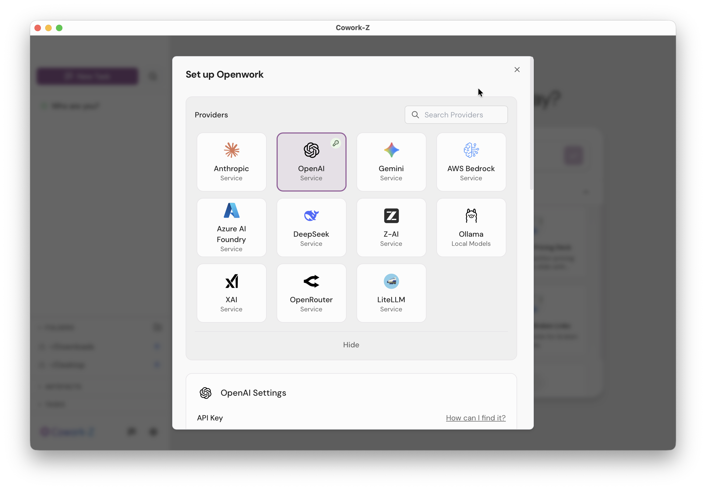
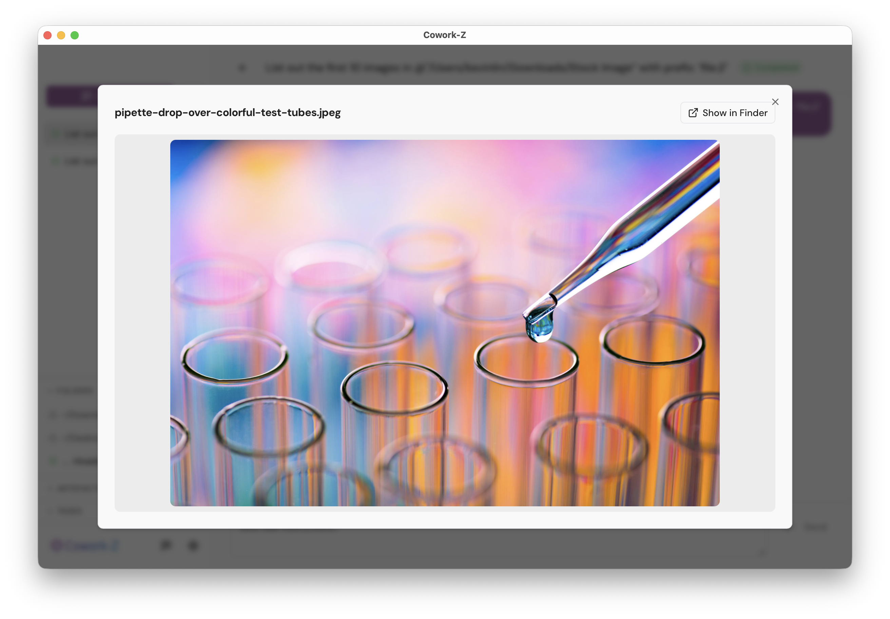
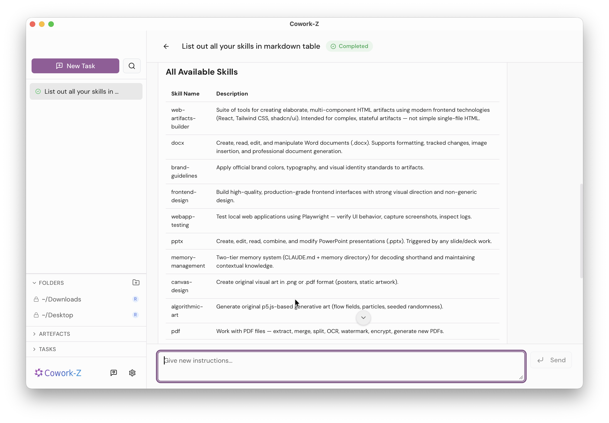

<p align="center">
  
</p>

<h1 align="center">Cowork-Z</h1>

<p align="center">
  <strong>A local-first desktop agent that brings AI to your files and workflows — without compromising privacy.</strong>
</p>

<p align="center">
  <a href="https://github.com/kevinlin/cowork-z/releases/latest"></a>
  <a href="LICENSE"></a>
  <a href="https://github.com/kevinlin/cowork-z/actions"></a>
</p>

<p align="center">
  
</p>

---

## Why Cowork-Z?

Most AI tools force an uncomfortable choice: **upload your sensitive work to cloud services, or forgo AI assistance entirely**.

Cowork-Z eliminates this tradeoff. It's a desktop app where AI agents run entirely on your machine — accessing your local files, executing commands in your environment, and integrating with your tools — all while keeping your data under your control.

Whether you're a developer protecting proprietary code, a researcher working with sensitive data, or a team that needs auditability and control, Cowork-Z delivers AI-powered productivity without the privacy compromise.

---

## Features

### Multi-Provider Flexibility

Connect to **13+ AI providers** and switch between them at any time:

**Direct API** — Anthropic, OpenAI, Google Gemini, xAI, DeepSeek, Z.AI
**Cloud Platforms** — AWS Bedrock, Azure AI Foundry
**Local Models** — Ollama
**Proxy Services** — OpenRouter, LiteLLM

Credentials are stored in the **OS Keychain** (macOS Keychain, Windows Credential Manager, Linux Secret Service) — never in plain text files.

<p align="center">
  
  <br />
  <em>Choose from 13+ AI providers — credentials stored securely in the OS Keychain</em>
</p>

### Sandboxed Permissions

You control exactly what the agent can access:

- **Folder-level access controls** — grant read or read-write per directory
- **Runtime permission prompts** — if the agent needs a folder you haven't approved, it asks first
- **Per-session tracking** — permissions are scoped and persisted per task

<p align="center">
  
  <br />
  <em>The agent asks before accessing directories outside your approved list</em>
</p>

### Rich Chat Experience

- **Inline file previews** — file paths render as clickable links with thumbnails for images and video
- **Image gallery** — click any thumbnail to open an in-app preview with "Show in Finder"
- **URL previews** — links in agent responses open in your default browser
- **Drag-and-drop** — drop files or folders from Finder into the chat to reference them
- **Multi-line input** — compose detailed prompts with `Shift+Enter`
- **Todo tracking** — see the agent's task progress in a sidebar panel with a progress bar
- **Artefacts panel** — all files the agent creates or modifies are tracked in the sidebar

<p align="center">
  
  <br />
  <em>Click any image thumbnail to preview it without leaving the app</em>
</p>

### Extensible with Skills & MCP Servers

- **Skills** — drop a `SKILL.md` file into `~/.config/opencode/skills/<name>/` to teach the agent new capabilities. Auto-discovered, no restart needed.
- **MCP Servers** — connect external tools and data sources (databases, APIs, file systems) via the [Model Context Protocol](https://opencode.ai/docs/mcp-servers/). Supports both local (command) and remote (URL) servers.

<p align="center">
  
  <br />
  <em>Skills are auto-discovered from your config directory — no restart needed</em>
</p>

### Desktop-Native Experience

- **Keyboard shortcuts** — `Cmd+N` new task, `Cmd+,` settings, `Escape` cancel
- **Multiple themes** — light and dark modes with runtime switching
- **Auto-updates** — checks for updates on launch with signed, verified bundles
- **Cross-platform** — macOS (Apple Silicon & Intel) today; Windows and Linux builds available

<p align="center">
  
  <br />
  <em>Switch between light and dark themes at any time</em>
</p>

---

## Download

### macOS (Apple Silicon & Intel)

<p>
  <a href="https://github.com/kevinlin/cowork-z/releases/latest">
    
  </a>
</p>

Go to the [**latest release**](https://github.com/kevinlin/cowork-z/releases/latest) and download the `.dmg` for your architecture:

| Chip | File |
|------|------|
| Apple Silicon (M1+) | `cowork-z_*_aarch64.dmg` |
| Intel | `cowork-z_*_x64.dmg` |

### Windows

> **Coming soon** — The build pipeline is in place and we're working on testing and polish. Star the repo or [watch releases](https://github.com/kevinlin/cowork-z/releases) to get notified.

### Linux

> Linux builds (x64 and ARM64) are produced by CI. Check the [releases page](https://github.com/kevinlin/cowork-z/releases) for `.deb` and `.AppImage` files.

---

## Quickstart

> [!CAUTION]
> **Developer Preview** — Cowork-Z is in active development. Features may change, break, or behave unexpectedly. Use at your own risk and please [report any issues](https://github.com/kevinlin/cowork-z/issues/new) you encounter.

### 1. Install OpenCode

Cowork-Z requires [**OpenCode**](https://opencode.ai/) as its AI engine. Install it globally:

```bash
npm install -g opencode-ai
```

Verify the installation:

```bash
opencode --version
```

> If the app can't find `opencode` on launch, it will show a dialog with installation instructions. Make sure the `opencode` binary is on your shell's `PATH`.

### 2. Launch the app & configure a provider

1. Open Cowork-Z
2. Press **`Cmd + ,`** (or click the gear icon) to open **Settings**
3. Pick an AI provider (e.g. Anthropic, OpenAI, Google Gemini, Ollama ...)
4. Enter your API key — credentials are stored securely in the **OS Keychain**, never in plain text

### 3. Set up Skills (optional)

Skills extend the agent with domain-specific knowledge. Cowork-Z supports the [OpenCode Skills spec](https://opencode.ai/docs/skills/) and auto-discovers skill files from:

```
~/.config/opencode/skills/<name>/SKILL.md
```

To add a skill, drop a `SKILL.md` file into a named folder at that path. The agent picks it up automatically — no restart needed.

> **Tip:** The Settings panel shows the skills folder path as a clickable link so you can open it in Finder.

### 4. Configure MCP Servers (optional)

[MCP (Model Context Protocol)](https://opencode.ai/docs/mcp-servers/) servers give the agent access to external tools and data sources — databases, APIs, file systems, and more.

1. Open **Settings** > **MCP Servers**
2. Add a server configuration as JSON:

```json
{
  "my-server": {
    "command": ["npx", "-y", "@my-org/mcp-server"],
    "environment": {
      "API_KEY": "your-key-here"
    },
    "enabled": true
  }
}
```

3. Both **local** (command-based) and **remote** (URL-based) servers are supported
4. Servers can be enabled/disabled individually at any time

### 5. Start a task

Type a prompt in the launcher (or press **`Cmd + N`**) and hit Enter. The agent will plan, execute, and report back — all running locally on your machine.

---

## Tech Stack

| Layer | Technology |
|-------|-----------|
| Desktop framework | [Tauri 2.x](https://tauri.app/) (Rust + Web) |
| Frontend | React 19, TypeScript, Tailwind CSS, Radix UI / shadcn/ui, Zustand |
| Build | Vite, Cargo, pnpm |
| Database | SQLite (rusqlite) |
| Secure storage | OS Keychain (keyring crate) |
| AI Engine | [OpenCode](https://opencode.ai/) via Node.js sidecar |

### Architecture

```
┌──────────────────┐      stdin/stdout       ┌─────────────────┐      HTTP/SSE      ┌──────────────────┐
│   Tauri (Rust)   │◄──── JSON-line IPC ────►│  Node.js Sidecar │◄──────────────────►│  OpenCode Server │
│   + React/TS UI  │                         │                  │                    │  (AI Engine)     │
└──────────────────┘                         └─────────────────┘                    └──────────────────┘
```

For detailed architecture documentation — including C4 diagrams, IPC protocol specs, security model, data architecture, and Architecture Decision Records — see [docs/architecture/](docs/architecture/README.md).

---

## Contributing

We welcome contributions! See [CONTRIBUTING.md](CONTRIBUTING.md) for development setup, coding guidelines, and how to submit pull requests.

### Quick dev start

```bash
git clone https://github.com/kevinlin/cowork-z.git
cd cowork-z
pnpm install
cd src-tauri/sidecar-opencode && pnpm install && cd ../..
pnpm tauri dev
```

### Prerequisites

- Node.js v20+, pnpm v9+
- Rust (stable toolchain)
- OpenCode (`npm install -g opencode-ai`)

---

## Roadmap

See the [requirements document](docs/specs/cowork-z/requirements.md) for the full feature spec. Outstanding items:

- [ ] Database encryption at rest (Req 5.2.2)
- [ ] OpenCode Server API Skill for agent self-introspection (Req 2.4)
- [ ] Windows testing and polish

Track progress on the [issues page](https://github.com/kevinlin/cowork-z/issues) or check the [changelog](UPDATE_LOG.md) for recent releases.

---

## License

[MIT](LICENSE) — Copyright (c) 2025-present Kevin Lin and contributors
