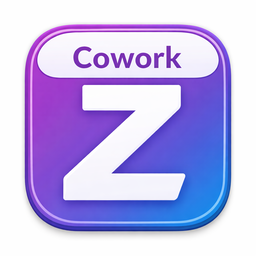

<p align="center">
  
</p>

<h1 align="center">Cowork-Z</h1>

<p align="center">
  <strong>A local-first desktop agent that brings AI to your files and workflows — without compromising privacy.</strong>
</p>

<p align="center">
  <a href="https://github.com/kevinlin/cowork-z/releases/latest"></a>
  <a href="LICENSE"></a>
  <a href="https://github.com/kevinlin/cowork-z/actions"></a>
</p>

<p align="center">
  
</p>

---

Most AI tools force an uncomfortable choice: upload your sensitive work to cloud services, or forgo AI assistance entirely. **Cowork-Z eliminates this tradeoff** by running entirely on your machine. The agent accesses your local files, executes commands in your environment, and integrates with your tools — all while keeping your data under your control.

## Highlights

- **Local-first** — All agent execution happens on your machine; nothing is uploaded to a cloud you don't control
- **13+ AI providers** — Anthropic, OpenAI, Google Gemini, Ollama, AWS Bedrock, Azure, OpenRouter, and more
- **Sandboxed permissions** — Granular folder-level access controls; you decide what the agent can read and write
- **Extensible** — Add custom skills and MCP server integrations to tailor the agent to your workflows
- **Rich chat experience** — Inline file/URL previews, drag-and-drop, todo tracking, artefact panels, themes
- **Cross-platform** — macOS today, Windows and Linux coming soon

---

## Download

### macOS (Apple Silicon & Intel)

<p>
  <a href="https://github.com/kevinlin/cowork-z/releases/latest">
    
  </a>
</p>

Go to the [**latest release**](https://github.com/kevinlin/cowork-z/releases/latest) and download the `.dmg` file for your architecture:

| Chip | File |
|------|------|
| Apple Silicon (M1+) | `cowork-z_*_aarch64.dmg` |
| Intel | `cowork-z_*_x64.dmg` |

### Windows

> **Coming soon** — Windows support is work-in-progress. The build pipeline is in place, and we're working on testing and polish. Star the repo or [watch releases](https://github.com/kevinlin/cowork-z/releases) to get notified.

### Linux

> Linux builds (x64 and ARM64) are produced by CI. Check the [releases page](https://github.com/kevinlin/cowork-z/releases) for `.deb` and `.AppImage` files.

---

## Quickstart

> [!CAUTION]
> **Developer Preview** — Cowork-Z is in active development. Features may change, break, or behave unexpectedly. Use at your own risk and please [report any issues](https://github.com/kevinlin/cowork-z/issues/new) you encounter.

### 1. Install OpenCode

Cowork-Z requires **OpenCode** as its AI engine. Install it globally:

```bash
npm install -g opencode-ai
```

Verify the installation:

```bash
opencode --version
```

> If the app can't find `opencode` on launch, it will show a dialog with installation instructions. Make sure the `opencode` binary is on your shell's `PATH`.

### 2. Launch the app & configure a provider

1. Open Cowork-Z
2. Press **`Cmd + ,`** (or click the gear icon) to open **Settings**
3. Pick an AI provider (e.g. Anthropic, OpenAI, Google Gemini, Ollama …)
4. Enter your API key — credentials are stored securely in the **OS Keychain**, never in plain text

### 3. Set up Skills (optional)

Skills extend the agent's capabilities with domain-specific knowledge. Cowork-Z supports the [OpenCode Skills spec](https://opencode.ai/docs/skills/) and auto-discovers skill files from:

```
~/.config/opencode/skills/<name>/SKILL.md
```

To add a skill, simply drop a `SKILL.md` file into a named folder at that path. The agent will pick it up automatically — no restart needed.

> **Tip:** The Settings panel shows the skills folder path as a clickable link so you can open it in Finder.

### 4. Configure MCP Servers (optional)

[MCP (Model Context Protocol)](https://opencode.ai/docs/mcp-servers/) servers give the agent access to external tools and data sources — databases, APIs, file systems, and more.

1. Open **Settings** → **MCP Servers**
2. Add a server configuration as JSON:

```json
{
  "my-server": {
    "command": ["npx", "-y", "@my-org/mcp-server"],
    "environment": {
      "API_KEY": "your-key-here"
    },
    "enabled": true
  }
}
```

3. Both **local** (command-based) and **remote** (URL-based) MCP servers are supported
4. Servers can be enabled/disabled individually at any time

### 5. Start a task

Type a prompt in the launcher (or press **`Cmd + N`**) and hit Enter. The agent will plan, execute, and report back — all running locally on your machine.

---

## Screenshots

*Coming soon*

---

## Tech Stack

| Layer | Technology |
|-------|-----------|
| Desktop framework | [Tauri 2.x](https://tauri.app/) (Rust + Web) |
| Frontend | React 19, TypeScript, Tailwind CSS, Radix UI / shadcn/ui, Zustand |
| Build | Vite, Cargo, pnpm |
| Database | SQLite (rusqlite) |
| Secrets | OS Keychain (keyring crate) |
| AI Engine | [OpenCode](https://opencode.ai/) via Node.js sidecar |

---

## Contributing

We welcome contributions! See [CONTRIBUTING.md](CONTRIBUTING.md) for development setup, coding guidelines, and how to submit pull requests.

```bash
# Quick dev start
git clone https://github.com/kevinlin/cowork-z.git
cd cowork-z
pnpm install
cd src-tauri/sidecar-opencode && pnpm install && cd ../..
pnpm tauri dev
```

---

## License

[MIT](LICENSE) — Copyright (c) 2025-present Kevin Lin and contributors
