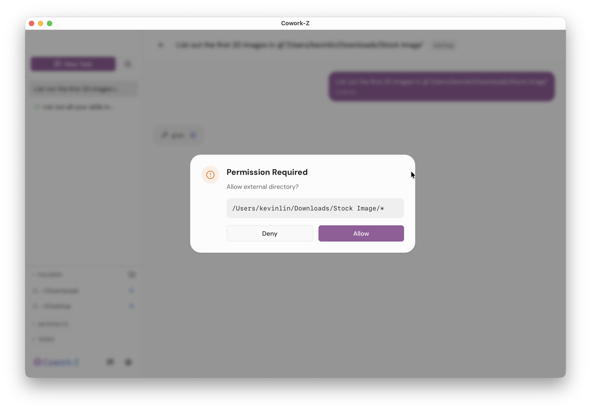
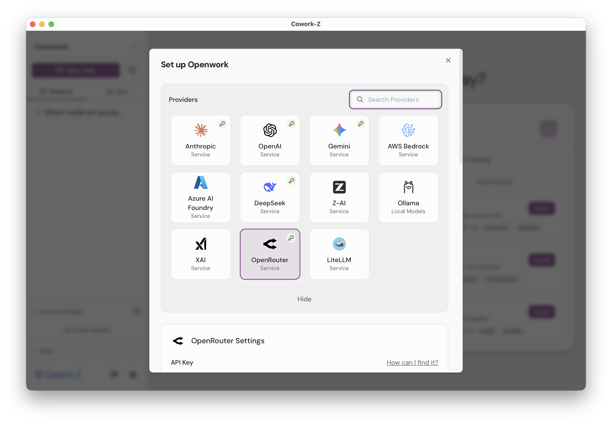
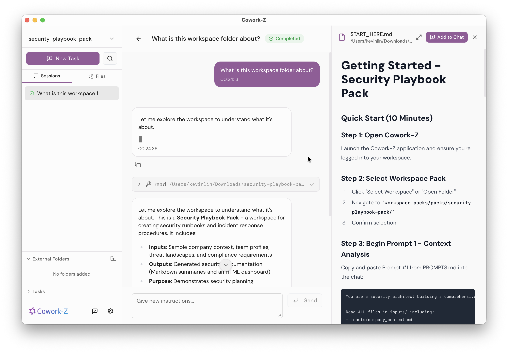
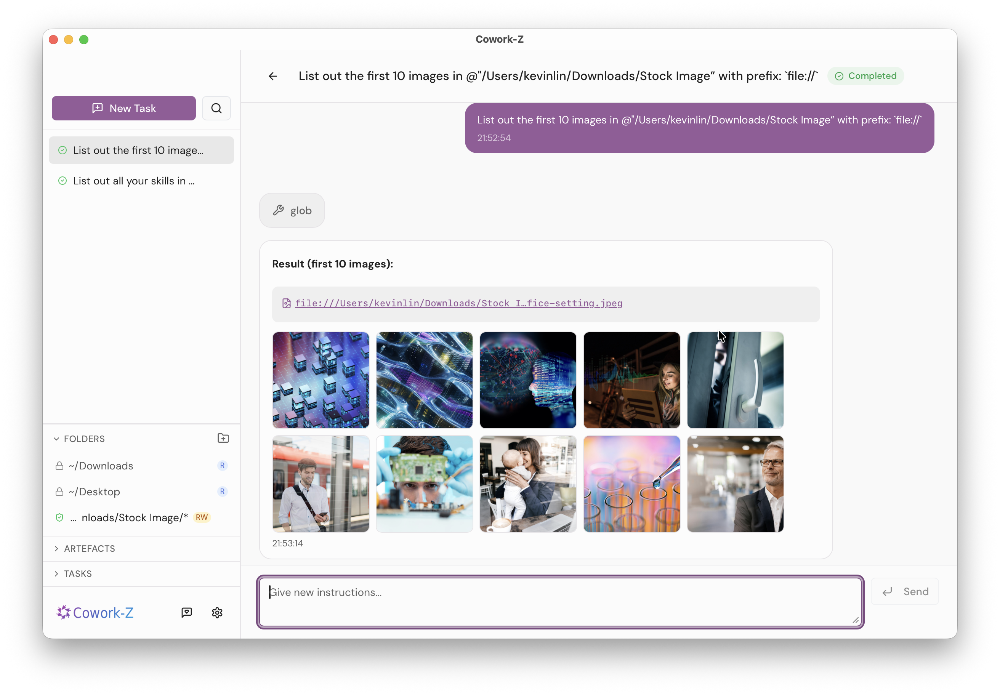
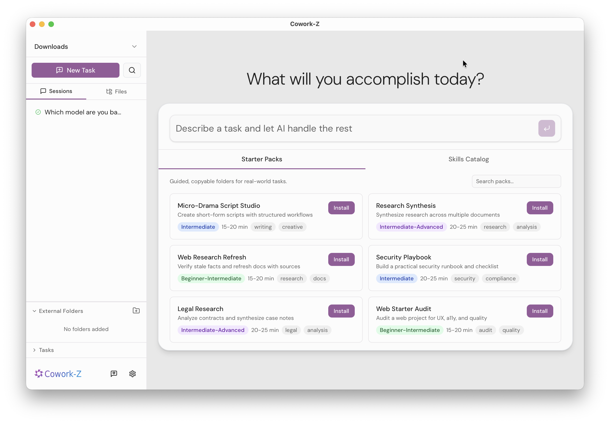
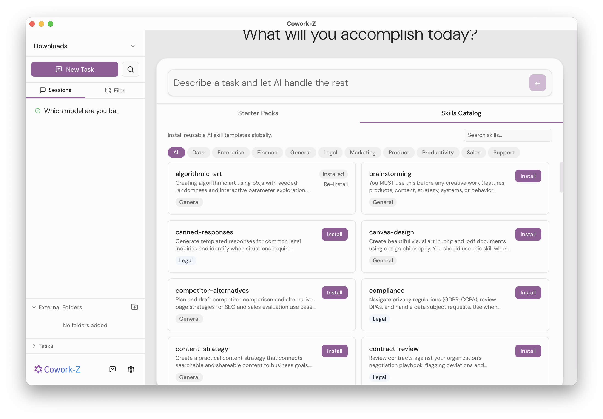
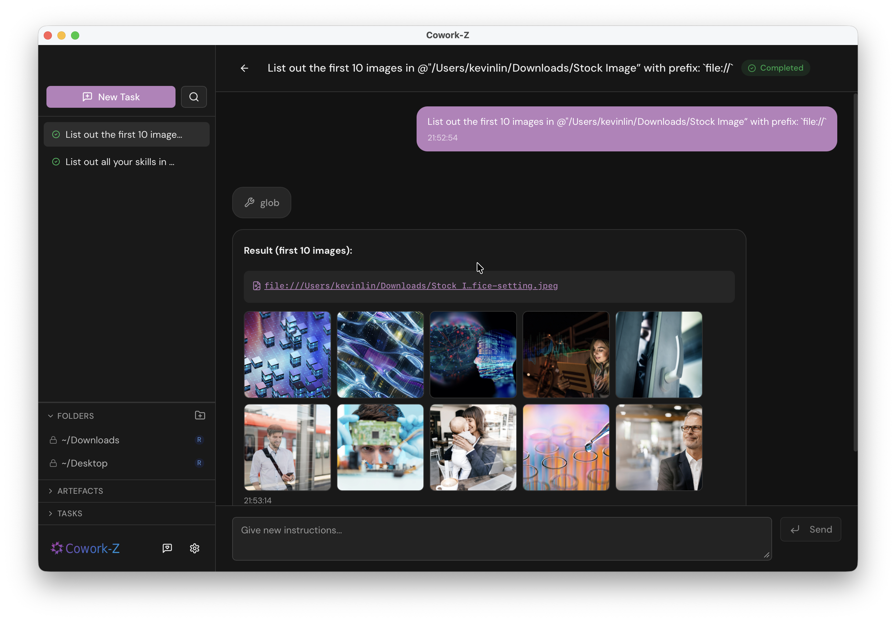

<p align="center">
  
</p>

<h1 align="center">Cowork-Z</h1>

<p align="center">
  <strong>A local-first AI workspace that keeps your work private, organized, and ready to run.</strong>
</p>

<p align="center">
  <a href="https://github.com/kevinlin/cowork-z/releases/latest"></a>
  <a href="LICENSE"></a>
  <a href="https://github.com/kevinlin/cowork-z/actions"></a>
</p>

<p align="center">
  
</p>

<p align="center">
  English | <a href="README.zh-CN.md">简体中文</a>
</p>

[](https://www.buymeacoffee.com/kevinlinyu8)

---

## Why Cowork-Z?

Most AI tools force you to choose between capability and privacy — and leave you rebuilding context from scratch every time. Cowork-Z takes a different approach.

Each project lives in its own workspace: one folder, all your files, sessions, and agent history in one place. Your data never leaves your machine. And a built-in Skills Catalog and Starter Packs mean you're productive in minutes, not hours.

Whether you're a developer protecting proprietary code, a researcher with sensitive data, or a knowledge worker who wants AI on your local files — if privacy matters, this is for you.

---

## Features

### 🔒 Private by design

#### Sandboxed Permissions

Your files never leave your machine. The agent reads and writes locally — nothing is uploaded to cloud servers. You control exactly what it can access:

- **Folder-level access controls** — grant read or read-write per directory
- **Runtime permission prompts** — if the agent needs a folder you haven't approved, it asks first
- **Per-session tracking** — permissions are scoped and persisted per task

<p align="center">
  
  <br />
  <em>The agent asks before accessing folders outside your approved list</em>
</p>

#### Multi-Provider Flexibility

Connect to **12+ AI providers** and switch between them at any time:

**Direct API** — Anthropic, OpenAI, Google Gemini, xAI, DeepSeek, Z.AI\
**Cloud Platforms** — GitHub Copilot, AWS Bedrock, Azure AI Foundry\
**Proxy Services** — OpenRouter, LiteLLM\
**Local Models** — Ollama

Credentials are stored in the **OS Keychain** (macOS Keychain, Windows Credential Manager, Linux Secret Service) — never in plain text files.

<p align="center">
  
  <br />
  <em>Connect to any provider — credentials stored in the OS Keychain</em>
</p>

---

### 📁 One project at a time

#### Workspace-per-Project

Work is organized around workspaces — one folder, one focus. Each workspace holds its own files, chat sessions, permissions, and agent history in one place. Switch workspaces to switch projects; nothing bleeds between them.

- **File tree browser** — lazy-loaded sidebar tree with real-time filesystem watching and search
- **File preview panel** — preview code (syntax-highlighted), Markdown, images, video, PDF, and HTML without leaving the app; supports fullscreen mode
- **"Add to Chat"** — insert any file as an `@path` reference into the chat input directly from the preview panel

<p align="center">
  
  <br />
  <em>One workspace per project — files, sessions, and history in one place</em>
</p>

#### Rich Chat Experience

- **Inline file previews** — file paths render as clickable links with thumbnails for images and video
- **Image gallery** — click any thumbnail to open an in-app preview with "Show in Finder"
- **URL previews** — links in agent responses open in your default browser
- **Drag-and-drop** — drop files or folders from Finder or the file tree into the chat to reference them
- **Multi-line input** — compose detailed prompts with `Shift+Enter`
- **Todo tracking** — see the agent's task progress in a sidebar panel with a progress bar
- **Artefacts panel** — all files the agent creates or modifies are tracked in the sidebar

<p align="center">
  
  <br />
  <em>File paths render as clickable links with inline media previews</em>
</p>

---

### ⚡ Ready in minutes

#### Starter Packs

Hit the ground running with **6 guided workspace packs** covering writing, research, security audits, legal review, and more. Each pack bundles template files, prompts, and step-by-step guidance:

1. Browse packs on the Home screen and click **Install**
2. Choose a destination folder — the app creates the workspace automatically
3. The agent opens `START_HERE.md` and walks you through the task

No configuration, no setup from scratch.

<p align="center">
  
  <br />
  <em>Browse and install guided workspace packs from the Home screen</em>
</p>

#### Skills Catalog

A built-in catalog of reusable AI skill templates, installable with one click:

- **Category tabs** — browse by domain (Marketing, Sales, Enterprise, and more)
- **Search** — filter by name, description, or category in real-time
- **One-click install** — skills are copied to `~/.config/opencode/skills/` and auto-discovered by the agent
- **Update detection** — SHA256 checksums flag outdated skills with a Re-install prompt

<p align="center">
  
  <br />
  <em>One-click install of reusable AI skills — no manual file management</em>
</p>

#### Skills Manager

A dedicated window for managing skills from Git repositories:

- **Register Git repos** — add any public or private Git repository as a skill source
- **Auto-discovery** — skills are automatically discovered from cloned repos by scanning for `SKILL.md` files
- **Browse & install** — search, filter, and install skills from registered repos into any global skills directory
- **Sync & update** — repos sync on app launch; outdated skills show an Update prompt
- **Multiple targets** — install to `~/.config/opencode/skills/`, `~/.claude/skills/`, or `~/.agents/skills/`

#### Extensible with MCP Servers

Connect external tools and data sources via the [Model Context Protocol](https://opencode.ai/docs/mcp-servers/). Supports both local (command) and remote (URL) servers, configurable from the Settings panel.

---

### 🖥️ Desktop-Native Experience

- **Keyboard shortcuts** — `Cmd+N` new task, `Cmd+,` settings, `Escape` cancel
- **Multiple themes** — light and dark modes with runtime switching
- **Auto-updates** — checks for updates on launch with signed, verified bundles
- **Cross-platform** — macOS (Apple Silicon & Intel) today; Windows and Linux builds available

<p align="center">
  
  <br />
  <em>Switch between light and dark themes at any time</em>
</p>

---

## Download

### macOS (Apple Silicon & Intel)

<p>
  <a href="https://github.com/kevinlin/cowork-z/releases/latest">
    
  </a>
</p>

Go to the [**latest release**](https://github.com/kevinlin/cowork-z/releases/latest) and download the `.dmg` for your architecture:

| Chip | File |
|------|------|
| Apple Silicon (M1+) | `cowork-z_*_aarch64.dmg` |
| Intel | `cowork-z_*_x64.dmg` |

### Windows

> **Windows support (dev)** — Cowork-Z now runs on Windows. Full feature coverage hasn't been completed yet, so please expect rough edges and [report issues](https://github.com/kevinlin/cowork-z/issues/new) you encounter.

### Linux

> Linux builds (x64 and ARM64) are produced by CI. Check the [releases page](https://github.com/kevinlin/cowork-z/releases) for `.deb` and `.AppImage` files.

---

## Quickstart

> [!NOTE]
> **Early access** — Cowork-Z is under active development. Some features may be rough around the edges. [Feedback and bug reports](https://github.com/kevinlin/cowork-z/issues/new) are very welcome.

### 1. Install OpenCode

Cowork-Z requires [**OpenCode**](https://opencode.ai/) as its AI engine. Install it globally:

```bash
npm install -g opencode-ai
```

> If the app can't find `opencode` on launch, it will show a dialog with installation instructions. Make sure the `opencode` binary is on your shell's `PATH`.

### 2. Launch the app & configure a provider

1. Open Cowork-Z
2. Press **`Cmd + ,`** (or click the gear icon) to open **Settings**
3. Pick an AI provider (e.g. Anthropic, OpenAI, Google Gemini, Ollama ...)
4. Enter your API key — credentials are stored securely in the **OS Keychain**, never in plain text

### 3. Start a task

Type a prompt in the launcher (or press **`Cmd + N`**) and hit Enter. The agent will plan, execute, and report back — all running locally on your machine.

**Try these:**
- `"Summarise all PDFs in this folder into a single report"`
- `"Review this codebase for security issues and write findings to AUDIT.md"`
- `"Organise the photos in ~/Downloads by date into year/month folders"`

### Go further (optional)

- **Starter Packs** — Browse the Home screen, pick a guided workspace pack, and click **Install**. The app creates a workspace and the agent walks you through `START_HERE.md`.
- **Skills Catalog** — Click **Install** on any skill from the Home screen to add it to your OpenCode skills directory. No restart needed.
- **Skills Manager** — Open the Skills Manager from the sidebar to register Git repositories as skill sources, browse discovered skills, and install or update them across multiple skills directories.
- **MCP Servers** — Open **Settings > MCP Servers** to connect external tools and data sources (databases, APIs, file systems) via the [Model Context Protocol](https://opencode.ai/docs/mcp-servers/).

---

## Tech Stack

| Layer | Technology |
|-------|-----------|
| Desktop framework | [Tauri 2.x](https://tauri.app/) (Rust + Web) |
| Frontend | React 19, TypeScript, Tailwind CSS, Radix UI / shadcn/ui, Zustand |
| Build | Vite, Cargo, pnpm |
| Database | SQLite (rusqlite) |
| Secure storage | OS Keychain (keyring crate) |
| AI Engine | [OpenCode](https://opencode.ai/) via Node.js sidecar |

---

## Contributing

We welcome contributions! See [CONTRIBUTING.md](CONTRIBUTING.md) for development setup, coding guidelines, and how to submit pull requests.

### Quick dev start

```bash
git clone https://github.com/kevinlin/cowork-z.git
cd cowork-z
pnpm install
cd src-tauri/sidecar-opencode && pnpm install && cd ../..
pnpm tauri dev
```

### Prerequisites

- Node.js v20+, pnpm v9+
- Tauri v2 toolchain (see https://v2.tauri.app/start/prerequisites/)
- Rust toolchain (for the Tauri backend)
- OpenCode (`npm install -g opencode-ai`)

#### Windows: Rust with MSVC toolchain

Tauri on Windows requires the **MSVC** toolchain. If you see `missing dlltool.exe` errors or your `rustc -vV` shows `host: x86_64-pc-windows-gnu`, follow these steps:

1. **Install Microsoft C++ Build Tools**
   - Download [Visual Studio Build Tools](https://visualstudio.microsoft.com/visual-cpp-build-tools/)
   - In the installer, select the **Desktop development with C++** workload
   - Verify the **MSVC v143** toolset and **Windows 10/11 SDK** are included
   - Open a **new terminal** after install and confirm with `where cl`

2. **Install rustup** (if `rustup`/`cargo` aren't found)
   - Download and run [rustup-init.exe](https://rustup.rs/) — choose the default install
   - Ensure `%USERPROFILE%\.cargo\bin` is on your `PATH`
   - Verify: `rustup --version && cargo --version`

3. **Switch to the MSVC toolchain**
   ```powershell
   rustup toolchain install stable-x86_64-pc-windows-msvc
   rustup default stable-x86_64-pc-windows-msvc
   ```
   Verify with `rustc -vV` — you should see `host: x86_64-pc-windows-msvc`.

4. **Remove any per-repo GNU override** (common gotcha)
   ```powershell
   rustup override list
   # If your repo is listed with ...-gnu:
   cd path\to\cowork-z
   rustup override unset
   ```

5. **Clean and rebuild**
   ```powershell
   cd src-tauri && cargo clean && cd ..
   pnpm tauri dev
   ```

> **Note:** Windows 11 ships with WebView2 pre-installed. If the build complains about WebView2, install the [runtime](https://developer.microsoft.com/en-us/microsoft-edge/webview2/) and retry.

---

## Roadmap

See the [requirements document](docs/specs/requirements.md) for the full feature spec. Outstanding items:

- [x] Windows testing and polish
- [ ] Database encryption at rest (Req 5.2.2)

Track progress on the [issues page](https://github.com/kevinlin/cowork-z/issues) or check the [changelog](UPDATE_LOG.md) for recent releases.

---

## Acknowledgments

- Cowork-Z's UI is based on [Accomplish](https://github.com/accomplish-ai/accomplish). Thanks to the Accomplish team for their work on the original implementation.
- The Workspace, Starter Packs and Skills Catalog features were inspired by and heavily referenced from [Tandem](https://github.com/frumu-ai/tandem). Thanks to the Tandem team for pioneering this pattern.

---

## License

[MIT](LICENSE) — Copyright (c) 2025-present Kevin Lin and contributors
