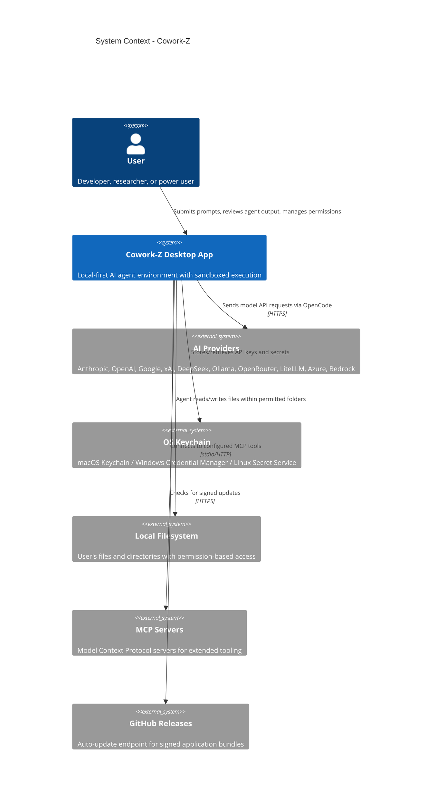
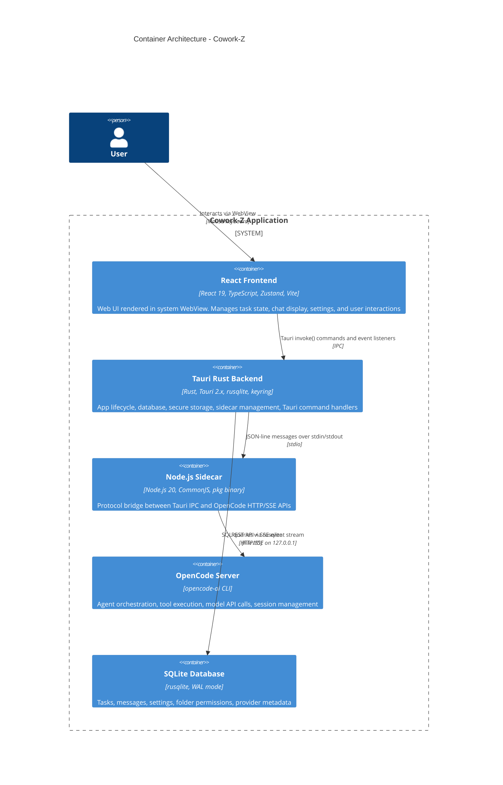
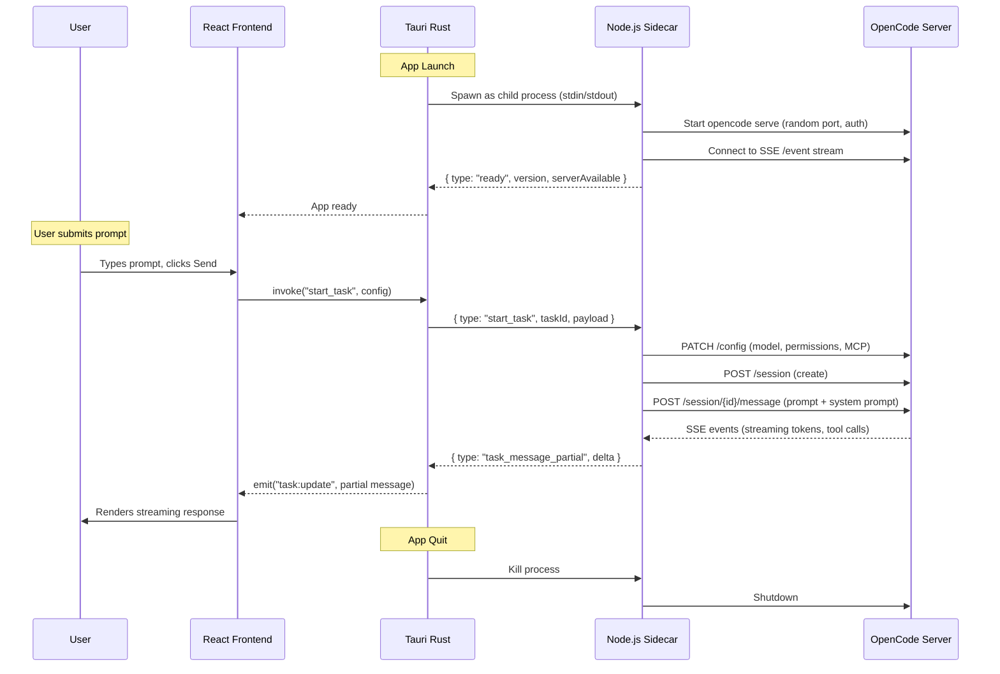
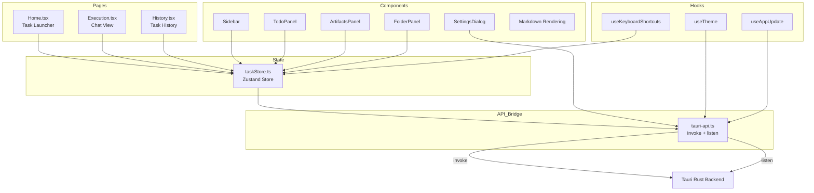
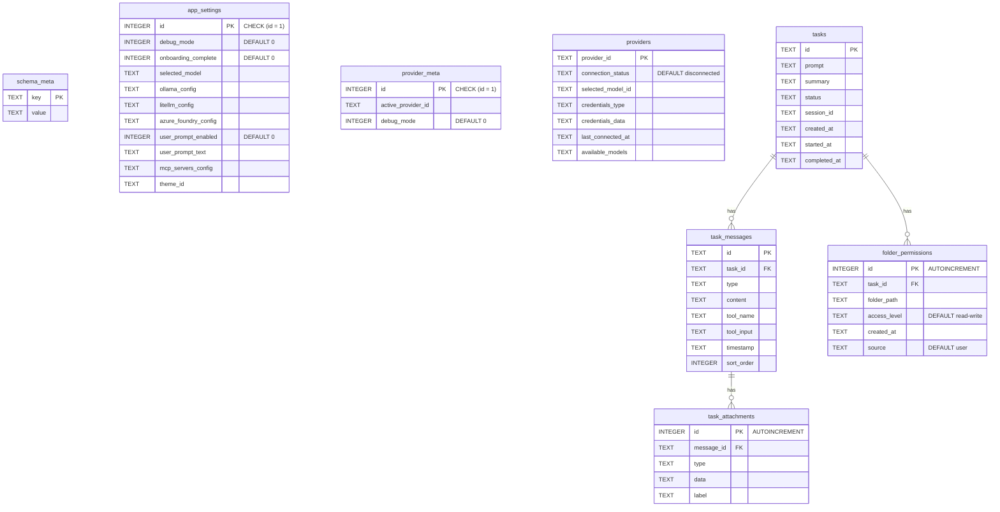
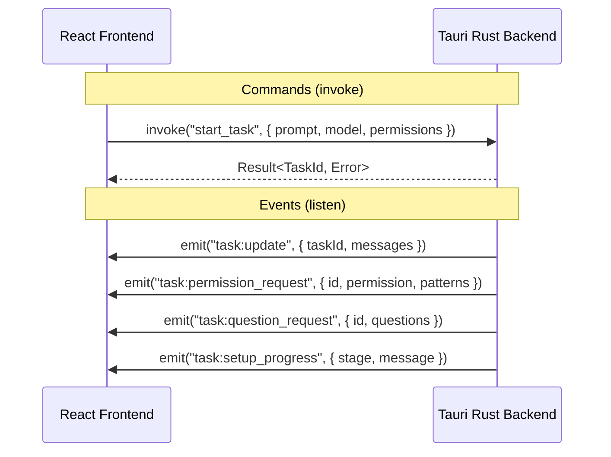
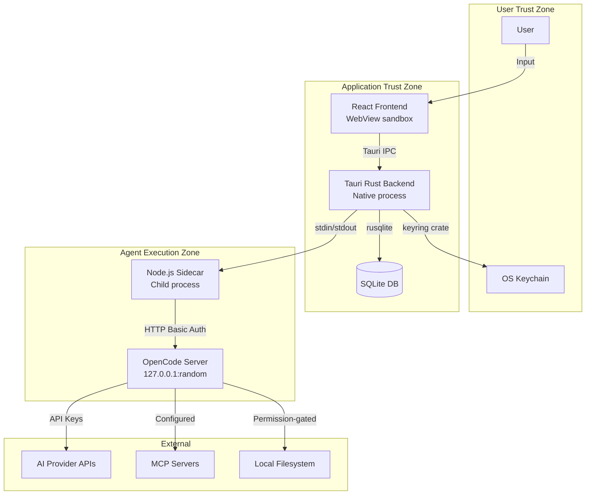
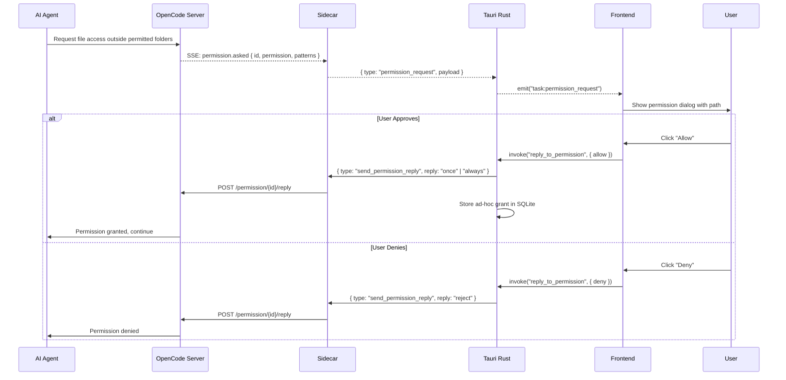
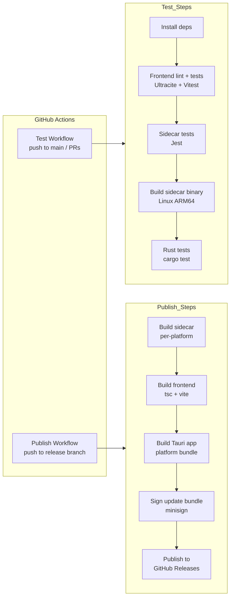

# Cowork-Z Architecture Documentation

Comprehensive architecture documentation for Cowork-Z, a local-first desktop AI agent built with Tauri 2.x.

**Version:** 0.4.0
**Last Updated:** 2026-02-13

---

## Table of Contents

1. [System Context](#1-system-context)
2. [Container Architecture](#2-container-architecture)
3. [Component Architecture](#3-component-architecture)
4. [Data Architecture](#4-data-architecture)
5. [IPC Protocol](#5-ipc-protocol)
6. [Security Architecture](#6-security-architecture)
7. [Deployment & CI/CD](#7-deployment--cicd)
8. [Architecture Decision Records](#8-architecture-decision-records)

---

## 1. System Context

Cowork-Z is a local-first desktop application that provides a sandboxed environment for autonomous AI agents. It runs entirely on the user's machine, with no cloud services beyond the AI provider APIs themselves.

### System Context Diagram



### External Systems

| System | Interaction | Protocol |
|--------|------------|----------|
| **AI Providers** (13+) | Model inference via OpenCode | HTTPS |
| **OS Keychain** | Credential storage/retrieval | Native API |
| **Local Filesystem** | File read/write within permitted directories | OS filesystem |
| **MCP Servers** | Extended tool capabilities | stdio / HTTP |
| **GitHub Releases** | Signed auto-update bundles | HTTPS |

### User Personas

- **Privacy-conscious developers** protecting proprietary code
- **Researchers** working with sensitive data
- **Security-minded teams** needing auditability and control

---

## 2. Container Architecture

Cowork-Z follows a multi-process architecture with three main containers communicating via distinct protocols.

### Container Diagram



### Container Details

| Container | Technology | Responsibility |
|-----------|-----------|---------------|
| **React Frontend** | React 19, TypeScript 5.8, Radix UI, shadcn/ui, Tailwind CSS, Zustand 5, Vite 7 | UI rendering, state management, user interaction, theme support |
| **Tauri Rust Backend** | Rust, Tauri 2.x, rusqlite, keyring, tokio | App lifecycle, 60+ command handlers, database access, keychain, sidecar process management |
| **Node.js Sidecar** | Node.js 20, CommonJS, eventsource, pkg binary | Translates Tauri IPC to OpenCode HTTP/SSE. Manages sessions, config, permissions |
| **OpenCode Server** | opencode-ai CLI (npm global) | Agent orchestration: tool execution (file ops, bash, search), model API calls |
| **SQLite Database** | rusqlite with WAL mode | Persists tasks, messages, settings, folder permissions, provider metadata |

### Process Lifecycle



---

## 3. Component Architecture

### 3.1 Rust Backend Components

```
src-tauri/src/
  lib.rs              # 60+ Tauri command handlers, app menu, state setup
  main.rs             # Tauri app entry point
  sidecar.rs          # Sidecar process lifecycle, IPC serialization, event routing
  secure_storage.rs   # OS Keychain integration (keyring crate)
  db/
    mod.rs            # Database initialization, WAL mode, foreign keys
    migrations.rs     # Versioned schema migrations
    tasks.rs          # Task CRUD operations
    settings.rs       # App settings persistence
    providers.rs      # Provider metadata persistence
    folder_permissions.rs  # Per-task folder permission grants
```

**Key Modules:**

| Module | Responsibility |
|--------|---------------|
| `lib.rs` | All Tauri `#[command]` handlers registered in `invoke_handler`. Handles task lifecycle, settings, provider management, permissions, app info |
| `sidecar.rs` | Defines `SidecarCommand` enum (Rust -> Sidecar) and parses `SidecarEvent` JSON (Sidecar -> Rust). Manages child process spawning, stdin writes, stdout parsing, Tauri event emission |
| `secure_storage.rs` | Wraps `keyring` crate. Service identifier: `com.kevinlin.cowork-z`. Supports 12 provider key types |
| `db/` | SQLite via `rusqlite`. WAL mode for concurrent reads. Auto-migrations on startup. Single-row pattern for `app_settings` and `provider_meta` |

### 3.2 Node.js Sidecar Components

```
src-tauri/sidecar-opencode/src/
  index.ts            # Entry point: stdin listener, dispatches commands
  types.ts            # Single source of truth for IPC + OpenCode API types
  session-manager.ts  # Session lifecycle, SSE event handling, state tracking
  opencode-client.ts  # OpenCode HTTP REST client (session, message, permission, question, config)
  event-stream.ts     # SSE client wrapping eventsource library
  config-builder.ts   # Builds OpenCode config objects and system prompts
  process-manager.ts  # OpenCode CLI process spawning and health checks
  logger.ts           # Structured logging to stderr
```

**Key Classes:**

| Class | Responsibility |
|-------|---------------|
| `SessionManager` | Core orchestrator. Listens to SSE events, maps `sessionID` -> `taskId`, emits typed events (started, message-partial, message-complete, permission-request, question-request, error, complete) |
| `OpenCodeClient` | HTTP client for OpenCode REST API. Methods: `createSession`, `getSession`, `sendMessage`, `replyToPermission`, `replyToQuestion`, `updateConfig`, `abortSession`, `getHealth` |
| `EventStream` | Wraps `eventsource` npm library. Connects to `GET /event`, parses SSE data, emits typed events. Auto-reconnects on disconnect |
| `ProcessManager` | Spawns `opencode serve` with random port, `OPENCODE_SERVER_PASSWORD`, and augmented PATH. Health-checks via `GET /global/health` |

### 3.3 Frontend Components

```
src/
  App.tsx                       # Root: routing, keyboard shortcuts, theme, dialogs
  main.tsx                      # React entry point with BrowserRouter
  pages/
    Home.tsx                    # Task launcher and empty state
    Execution.tsx               # Active task chat view with streaming
    History.tsx                 # Task history listing
  stores/
    taskStore.ts                # Zustand global store: tasks, permissions, todos, artifacts, UI state
  lib/
    tauri-api.ts                # All Tauri invoke() and listen() calls
    tauri-api-interface.ts      # TauriAPI interface abstraction
    animations.ts               # Framer Motion animation presets
    analytics.ts                # Event tracking
  hooks/
    useKeyboardShortcuts.ts     # Cmd+, / Cmd+N / Cmd+K
    useTheme.ts                 # Theme persistence and OS dark-mode detection
    useAppUpdate.ts             # Auto-update lifecycle
  components/
    layout/
      Sidebar.tsx               # App sidebar with task history, panels
      SettingsDialog.tsx         # Radix Dialog for settings
      AboutDialog.tsx           # App info and changelog
      UpdateDialog.tsx          # Auto-update prompt
      OpenCodeCliMissingDialog.tsx  # Missing CLI detection
    sidebar/
      TodoPanel.tsx             # Task todo items with progress bar
      ArtifactsPanel.tsx        # Files created/modified by agent
      FolderPanel.tsx           # Folder permission management
    settings/
      AnthropicSettings.tsx     # Provider-specific config forms
      OpenAISettings.tsx        # (one per provider)
      McpServersSettings.tsx    # MCP server JSON editor
      ...
    markdown/
      EnhancedLink.tsx          # Rich file/URL rendering with icons
    media/
      ImageThumbnail.tsx        # Image/video preview in messages
    TaskLauncher/               # Cmd+K command palette
    ui/                         # Radix + shadcn/ui primitives
  shared/
    types/
      task.ts                   # Task, TaskMessage, TaskStatus, PartialMessage, Todo, Artifact
      provider.ts               # ProviderId, ConnectedProvider
      permission.ts             # PermissionRequest, FolderPermission
      auth.ts                   # ApiKeyConfig
      mcpSettings.ts            # McpServersConfig
      providerSettings.ts       # Provider settings types
      opencode.ts               # OpenCode message types
    constants.ts                # App-wide constants
```

### Frontend Architecture Diagram



### State Management

The application uses a single Zustand store (`taskStore.ts`) containing:

| State Slice | Purpose |
|------------|---------|
| `currentTask` | Active task being executed |
| `tasks` | Task history array |
| `partialMessages` | `Map<string, PartialMessage>` for streaming tokens |
| `permissionRequest` | Current pending permission dialog |
| `todos` | `Map<taskId, Todo[]>` per-task todo items |
| `artifacts` | `Map<taskId, Artifact[]>` per-task created/modified files |
| `startupStage` | Task initialization progress indicator |
| `showSettings` / `showAbout` / `showCliMissing` | Dialog visibility flags |

### Routing

| Path | Page | Purpose |
|------|------|---------|
| `/` | `Home.tsx` | Task launcher, empty state |
| `/execution/:id` | `Execution.tsx` | Active task chat view |
| `*` | Redirect to `/` | Catch-all |

---

## 4. Data Architecture

### 4.1 Database Schema

SQLite database located at:
- **macOS:** `~/Library/Application Support/cowork-z/cowork-dev.db` (dev) / `cowork.db` (prod)
- **Windows:** `%APPDATA%/Cowork-Z/`
- **Linux:** `~/.local/share/cowork-z/`



### 4.2 Schema Configuration

- **Journal mode:** WAL (Write-Ahead Logging) for concurrent read/write
- **Foreign keys:** Enabled with `ON DELETE CASCADE`
- **Migrations:** Versioned via `schema_meta` table, auto-run on startup
- **Single-row tables:** `app_settings` and `provider_meta` use `CHECK (id = 1)` constraint

### 4.3 Credential Storage

API keys are **never** stored in the database. They are stored in the OS-native keychain:

| Platform | Backend | Service Identifier |
|----------|---------|-------------------|
| macOS | Keychain | `com.kevinlin.cowork-z` |
| Windows | Credential Manager | `com.kevinlin.cowork-z` |
| Linux | Secret Service (D-Bus) | `com.kevinlin.cowork-z` |

Supported providers: `anthropic`, `openai`, `google`, `xai`, `ollama`, `deepseek`, `zai`, `azure-foundry`, `bedrock`, `litellm`, `openrouter`, `custom`

---

## 5. IPC Protocol

The system uses three distinct IPC boundaries, each with its own protocol.

### 5.1 Frontend <-> Rust Backend (Tauri IPC)

**Mechanism:** `invoke()` for commands, `listen()` for events.



**Key Tauri Commands (60+):**

| Category | Commands |
|----------|----------|
| **Task Lifecycle** | `start_task`, `cancel_task`, `resume_session`, `abort_session` |
| **Permissions** | `reply_to_permission`, `get_folder_permissions`, `add_folder_permission`, `remove_folder_permission` |
| **Questions** | `reply_to_question` |
| **Settings** | `get_settings`, `set_setting`, `get_debug_mode`, `set_debug_mode` |
| **Providers** | `get_providers`, `set_active_provider`, `validate_api_key` |
| **Credentials** | `store_api_key`, `get_api_key`, `delete_api_key`, `has_api_key` |
| **Tasks DB** | `get_tasks`, `get_task`, `update_task_summary` |
| **App Info** | `get_version`, `get_platform`, `get_arch` |
| **MCP** | `get_mcp_config`, `save_mcp_config`, `update_mcp_config` |

**Key Tauri Events:**

| Event | Payload | Direction |
|-------|---------|-----------|
| `task:update` | `{ taskId, messages }` | Rust -> Frontend |
| `task:update_batch` | `{ taskId, messages[] }` | Rust -> Frontend |
| `task:permission_request` | `{ id, taskId, permission, patterns, metadata }` | Rust -> Frontend |
| `task:question_request` | `{ id, taskId, questions }` | Rust -> Frontend |
| `task:setup_progress` | `{ taskId, stage, message }` | Rust -> Frontend |
| `task:todo_updated` | `{ taskId, todos }` | Rust -> Frontend |
| `show-about` | `{}` | Rust -> Frontend (menu) |

### 5.2 Rust Backend <-> Node.js Sidecar (JSON-line IPC)

**Mechanism:** JSON-line messages over stdin (commands) and stdout (events).

**Commands (Rust -> Sidecar):**

```typescript
type SidecarCommand =
  | { type: "start_task"; taskId: string; payload: StartTaskPayload }
  | { type: "resume_session"; taskId: string; payload: ResumeSessionPayload }
  | { type: "cancel_task"; taskId: string }
  | { type: "abort_session"; taskId: string; sessionId: string }
  | { type: "send_permission_reply"; taskId: string; payload: PermissionReplyPayload }
  | { type: "send_question_reply"; taskId: string; payload: QuestionReplyPayload }
  | { type: "get_session_todos"; taskId: string; sessionId: string }
  | { type: "update_mcp_config"; payload: UpdateMcpConfigPayload }
  | { type: "ping" }
  | { type: "check_server" };
```

**Events (Sidecar -> Rust):**

```typescript
type SidecarEvent =
  | { type: "ready"; payload: { version, serverAvailable, serverVersion } }
  | { type: "pong"; payload: { timestamp } }
  | { type: "server_status"; payload: { running, port, version } }
  | { type: "task_started"; taskId: string; payload: { taskId, sessionId } }
  | { type: "task_message_partial"; taskId: string; payload: { messageId, textSoFar, delta, isStreaming } }
  | { type: "task_message_complete"; taskId: string; payload: { messageId, text } }
  | { type: "task_progress"; taskId: string; payload: { stage } }
  | { type: "task_complete"; taskId: string; payload: { status, sessionId, error? } }
  | { type: "task_error"; taskId: string; payload: { error, sessionId? } }
  | { type: "permission_request"; taskId: string; payload: { id, sessionId, permission, patterns, metadata } }
  | { type: "question_request"; taskId: string; payload: { id, sessionId, questions } }
  | { type: "todo_updated"; taskId: string; payload: { todos } }
  | { type: "log"; payload: { level, message } }
  | { type: "error"; payload: { message } };
```

### 5.3 Sidecar <-> OpenCode Server (HTTP/SSE)

**Mechanism:** REST API for commands, Server-Sent Events for streaming.

| Endpoint | Method | Purpose |
|----------|--------|---------|
| `/event` | GET | SSE event stream for real-time updates |
| `/session` | POST | Create a new session |
| `/session/{id}` | GET | Get session details |
| `/session/{id}/message` | POST | Send message (with system prompt) |
| `/session/{id}/todo` | GET | Get session todos |
| `/permission/{id}/reply` | POST | Reply to permission request |
| `/question/{id}/reply` | POST | Reply to agent question |
| `/config` | PATCH | Update model, permissions, MCP config |
| `/global/health` | GET | Server health check |

**SSE Event Types:**

| Event | Payload Shape |
|-------|--------------|
| `session.status` | `{ sessionID, status: { type: "idle" \| "busy" \| "retry" } }` |
| `message.updated` | `{ info: MessageInfo }` |
| `message.part.updated` | `{ part: PartUpdate, delta? }` (sessionID/messageID nested in part) |
| `permission.asked` | `PermissionRequest` |
| `question.asked` | `QuestionRequest` |
| `todo.updated` | `{ sessionID, todos }` |
| `session.error` | `{ sessionID, error }` |
| `server.heartbeat` | `{}` (keepalive) |
| `server.instance.disposed` | `{ directory }` (triggers SSE reconnection) |

**Important:** `PATCH /config` causes the OpenCode server to dispose and recreate its instance, which terminates the SSE connection. The `eventsource` library auto-reconnects in ~1 second.

---

## 6. Security Architecture

### Security Boundary Diagram



### Defense-in-Depth Layers

| Layer | Mechanism | Details |
|-------|-----------|---------|
| **Credential Storage** | OS Keychain | All API keys stored via `keyring` crate. Never in database, config files, or logs. Only masked prefixes returned to frontend |
| **Server Isolation** | Random port + auth | OpenCode binds to `127.0.0.1` on random port. Random password generated per launch via `OPENCODE_SERVER_PASSWORD`. HTTP basic auth required on all requests |
| **Folder Permissions** | Explicit grant model | Default access: Desktop + Downloads only. All other paths require user approval via modal dialog. Grants stored per-task in SQLite |
| **Tauri Capabilities** | Declarative permissions | `capabilities/default.json` restricts shell permissions to `spawn`, `stdin-write`, `kill`, `open`. No arbitrary command execution from frontend |
| **Process Lifecycle** | Tied to app | Sidecar and OpenCode server start/stop with the app. No orphaned processes |
| **Update Signing** | minisign | Update bundles signed with private key in CI. Public key embedded in `tauri.conf.json`. Unsigned bundles rejected |
| **Asset Protocol** | Scoped access | Tauri asset protocol enabled with `**` scope for local file preview |

### Permission Flow



---

## 7. Deployment & CI/CD

### Build Pipeline



### Platform Build Matrix

| Platform | Target | Sidecar Binary | App Bundle |
|----------|--------|---------------|------------|
| macOS ARM64 | `aarch64-apple-darwin` | `sidecar-opencode-aarch64-apple-darwin` | `.dmg` |
| macOS x64 | `x86_64-apple-darwin` | `sidecar-opencode-x86_64-apple-darwin` | `.dmg` |
| Windows x64 | `x86_64-pc-windows-msvc` | `sidecar-opencode-x86_64-pc-windows-msvc.exe` | `.msi` / `.exe` |
| Linux x64 | `x86_64-unknown-linux-gnu` | `sidecar-opencode-x86_64-unknown-linux-gnu` | `.AppImage` / `.deb` |
| Linux ARM64 | `aarch64-unknown-linux-gnu` | `sidecar-opencode-aarch64-unknown-linux-gnu` | `.AppImage` / `.deb` |

### Sidecar Build Constraints

- **Must use CommonJS** — `pkg` bundler (`@yao-pkg/pkg`) has limited ESM support
- **No `.js` extensions** in TypeScript imports (CommonJS convention)
- **Node.js 20** target for `pkg` compilation
- **Single dependency** at runtime: `eventsource` (bundled into binary)

### Auto-Update Flow

1. App checks GitHub Releases endpoint on startup (after delay)
2. Compares latest version against `tauri.conf.json` version
3. Verifies update bundle signature using embedded public key
4. User prompted with version + release notes dialog
5. On "Update Now": download, install, restart

---

## 8. Architecture Decision Records

### ADR-001: OpenCode CLI over Embedded Agent Runtime

**Status:** Accepted
**Context:** Needed to choose between building a custom agent runtime or delegating to an existing one.
**Decision:** Delegate agent orchestration to the OpenCode CLI rather than implementing a custom agent runtime.
**Rationale:** OpenCode provides tool execution (file ops, bash, search), model API integration with 13+ providers, session management, and MCP support. Building these from scratch would be a massive undertaking with limited differentiation.
**Consequences:** Requires OpenCode to be installed globally (`npm install -g opencode-ai`). App depends on OpenCode's release cycle. Need CLI detection at startup.

### ADR-002: Node.js Sidecar over Direct Rust Integration

**Status:** Accepted
**Context:** OpenCode exposes an HTTP/SSE API. Need to bridge this to Tauri IPC.
**Decision:** Use a Node.js sidecar process bundled as a binary via `pkg`, rather than making HTTP calls from Rust directly or embedding the OpenCode SDK in Rust.
**Rationale:** OpenCode's JavaScript SDK provides the most natural integration. Node.js `eventsource` library handles SSE reconnection automatically. `pkg` bundles the sidecar into a self-contained binary. The original architecture considered a Python sidecar but switched to Node.js for better SDK alignment.
**Consequences:** Additional build step for sidecar binary. Must use CommonJS (pkg limitation). Adds ~50MB to app bundle. Separate test suite needed.

### ADR-003: JSON-line IPC over Unix Sockets

**Status:** Accepted
**Context:** Rust backend needs bidirectional communication with sidecar process.
**Decision:** Use JSON-line protocol over stdin/stdout of the child process.
**Rationale:** Simple, debuggable, no socket management. Tauri's `shell` plugin provides native stdin/stdout access. Each message is a single line of JSON, making parsing trivial. No port allocation or connection setup needed.
**Consequences:** All messages are serialized/deserialized as JSON. Binary data must be base64-encoded. Message ordering guaranteed by stdin/stdout stream semantics.

### ADR-004: SSE over WebSockets

**Status:** Accepted (OpenCode design choice)
**Context:** Need real-time streaming from OpenCode server to sidecar.
**Decision:** Use Server-Sent Events (SSE) rather than WebSockets.
**Rationale:** SSE is simpler (HTTP-based, unidirectional), supports automatic reconnection via the `eventsource` library, and is the protocol chosen by OpenCode. Commands go via REST API, events stream via SSE — clean separation.
**Consequences:** `PATCH /config` causes server instance disposal and SSE reconnection (~1s). Must not add manual reconnection logic on top of library auto-reconnect.

### ADR-005: OS Keychain for All Secrets

**Status:** Accepted
**Context:** Need secure storage for API keys across all supported platforms.
**Decision:** Store all credentials in the OS-native keychain — never in the database or config files.
**Rationale:** OS keychains provide hardware-backed security on macOS, encrypted storage on Windows, and D-Bus Secret Service on Linux. Users expect their credentials to be stored securely. Only masked key prefixes are ever sent to the frontend.
**Consequences:** Requires `keyring` crate (Rust). Cross-platform behavior varies (Linux requires running D-Bus Secret Service). Keys retrieved on-demand, not cached in memory long-term.

### ADR-006: Zustand for State Management

**Status:** Accepted
**Context:** Need a state management solution for the React frontend.
**Decision:** Use Zustand with a single global store rather than React Context, Redux, or multiple stores.
**Rationale:** Lightweight (~1KB), TypeScript-friendly with excellent type inference, no boilerplate (no actions/reducers), supports direct mutations, selective subscriptions prevent unnecessary re-renders. Single store simplifies state coordination between task lifecycle, permissions, UI state.
**Consequences:** All app state in one store can grow large. Map-based state slices (todos, artifacts, partialMessages) avoid serialization issues with Zustand devtools.

### ADR-007: Tied Process Lifecycle

**Status:** Accepted
**Context:** Need to manage sidecar and OpenCode server processes.
**Decision:** Start sidecar (and OpenCode server) on app launch, terminate on app quit. No independent lifecycle.
**Rationale:** Prevents orphaned processes. Simplifies process management. User expectation: opening the app starts AI capabilities, closing stops them. Random port and password per session ensures no stale connections.
**Consequences:** App startup includes sidecar + server initialization time. Cannot pre-warm server before app opens. Server state resets between sessions (by design for security).

---

## Cross-References

| Document | Location | Purpose |
|----------|----------|---------|
| Feature Requirements | [requirements.md](../specs/cowork-z/requirements.md) | Detailed acceptance criteria |
| Technical Design | [design.md](../specs/cowork-z/design.md) | Implementation-level design |
| Sidecar Rewrite Plan | [plan_sidecar-opencode-rewrite.md](../specs/opencode-sidecar/plan_sidecar-opencode-rewrite.md) | Sidecar architecture evolution |
| IPC Protocol Types | [types.ts](../../src-tauri/sidecar-opencode/src/types.ts) | Single source of truth for IPC |
| Tauri API Bridge | [tauri-api.ts](../../src/lib/tauri-api.ts) | Frontend-to-Rust contract |
| Tauri Config | [tauri.conf.json](../../src-tauri/tauri.conf.json) | App configuration |
