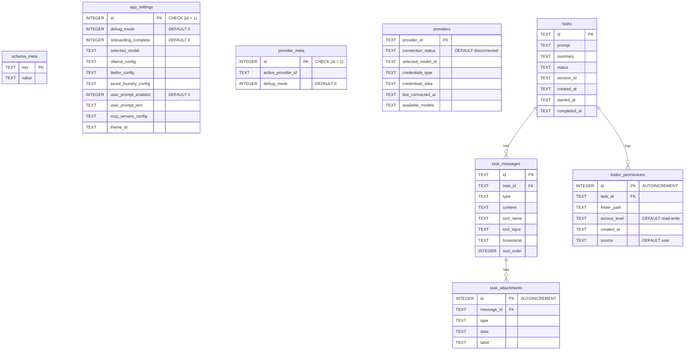
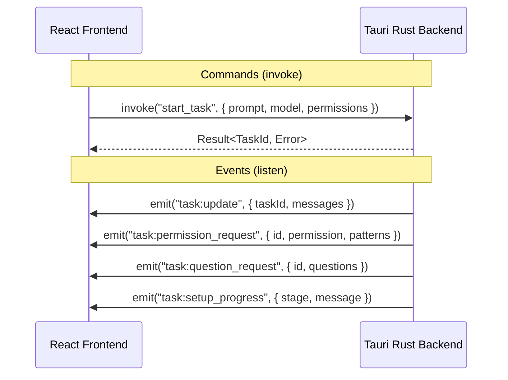
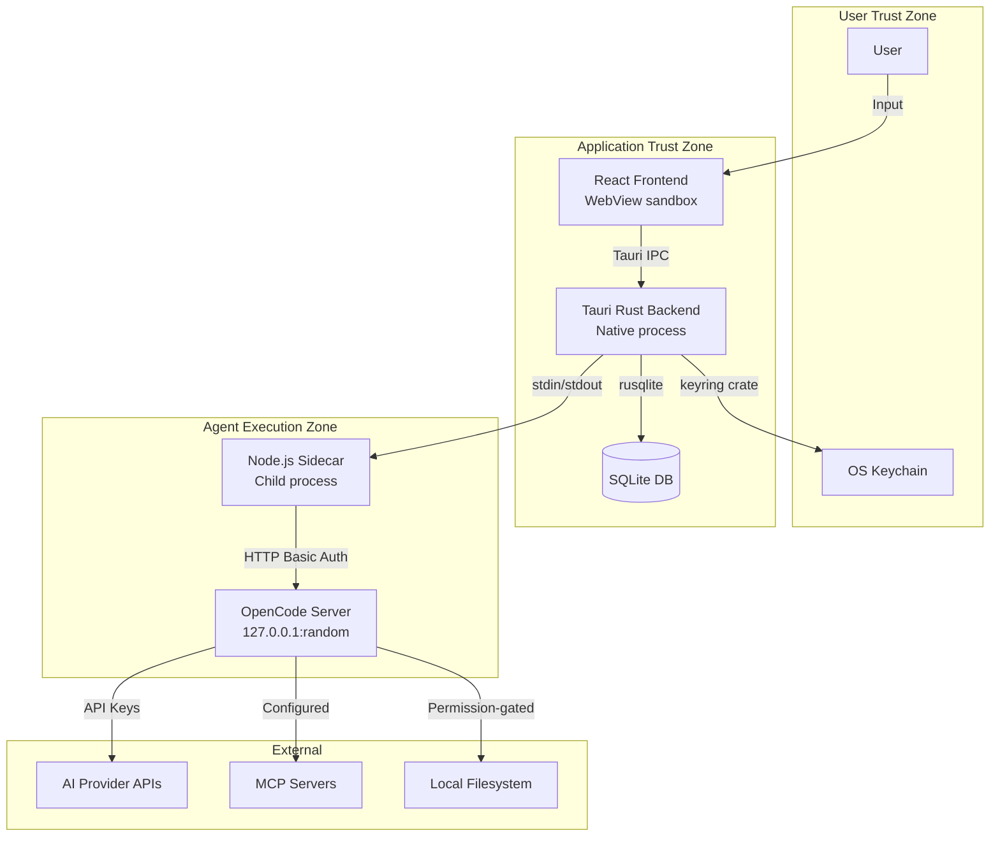
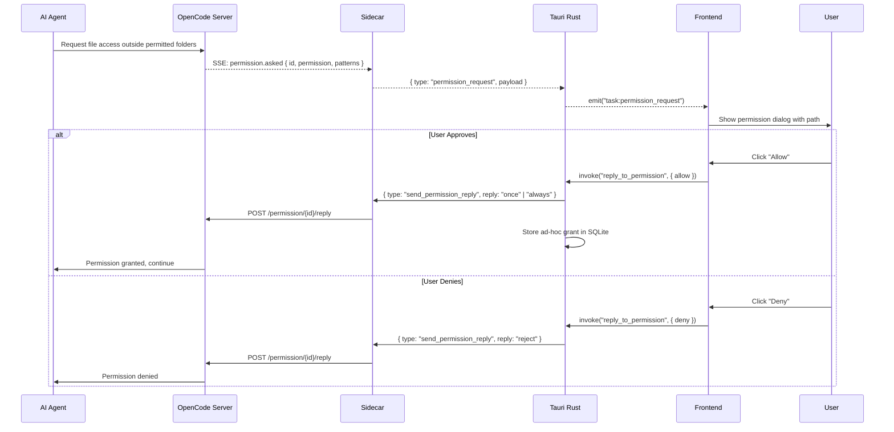
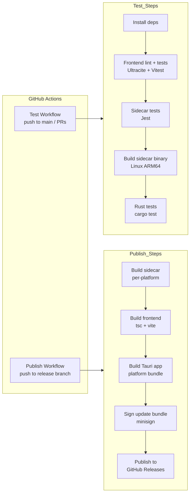

# Cowork-Z Architecture Documentation

Comprehensive architecture documentation for Cowork-Z, a local-first desktop AI agent built with Tauri 2.x.

**Version:** 0.4.0
**Last Updated:** 2026-07-03

---

## Table of Contents

1. [System Architecture](#1-system-architecture)
2. [Frontend Architecture](#2-frontend-architecture)
3. [Backend Architecture](#3-backend-architecture)
4. [Data Architecture](#4-data-architecture)
5. [IPC Protocol](#5-ipc-protocol)
6. [Security Architecture](#6-security-architecture)
7. [Deployment & CI/CD](#7-deployment--cicd)
8. [Architecture Decision Records](#8-architecture-decision-records)

---

## 1. System Architecture

Cowork-Z is a local-first desktop application that provides a sandboxed environment for autonomous AI agents. It runs entirely on the user's machine, with no cloud services beyond the AI provider APIs themselves. The system is a Tauri 2.x multi-process architecture: the React frontend talks to the Rust backend over Tauri IPC, the Rust backend manages a Node.js sidecar over stdin/stdout JSON-line, and the sidecar drives an `opencode serve` instance over HTTP/SSE.

<div style="width: 1200px; box-sizing: border-box; position: relative; background: #fafbff; padding: 20px; border-radius: 10px;">
  <style scoped>
    .arch-wrapper { display: flex; gap: 12px; }.arch-sidebar { width: 165px; flex-shrink: 0; }.arch-main { flex: 1; min-width: 0; }.arch-title { text-align: center; font-size: 22px; font-weight: bold; color: #1e293b; margin-bottom: 4px; }.arch-subtitle { text-align: center; font-size: 11px; color: #64748b; margin-bottom: 14px; }
    .arch-layer { margin: 8px 0; padding: 14px; border-radius: 8px; box-shadow: 0 2px 8px rgba(0, 0, 0, 0.04); }.arch-layer-title { font-size: 13px; font-weight: bold; margin-bottom: 10px; text-align: center; }
    .arch-grid { display: grid; gap: 8px; }.arch-grid-2 { grid-template-columns: repeat(2, 1fr); }.arch-grid-3 { grid-template-columns: repeat(3, 1fr); }.arch-grid-4 { grid-template-columns: repeat(4, 1fr); }.arch-grid-5 { grid-template-columns: repeat(5, 1fr); }.arch-grid-6 { grid-template-columns: repeat(6, 1fr); }
    .arch-box { border-radius: 6px; padding: 8px; text-align: center; font-size: 11px; font-weight: 600; line-height: 1.35; color: #1e293b; background: #ffffff; border: 1px solid #e2e8f0; }.arch-box.highlight { background: linear-gradient(135deg, #dbeafe 0%, #bfdbfe 100%); border: 2px solid #2563eb; }.arch-box.tech { font-size: 10px; color: #475569; background: #f8fafc; }
    .arch-layer.external { background: linear-gradient(135deg, #f8fafc 0%, #f1f5f9 100%); border: 2px dashed #94a3b8; }.arch-layer.external .arch-layer-title { color: #64748b; }.arch-layer.user { background: linear-gradient(135deg, #dbeafe 0%, #bfdbfe 100%); border: 2px solid #3b82f6; }.arch-layer.user .arch-layer-title { color: #1e40af; }.arch-layer.application { background: linear-gradient(135deg, #fef3c7 0%, #fde68a 100%); border: 2px solid #eab308; }.arch-layer.application .arch-layer-title { color: #854d0e; }.arch-layer.ai { background: linear-gradient(135deg, #dcfce7 0%, #bbf7d0 100%); border: 2px solid #22c55e; }.arch-layer.ai .arch-layer-title { color: #15803d; }.arch-layer.data { background: linear-gradient(135deg, #fce7f3 0%, #fbcfe8 100%); border: 2px solid #ec4899; }.arch-layer.data .arch-layer-title { color: #9d174d; }.arch-layer.infra { background: linear-gradient(135deg, #e0e7ff 0%, #c7d2fe 100%); border: 2px solid #6366f1; }.arch-layer.infra .arch-layer-title { color: #4338ca; }
    .arch-sidebar-panel { border-radius: 8px; padding: 10px; background: linear-gradient(135deg, #f3f4f6 0%, #e5e7eb 100%); border: 1px solid #9ca3af; margin-bottom: 8px; }.arch-sidebar-title { font-size: 12px; font-weight: bold; text-align: center; color: #1e293b; margin-bottom: 6px; }.arch-sidebar-item { font-size: 10px; text-align: center; color: #374151; background: #ffffff; padding: 5px; border-radius: 5px; margin: 3px 0; border: 1px solid #e5e7eb; }.arch-sidebar-item.metric { background: #dbeafe; border: 1px solid #3b82f6; color: #1e40af; font-weight: 600; }
    .arch-subgroup-box { border-radius: 6px; padding: 8px; background: rgba(255, 255, 255, 0.5); border: 1px solid rgba(0, 0, 0, 0.08); margin: 6px 0; }.arch-subgroup-title { font-size: 10px; font-weight: bold; color: #374151; text-align: center; margin-bottom: 6px; }
    .arch-flow { text-align: center; font-size: 10px; font-weight: 600; color: #64748b; margin: 2px 0; }
  </style>
  <div class="arch-title">Cowork-Z — System Architecture</div>
  <div class="arch-subtitle">Tauri 2.x desktop app · sandboxed autonomous AI agents · OpenCode SDK integration</div>
  <div class="arch-wrapper">
    <div class="arch-sidebar">
      <div class="arch-sidebar-panel"><div class="arch-sidebar-title">App Startup</div><div class="arch-sidebar-item">Skill deploy → ~/.config/opencode/skills</div><div class="arch-sidebar-item">Repo sync (git pull / shallow clone)</div><div class="arch-sidebar-item">Sidecar binary build (beforeDevCommand)</div></div>
      <div class="arch-sidebar-panel"><div class="arch-sidebar-title">Runtime Events</div><div class="arch-sidebar-item">task:* (started, permission, question, todo)</div><div class="arch-sidebar-item">skills:changed / sync_progress</div><div class="arch-sidebar-item">workspace:fs_changed (300ms debounce)</div><div class="arch-sidebar-item">copilot:oauth_result</div></div>
      <div class="arch-sidebar-panel"><div class="arch-sidebar-title">Dev Tooling</div><div class="arch-sidebar-item">pnpm tauri dev</div><div class="arch-sidebar-item">Vite 7 HMR · port 1420</div><div class="arch-sidebar-item">tsc + cargo check</div><div class="arch-sidebar-item">Ultracite (Biome)</div></div>
      <div class="arch-sidebar-panel"><div class="arch-sidebar-title">Testing</div><div class="arch-sidebar-item">Vitest (jsdom)</div><div class="arch-sidebar-item">Jest (sidecar)</div><div class="arch-sidebar-item">cargo test</div></div>
    </div>
    <div class="arch-main">
      <div class="arch-layer user">
        <div class="arch-layer-title">Frontend — WebView (React 19 · TypeScript 5.8)</div>
        <div class="arch-grid arch-grid-3"><div class="arch-box">Home.tsx<br><small>Task launcher — /</small></div><div class="arch-box">Execution.tsx<br><small>Task chat — /execution/:id</small></div><div class="arch-box">Skills Manager<br><small>Separate window — /#/skills</small></div><div class="arch-box tech">Zustand stores<br><small>taskStore · workspaceStore · filePreviewStore · skillsStore</small></div><div class="arch-box tech">UI Components<br><small>Radix UI + shadcn/ui · Tailwind CSS 3.4</small></div><div class="arch-box highlight">tauri-api.ts<br><small>Frontend ↔ Rust contract (invoke / listen)</small></div></div>
      </div>
      <div class="arch-flow">⇅ Tauri IPC — invoke() commands / emitted events</div>
      <div class="arch-layer application">
        <div class="arch-layer-title">Backend — Tauri Rust Core (src-tauri)</div>
        <div class="arch-grid arch-grid-3"><div class="arch-box">lib.rs<br><small>Entry point · plugins · menu · command registry</small></div><div class="arch-box">commands/<br><small>Handlers by domain: tasks, settings, skills, workspaces…</small></div><div class="arch-box highlight">sidecar.rs<br><small>Process lifecycle · IPC serialization · event routing</small></div><div class="arch-box tech">db/<br><small>SQLite persistence · migrations</small></div><div class="arch-box tech">fs_watcher.rs · git_ops.rs<br><small>FS watch · repo clone/pull</small></div><div class="arch-box tech">secure_storage.rs · workspace_validator.rs<br><small>Keychain wrapper · path validation</small></div></div>
      </div>
      <div class="arch-flow">⇅ stdin/stdout JSON-line — SidecarCommand ↓ · SidecarEvent ↑ (snake_case)</div>
      <div class="arch-layer ai">
        <div class="arch-layer-title">Agent Runtime — Sidecar + OpenCode Server</div>
        <div class="arch-subgroup-box"><div class="arch-subgroup-title">Node.js Sidecar (CommonJS · pkg standalone binary)</div><div class="arch-grid arch-grid-4"><div class="arch-box">session-manager.ts<br><small>Session lifecycle</small></div><div class="arch-box">opencode-client.ts<br><small>REST client</small></div><div class="arch-box">event-stream.ts<br><small>SSE client</small></div><div class="arch-box highlight">types.ts<br><small>IPC protocol source of truth</small></div></div></div>
        <div class="arch-flow">⇅ HTTP REST + SSE — basic auth opencode:&lt;password&gt; · ephemeral port</div>
        <div class="arch-subgroup-box"><div class="arch-subgroup-title">opencode serve (spawned child process)</div><div class="arch-grid arch-grid-4"><div class="arch-box tech">GET /event<br><small>SSE · ?directory=workspace</small></div><div class="arch-box tech">POST /session/{id}/message<br><small>System prompt injected per call</small></div><div class="arch-box tech">permission / question reply<br><small>POST …/reply</small></div><div class="arch-box tech">PATCH /config<br><small>MCP config updates</small></div></div></div>
      </div>
      <div class="arch-layer data">
        <div class="arch-layer-title">Data &amp; Storage</div>
        <div class="arch-grid arch-grid-4"><div class="arch-box">SQLite<br><small>rusqlite · WAL · cowork.db / cowork-dev.db</small></div><div class="arch-box highlight">OS Keychain<br><small>keyring crate · provider API keys</small></div><div class="arch-box tech">OPENCODE_DATA_DIR<br><small>opencode.json · config.json</small></div><div class="arch-box tech">Bundled resources/<br><small>Skills · skill templates · workspace packs</small></div></div>
      </div>
      <div class="arch-layer external">
        <div class="arch-layer-title">External Services</div>
        <div class="arch-grid arch-grid-4"><div class="arch-box tech">AI Providers<br><small>Anthropic · OpenAI · Google · Bedrock · Azure Foundry · OpenRouter · Ollama · LiteLLM</small></div><div class="arch-box tech">GitHub Copilot<br><small>OAuth device flow</small></div><div class="arch-box tech">Skill Repos<br><small>git clone --depth 1 / pull</small></div><div class="arch-box tech">OpenCode CLI<br><small>npm i -g opencode-ai (prerequisite)</small></div></div>
      </div>
    </div>
    <div class="arch-sidebar">
      <div class="arch-sidebar-panel"><div class="arch-sidebar-title">Security</div><div class="arch-sidebar-item metric">API keys in OS Keychain</div><div class="arch-sidebar-item metric">Random server password per launch</div><div class="arch-sidebar-item">Capabilities: default · desktop · skills</div><div class="arch-sidebar-item">Workspace path validation</div><div class="arch-sidebar-item">apiKeysFingerprint (no key material in IPC)</div></div>
      <div class="arch-sidebar-panel"><div class="arch-sidebar-title">IPC Protocol</div><div class="arch-sidebar-item">SidecarCommand ↓ start_task, resume_session, abort_session…</div><div class="arch-sidebar-item">SidecarEvent ↑ task_message, permission_request, todo_updated…</div><div class="arch-sidebar-item">request_api_keys ↔ api_keys_response</div></div>
      <div class="arch-sidebar-panel"><div class="arch-sidebar-title">Platform</div><div class="arch-sidebar-item">macOS ARM64 / x64</div><div class="arch-sidebar-item">Windows x64 (WinNAT port checks)</div><div class="arch-sidebar-item">Linux x64 / ARM64</div><div class="arch-sidebar-item">Login-shell PATH merge (GUI launch)</div></div>
    </div>
  </div>
</div>

### Reading the Diagram

- **Blue (Frontend)** — everything running in the Tauri WebView. `tauri-api.ts` is the single bridge: all `invoke()` calls and event subscriptions go through it.
- **Amber (Backend)** — the Rust core. `sidecar.rs` owns the sidecar process and translates between Tauri events and the JSON-line IPC protocol.
- **Green (Agent Runtime)** — two processes: the Node.js sidecar (built as a standalone `pkg` binary) and the `opencode serve` instance it spawns and authenticates against.
- **Pink (Data)** — task history in SQLite, secrets in the OS Keychain (never in the DB or IPC payloads), and OpenCode config files written before server spawn.
- **Dashed gray (External)** — LLM provider APIs reached by the OpenCode server, plus git-based skill repos synced by the Rust backend.
- The **⇅ flow bars** mark the three process/transport boundaries: Tauri IPC, stdin/stdout JSON-line, and HTTP/SSE with basic auth.

---

## 2. Frontend Architecture

The frontend is a React 19 + TypeScript single-page app rendered in the system WebView, routed with react-router-dom (`HashRouter`). All communication with the Rust backend flows through a single bridge module (`tauri-api.ts`), and state lives in domain-scoped Zustand stores.

### Frontend Architecture Diagram

<div style="width: 1200px; box-sizing: border-box; position: relative; background: #fafbff; padding: 20px; border-radius: 10px;">
  <style scoped>
    .arch-main { min-width: 0; }.arch-title { text-align: center; font-size: 22px; font-weight: bold; color: #1e293b; margin-bottom: 4px; }.arch-subtitle { text-align: center; font-size: 11px; color: #64748b; margin-bottom: 14px; }
    .arch-layer { margin: 8px 0; padding: 14px; border-radius: 8px; box-shadow: 0 2px 8px rgba(0, 0, 0, 0.04); }.arch-layer-title { font-size: 13px; font-weight: bold; margin-bottom: 10px; text-align: center; }
    .arch-grid { display: grid; gap: 8px; }.arch-grid-2 { grid-template-columns: repeat(2, 1fr); }.arch-grid-3 { grid-template-columns: repeat(3, 1fr); }.arch-grid-4 { grid-template-columns: repeat(4, 1fr); }.arch-grid-5 { grid-template-columns: repeat(5, 1fr); }.arch-grid-6 { grid-template-columns: repeat(6, 1fr); }
    .arch-box { border-radius: 6px; padding: 8px; text-align: center; font-size: 11px; font-weight: 600; line-height: 1.35; color: #1e293b; background: #ffffff; border: 1px solid #e2e8f0; }.arch-box.highlight { background: linear-gradient(135deg, #dbeafe 0%, #bfdbfe 100%); border: 2px solid #2563eb; }.arch-box.tech { font-size: 10px; color: #475569; background: #f8fafc; }
    .arch-layer.external { background: linear-gradient(135deg, #f8fafc 0%, #f1f5f9 100%); border: 2px dashed #94a3b8; }.arch-layer.external .arch-layer-title { color: #64748b; }.arch-layer.user { background: linear-gradient(135deg, #dbeafe 0%, #bfdbfe 100%); border: 2px solid #3b82f6; }.arch-layer.user .arch-layer-title { color: #1e40af; }.arch-layer.application { background: linear-gradient(135deg, #fef3c7 0%, #fde68a 100%); border: 2px solid #eab308; }.arch-layer.application .arch-layer-title { color: #854d0e; }.arch-layer.ai { background: linear-gradient(135deg, #dcfce7 0%, #bbf7d0 100%); border: 2px solid #22c55e; }.arch-layer.ai .arch-layer-title { color: #15803d; }.arch-layer.infra { background: linear-gradient(135deg, #e0e7ff 0%, #c7d2fe 100%); border: 2px solid #6366f1; }.arch-layer.infra .arch-layer-title { color: #4338ca; }
    .arch-subgroup-box { border-radius: 6px; padding: 8px; background: rgba(255, 255, 255, 0.5); border: 1px solid rgba(0, 0, 0, 0.08); margin: 6px 0; }.arch-subgroup-title { font-size: 10px; font-weight: bold; color: #374151; text-align: center; margin-bottom: 6px; }
    .arch-flow { text-align: center; font-size: 10px; font-weight: 600; color: #64748b; margin: 2px 0; }
  </style>
  <div class="arch-title">Cowork-Z — Frontend Architecture</div>
  <div class="arch-subtitle">React 19 · TypeScript 5.8 · Vite 7 · Zustand 5 · rendered in the Tauri WebView</div>
  <div class="arch-main">
    <div class="arch-layer user">
      <div class="arch-layer-title">Pages &amp; Windows (react-router-dom · HashRouter)</div>
      <div class="arch-grid arch-grid-5"><div class="arch-box">App.tsx<br><small>Root: routes · shortcuts · theme · dialogs</small></div><div class="arch-box">Home.tsx<br><small>Task launcher — /</small></div><div class="arch-box">Execution.tsx<br><small>Task chat — /execution/:id</small></div><div class="arch-box">Arena.tsx<br><small>Model arena — /arena/:arenaId</small></div><div class="arch-box">SkillsManager.tsx<br><small>Separate window — /skills</small></div></div>
    </div>
    <div class="arch-layer application">
      <div class="arch-layer-title">Component Library (Radix UI + shadcn/ui · Tailwind CSS 3.4)</div>
      <div class="arch-grid arch-grid-4"><div class="arch-box">layout/<br><small>Sidebar · SettingsDialog · About / Update dialogs</small></div><div class="arch-box">chat/<br><small>Message list · tool call cards · streaming UI</small></div><div class="arch-box">sidebar/<br><small>FileTree · Todo · Artifacts · Folder panels</small></div><div class="arch-box">landing/<br><small>TaskInputBar · drag-drop integration</small></div><div class="arch-box">settings/<br><small>Provider forms · MCP JSON editor</small></div><div class="arch-box">file-preview/<br><small>Code · Markdown · Media preview</small></div><div class="arch-box">skills-manager/<br><small>Repo management · skill grid</small></div><div class="arch-box">markdown/ · media/<br><small>Rich rendering · thumbnails</small></div><div class="arch-box">TaskLauncher/<br><small>Cmd+K command palette</small></div><div class="arch-box">arena/<br><small>Model comparison UI</small></div><div class="arch-box tech">ui/<br><small>Radix + shadcn/ui primitives</small></div></div>
    </div>
    <div class="arch-layer ai">
      <div class="arch-layer-title">State &amp; Hooks</div>
      <div class="arch-subgroup-box"><div class="arch-subgroup-title">Zustand Stores (src/stores)</div><div class="arch-grid arch-grid-4"><div class="arch-box highlight">taskStore<br><small>Tasks · permissions · questions · todos · UI state</small></div><div class="arch-box">workspaceStore<br><small>Workspace list · active workspace</small></div><div class="arch-box">filePreviewStore<br><small>Preview panel · fullscreen</small></div><div class="arch-box">skillsStore<br><small>Installed skills · autocomplete</small></div><div class="arch-box">skillsManagerStore<br><small>Repos · repo skills · target folder</small></div><div class="arch-box">arenaStore<br><small>Arena sessions · results</small></div><div class="arch-box">automationStore<br><small>Scheduled automations</small></div></div></div>
      <div class="arch-subgroup-box"><div class="arch-subgroup-title">Hooks (src/hooks)</div><div class="arch-grid arch-grid-3"><div class="arch-box tech">useKeyboardShortcuts<br><small>Cmd+, · Cmd+N · Cmd+K · Cmd+Enter · Esc</small></div><div class="arch-box tech">useTheme<br><small>Theme persistence · OS dark mode</small></div><div class="arch-box tech">useAppUpdate<br><small>Auto-update lifecycle</small></div><div class="arch-box tech">useFileTree<br><small>Lazy-loading workspace tree</small></div><div class="arch-box tech">useSkillAutocomplete<br><small>Slash-command skills</small></div><div class="arch-box tech">useMcpRuntime<br><small>MCP runtime status</small></div></div></div>
    </div>
    <div class="arch-layer infra">
      <div class="arch-layer-title">API Bridge &amp; Shared</div>
      <div class="arch-grid arch-grid-4"><div class="arch-box highlight">tauri-api.ts<br><small>All invoke() / listen() calls — frontend ↔ Rust contract</small></div><div class="arch-box">tauri-api-interface.ts<br><small>TauriAPI abstraction</small></div><div class="arch-box tech">shared/types<br><small>task · workspace · provider · permission · opencode</small></div><div class="arch-box tech">lib/ utilities<br><small>animations · themes · analytics · file utils</small></div></div>
    </div>
    <div class="arch-flow">⇅ Tauri IPC — invoke() commands / listen() events</div>
    <div class="arch-layer external">
      <div class="arch-layer-title">Tauri Rust Backend (native process)</div>
      <div class="arch-grid arch-grid-3"><div class="arch-box tech">commands/<br><small>invoke() targets by domain</small></div><div class="arch-box tech">Emitted events<br><small>task:* · skills:* · workspace:* · copilot:*</small></div><div class="arch-box tech">Asset protocol<br><small>Local file preview</small></div></div>
    </div>
  </div>
</div>

### Frontend Structure

```
src/
  App.tsx                       # Root: routing, keyboard shortcuts, theme, dialogs
  main.tsx                      # React entry point (HashRouter)
  pages/
    Home.tsx                    # Task launcher and empty state
    Execution.tsx               # Active task chat view with streaming
    Arena.tsx                   # Multi-model comparison view
    SkillsManager.tsx           # Skills Manager window (separate Tauri window)
  stores/
    taskStore.ts                # Tasks, permissions, questions, todos, artifacts, UI state
    workspaceStore.ts           # Workspace list, active workspace, switchWorkspace()
    filePreviewStore.ts         # File preview panel state, fullscreen toggle
    skillsStore.ts              # Installed skills for slash-command autocomplete
    skillsManagerStore.ts       # Skills Manager window state: repos, skills, target folder
    arenaStore.ts               # Arena sessions and results
    automationStore.ts          # Scheduled automations
  lib/
    tauri-api.ts                # All Tauri invoke() and listen() calls
    tauri-api-interface.ts      # TauriAPI interface abstraction
    ...                         # animations, analytics, themes, file/markdown utilities
  hooks/
    useKeyboardShortcuts.ts     # Cmd+, / Cmd+N / Cmd+K / Cmd+Enter / Escape
    useTheme.ts                 # Theme persistence and OS dark-mode detection
    useAppUpdate.ts             # Auto-update lifecycle
    useFileTree.ts              # Lazy-loading workspace file tree
    useSkillAutocomplete.ts     # Slash-command skill autocomplete
    useMcpRuntime.ts            # MCP runtime status
  components/
    layout/                     # App shell: Sidebar, SettingsDialog, About/Update dialogs
    chat/                       # Message list, tool call cards, streaming UI
    sidebar/                    # FileTreePanel, TodoPanel, ArtifactsPanel, FolderPanel
    landing/                    # TaskInputBar and drag-drop integration
    settings/                   # Provider configuration forms, MCP JSON editor
    file-preview/               # Code/Markdown/Media preview panel
    skills-manager/             # Skills Manager window UI
    markdown/ + media/          # Rich message rendering, image/video previews
    TaskLauncher/               # Cmd+K command palette
    arena/                      # Arena comparison UI
    ui/                         # Radix + shadcn/ui primitives
  shared/
    types/                      # task, workspace, provider, permission, mcp, opencode types
    constants.ts                # App-wide constants
```

### State Management

State is split across domain-scoped Zustand stores. The primary store is `taskStore.ts`:

| State Slice | Purpose |
|------------|---------|
| `currentTask` | Active task being executed |
| `tasks` | Task history array |
| `partialMessages` | `Map<string, PartialMessage>` for streaming tokens |
| `permissionRequest` | Current pending permission dialog |
| `todos` | `Map<taskId, Todo[]>` per-task todo items |
| `artifacts` | `Map<taskId, Artifact[]>` per-task created/modified files |
| `startupStage` | Task initialization progress indicator |
| `showSettings` / `showAbout` / `showCliMissing` | Dialog visibility flags |

Supporting stores: `workspaceStore` (workspace lifecycle, SSE reconnection on switch), `filePreviewStore`, `skillsStore`, `skillsManagerStore`, `arenaStore`, `automationStore`.

### Routing

| Path | Page | Purpose |
|------|------|---------|
| `/` | `Home.tsx` | Task launcher, empty state |
| `/execution/:id` | `Execution.tsx` | Active task chat view |
| `/arena/:arenaId` | `Arena.tsx` | Multi-model comparison |
| `/skills` | `SkillsManager.tsx` | Skills Manager window (standalone layout, no sidebar) |
| `*` | Redirect to `/` | Catch-all |

---

## 3. Backend Architecture

The backend spans two processes: the **Tauri Rust core** (native process — command handlers, persistence, secure storage, process management) and the **Node.js sidecar** it spawns (protocol bridge to the OpenCode server). The IPC protocol between them is defined in `types.ts` — the single source of truth.

### Backend Architecture Diagram

<div style="width: 1200px; box-sizing: border-box; position: relative; background: #fafbff; padding: 20px; border-radius: 10px;">
  <style scoped>
    .arch-main { min-width: 0; }.arch-title { text-align: center; font-size: 22px; font-weight: bold; color: #1e293b; margin-bottom: 4px; }.arch-subtitle { text-align: center; font-size: 11px; color: #64748b; margin-bottom: 14px; }
    .arch-layer { margin: 8px 0; padding: 14px; border-radius: 8px; box-shadow: 0 2px 8px rgba(0, 0, 0, 0.04); }.arch-layer-title { font-size: 13px; font-weight: bold; margin-bottom: 10px; text-align: center; }
    .arch-grid { display: grid; gap: 8px; }.arch-grid-2 { grid-template-columns: repeat(2, 1fr); }.arch-grid-3 { grid-template-columns: repeat(3, 1fr); }.arch-grid-4 { grid-template-columns: repeat(4, 1fr); }.arch-grid-5 { grid-template-columns: repeat(5, 1fr); }.arch-grid-6 { grid-template-columns: repeat(6, 1fr); }
    .arch-box { border-radius: 6px; padding: 8px; text-align: center; font-size: 11px; font-weight: 600; line-height: 1.35; color: #1e293b; background: #ffffff; border: 1px solid #e2e8f0; }.arch-box.highlight { background: linear-gradient(135deg, #dbeafe 0%, #bfdbfe 100%); border: 2px solid #2563eb; }.arch-box.tech { font-size: 10px; color: #475569; background: #f8fafc; }
    .arch-layer.external { background: linear-gradient(135deg, #f8fafc 0%, #f1f5f9 100%); border: 2px dashed #94a3b8; }.arch-layer.external .arch-layer-title { color: #64748b; }.arch-layer.user { background: linear-gradient(135deg, #dbeafe 0%, #bfdbfe 100%); border: 2px solid #3b82f6; }.arch-layer.user .arch-layer-title { color: #1e40af; }.arch-layer.application { background: linear-gradient(135deg, #fef3c7 0%, #fde68a 100%); border: 2px solid #eab308; }.arch-layer.application .arch-layer-title { color: #854d0e; }.arch-layer.ai { background: linear-gradient(135deg, #dcfce7 0%, #bbf7d0 100%); border: 2px solid #22c55e; }.arch-layer.ai .arch-layer-title { color: #15803d; }.arch-layer.data { background: linear-gradient(135deg, #fce7f3 0%, #fbcfe8 100%); border: 2px solid #ec4899; }.arch-layer.data .arch-layer-title { color: #9d174d; }
    .arch-flow { text-align: center; font-size: 10px; font-weight: 600; color: #64748b; margin: 2px 0; }
  </style>
  <div class="arch-title">Cowork-Z — Backend Architecture</div>
  <div class="arch-subtitle">Tauri Rust core (native process) + Node.js sidecar (child process) · JSON-line IPC over stdin/stdout</div>
  <div class="arch-main">
    <div class="arch-flow">⇅ Tauri IPC — invoke() from React frontend / events emitted back</div>
    <div class="arch-layer user">
      <div class="arch-layer-title">Command Layer (src-tauri/src/commands — handlers by domain)</div>
      <div class="arch-grid arch-grid-4"><div class="arch-box">Tasks &amp; Sessions<br><small>tasks.rs</small></div><div class="arch-box">Settings · Providers · Keys<br><small>settings.rs · providers.rs · api_keys.rs</small></div><div class="arch-box">Workspaces &amp; Files<br><small>workspaces.rs · files.rs · workspace_permissions.rs</small></div><div class="arch-box">Skills &amp; Packs<br><small>skills.rs · skill_repos.rs · packs.rs</small></div><div class="arch-box">Automations &amp; Arena<br><small>automations.rs · arena.rs</small></div><div class="arch-box">Provider Integrations<br><small>ollama · bedrock · azure_foundry · litellm · copilot</small></div><div class="arch-box">MCP &amp; OpenCode CLI<br><small>mcp.rs · opencode_cli.rs</small></div><div class="arch-box">App<br><small>updates.rs · app_info.rs · logging.rs</small></div></div>
    </div>
    <div class="arch-layer application">
      <div class="arch-layer-title">Core Services (src-tauri/src)</div>
      <div class="arch-grid arch-grid-4"><div class="arch-box">lib.rs<br><small>Entry point · plugins · menu · command registry</small></div><div class="arch-box highlight">sidecar.rs<br><small>Sidecar lifecycle · SidecarCommand enum · event routing</small></div><div class="arch-box">automation_scheduler.rs<br><small>+ automation_dispatch.rs — scheduled runs</small></div><div class="arch-box">fs_watcher.rs<br><small>300ms debounce → workspace:fs_changed</small></div><div class="arch-box">git_ops.rs · skill_discovery.rs<br><small>Repo clone/pull · SKILL.md scan</small></div><div class="arch-box">secure_storage.rs<br><small>OS Keychain (keyring crate)</small></div><div class="arch-box">workspace_validator.rs · path_guard.rs<br><small>Path validation · FS safety</small></div><div class="arch-box tech">types.rs · fs_utils.rs · lock_util.rs<br><small>Shared types · helpers</small></div></div>
    </div>
    <div class="arch-layer data">
      <div class="arch-layer-title">Persistence (src-tauri/src/db)</div>
      <div class="arch-grid arch-grid-4"><div class="arch-box highlight">SQLite<br><small>rusqlite · WAL · cowork.db / cowork-dev.db</small></div><div class="arch-box">Domain modules<br><small>tasks · settings · providers · workspaces · workspace_permissions · skill_repos · automations · arenas</small></div><div class="arch-box">migrations.rs<br><small>Versioned schema · auto-run on startup</small></div><div class="arch-box highlight">OS Keychain<br><small>com.kevinlin.cowork-z — API keys never in DB</small></div></div>
    </div>
    <div class="arch-flow">⇅ stdin/stdout JSON-line — SidecarCommand ↓ · SidecarEvent ↑ (defined in types.ts)</div>
    <div class="arch-layer ai">
      <div class="arch-layer-title">Node.js Sidecar (src-tauri/sidecar-opencode — CommonJS · pkg binary)</div>
      <div class="arch-grid arch-grid-3"><div class="arch-box">index.ts<br><small>Entry point: stdin listener · command dispatch</small></div><div class="arch-box">command-queue.ts<br><small>Serializes inbound commands</small></div><div class="arch-box highlight">types.ts<br><small>IPC + OpenCode API types — source of truth</small></div><div class="arch-box">session-manager.ts<br><small>Session lifecycle · SSE event handling · sessionID → taskId</small></div><div class="arch-box">opencode-client.ts<br><small>REST client: session · message · permission · question · config</small></div><div class="arch-box">event-stream.ts<br><small>SSE client (eventsource) · auto-reconnect</small></div><div class="arch-box">config-builder.ts<br><small>OpenCode config · system prompts</small></div><div class="arch-box">process-manager.ts<br><small>Spawns opencode serve · port · password · PATH · health</small></div><div class="arch-box tech">redact.ts · logger.ts · paths.ts<br><small>Secret redaction · stderr logging · data dirs</small></div></div>
    </div>
    <div class="arch-flow">⇅ HTTP REST + SSE — basic auth opencode:&lt;password&gt; · 127.0.0.1 ephemeral port</div>
    <div class="arch-layer external">
      <div class="arch-layer-title">opencode serve (spawned child process)</div>
      <div class="arch-grid arch-grid-4"><div class="arch-box tech">GET /event<br><small>SSE · ?directory=workspace</small></div><div class="arch-box tech">POST /session/{id}/message<br><small>System prompt injected per call</small></div><div class="arch-box tech">permission / question reply<br><small>POST …/reply</small></div><div class="arch-box tech">PATCH /config · GET /global/health<br><small>Config updates · health check</small></div></div>
    </div>
  </div>
</div>

### 3.1 Rust Backend Components

```
src-tauri/src/
  main.rs                 # Tauri app entry point
  lib.rs                  # App setup: plugins, menu, state, command registration
  sidecar.rs              # Sidecar process lifecycle, IPC serialization, event routing
  types.rs                # Shared serializable Rust types
  secure_storage.rs       # OS Keychain integration (keyring crate)
  fs_watcher.rs           # Filesystem watcher (300ms debounce) -> workspace:fs_changed
  fs_utils.rs / path_guard.rs / lock_util.rs   # FS helpers, path safety, locking
  git_ops.rs              # Git operations (shallow clone, pull) for skill repo sync
  skill_discovery.rs      # Skill discovery: SKILL.md scan, skills.json manifest
  workspace_validator.rs  # Platform-aware workspace path validation
  automation_scheduler.rs # Scheduled automation runs
  automation_dispatch.rs  # Automation task dispatch
  commands/               # Tauri command handlers by domain
    tasks.rs, settings.rs, api_keys.rs, providers.rs, workspaces.rs,
    workspace_permissions.rs, files.rs, skills.rs, skill_repos.rs, packs.rs,
    automations.rs, arena.rs, mcp.rs, copilot.rs, ollama.rs, bedrock.rs,
    azure_foundry.rs, litellm.rs, opencode_cli.rs, updates.rs, app_info.rs, logging.rs
  db/                     # SQLite persistence (WAL mode, foreign keys)
    mod.rs, migrations.rs, tasks.rs, settings.rs, providers.rs, workspaces.rs,
    workspace_permissions.rs, skill_repos.rs, automations.rs, arenas.rs
```

**Key Modules:**

| Module | Responsibility |
|--------|---------------|
| `lib.rs` | App entry: plugin/menu setup, state initialization, all Tauri `#[command]` handlers registered in `invoke_handler` |
| `commands/` | Command handlers organized by domain (one file per domain): task lifecycle, settings, providers, workspaces, skills, automations, arena |
| `sidecar.rs` | Defines `SidecarCommand` enum (Rust -> Sidecar) and parses `SidecarEvent` JSON (Sidecar -> Rust). Manages child process spawning, stdin writes, stdout parsing, Tauri event emission |
| `secure_storage.rs` | Wraps `keyring` crate. Service identifier: `com.kevinlin.cowork-z`. Supports 12 provider key types |
| `db/` | SQLite via `rusqlite`. WAL mode for concurrent reads. Auto-migrations on startup. Single-row pattern for `app_settings` and `provider_meta` |
| `automation_scheduler.rs` / `automation_dispatch.rs` | Schedules and dispatches recurring automation tasks |

### 3.2 Node.js Sidecar Components

```
src-tauri/sidecar-opencode/src/
  index.ts            # Entry point: stdin listener, dispatches commands
  command-queue.ts    # Serializes inbound command processing
  types.ts            # Single source of truth for IPC + OpenCode API types
  session-manager.ts  # Session lifecycle, SSE event handling, state tracking
  opencode-client.ts  # OpenCode HTTP REST client (session, message, permission, question, config)
  event-stream.ts     # SSE client wrapping eventsource library
  config-builder.ts   # Builds OpenCode config objects and system prompts
  process-manager.ts  # OpenCode CLI process spawning and health checks
  redact.ts           # Secret redaction for logs
  paths.ts            # Data directory resolution
  logger.ts           # Structured logging to stderr
```

**Key Classes:**

| Class | Responsibility |
|-------|---------------|
| `SessionManager` | Core orchestrator. Listens to SSE events, maps `sessionID` -> `taskId`, emits typed events (started, message-partial, message-complete, permission-request, question-request, error, complete) |
| `OpenCodeClient` | HTTP client for OpenCode REST API. Methods: `createSession`, `getSession`, `sendMessage`, `replyToPermission`, `replyToQuestion`, `updateConfig`, `abortSession`, `getHealth` |
| `EventStream` | Wraps `eventsource` npm library. Connects to `GET /event`, parses SSE data, emits typed events. Auto-reconnects on disconnect |
| `ProcessManager` | Spawns `opencode serve` with random port, `OPENCODE_SERVER_PASSWORD`, and augmented PATH. Health-checks via `GET /global/health` |

---

## 4. Data Architecture

### 4.1 Database Schema

SQLite database located at:
- **macOS:** `~/Library/Application Support/cowork-z/cowork-dev.db` (dev) / `cowork.db` (prod)
- **Windows:** `%APPDATA%/Cowork-Z/`
- **Linux:** `~/.local/share/cowork-z/`



### 4.2 Schema Configuration

- **Journal mode:** WAL (Write-Ahead Logging) for concurrent read/write
- **Foreign keys:** Enabled with `ON DELETE CASCADE`
- **Migrations:** Versioned via `schema_meta` table, auto-run on startup
- **Single-row tables:** `app_settings` and `provider_meta` use `CHECK (id = 1)` constraint

### 4.3 Credential Storage

API keys are **never** stored in the database. They are stored in the OS-native keychain:

| Platform | Backend | Service Identifier |
|----------|---------|-------------------|
| macOS | Keychain | `com.kevinlin.cowork-z` |
| Windows | Credential Manager | `com.kevinlin.cowork-z` |
| Linux | Secret Service (D-Bus) | `com.kevinlin.cowork-z` |

Supported providers: `anthropic`, `openai`, `google`, `xai`, `ollama`, `deepseek`, `zai`, `azure-foundry`, `bedrock`, `litellm`, `openrouter`, `custom`

---

## 5. IPC Protocol

The system uses three distinct IPC boundaries, each with its own protocol.

### 5.1 Frontend <-> Rust Backend (Tauri IPC)

**Mechanism:** `invoke()` for commands, `listen()` for events.



**Key Tauri Commands (60+):**

| Category | Commands |
|----------|----------|
| **Task Lifecycle** | `start_task`, `cancel_task`, `resume_session`, `abort_session` |
| **Permissions** | `reply_to_permission`, `get_folder_permissions`, `add_folder_permission`, `remove_folder_permission` |
| **Questions** | `reply_to_question` |
| **Settings** | `get_settings`, `set_setting`, `get_debug_mode`, `set_debug_mode` |
| **Providers** | `get_providers`, `set_active_provider`, `validate_api_key` |
| **Credentials** | `store_api_key`, `get_api_key`, `delete_api_key`, `has_api_key` |
| **Tasks DB** | `get_tasks`, `get_task`, `update_task_summary` |
| **App Info** | `get_version`, `get_platform`, `get_arch` |
| **MCP** | `get_mcp_config`, `save_mcp_config`, `update_mcp_config` |

**Key Tauri Events:**

| Event | Payload | Direction |
|-------|---------|-----------|
| `task:update` | `{ taskId, messages }` | Rust -> Frontend |
| `task:update_batch` | `{ taskId, messages[] }` | Rust -> Frontend |
| `task:permission_request` | `{ id, taskId, permission, patterns, metadata }` | Rust -> Frontend |
| `task:question_request` | `{ id, taskId, questions }` | Rust -> Frontend |
| `task:setup_progress` | `{ taskId, stage, message }` | Rust -> Frontend |
| `task:todo_updated` | `{ taskId, todos }` | Rust -> Frontend |
| `show-about` | `{}` | Rust -> Frontend (menu) |

### 5.2 Rust Backend <-> Node.js Sidecar (JSON-line IPC)

**Mechanism:** JSON-line messages over stdin (commands) and stdout (events).

**Commands (Rust -> Sidecar):**

```typescript
type SidecarCommand =
  | { type: "start_task"; taskId: string; payload: StartTaskPayload }
  | { type: "resume_session"; taskId: string; payload: ResumeSessionPayload }
  | { type: "cancel_task"; taskId: string }
  | { type: "abort_session"; taskId: string; sessionId: string }
  | { type: "send_permission_reply"; taskId: string; payload: PermissionReplyPayload }
  | { type: "send_question_reply"; taskId: string; payload: QuestionReplyPayload }
  | { type: "get_session_todos"; taskId: string; sessionId: string }
  | { type: "update_mcp_config"; payload: UpdateMcpConfigPayload }
  | { type: "ping" }
  | { type: "check_server" };
```

**Events (Sidecar -> Rust):**

```typescript
type SidecarEvent =
  | { type: "ready"; payload: { version, serverAvailable, serverVersion } }
  | { type: "pong"; payload: { timestamp } }
  | { type: "server_status"; payload: { running, port, version } }
  | { type: "task_started"; taskId: string; payload: { taskId, sessionId } }
  | { type: "task_message_partial"; taskId: string; payload: { messageId, textSoFar, delta, isStreaming } }
  | { type: "task_message_complete"; taskId: string; payload: { messageId, text } }
  | { type: "task_progress"; taskId: string; payload: { stage } }
  | { type: "task_complete"; taskId: string; payload: { status, sessionId, error? } }
  | { type: "task_error"; taskId: string; payload: { error, sessionId? } }
  | { type: "permission_request"; taskId: string; payload: { id, sessionId, permission, patterns, metadata } }
  | { type: "question_request"; taskId: string; payload: { id, sessionId, questions } }
  | { type: "todo_updated"; taskId: string; payload: { todos } }
  | { type: "log"; payload: { level, message } }
  | { type: "error"; payload: { message } };
```

### 5.3 Sidecar <-> OpenCode Server (HTTP/SSE)

**Mechanism:** REST API for commands, Server-Sent Events for streaming.

| Endpoint | Method | Purpose |
|----------|--------|---------|
| `/event` | GET | SSE event stream for real-time updates |
| `/session` | POST | Create a new session |
| `/session/{id}` | GET | Get session details |
| `/session/{id}/message` | POST | Send message (with system prompt) |
| `/session/{id}/todo` | GET | Get session todos |
| `/permission/{id}/reply` | POST | Reply to permission request |
| `/question/{id}/reply` | POST | Reply to agent question |
| `/config` | PATCH | Update model, permissions, MCP config |
| `/global/health` | GET | Server health check |

**SSE Event Types:**

| Event | Payload Shape |
|-------|--------------|
| `session.status` | `{ sessionID, status: { type: "idle" \| "busy" \| "retry" } }` |
| `message.updated` | `{ info: MessageInfo }` |
| `message.part.updated` | `{ part: PartUpdate, delta? }` (sessionID/messageID nested in part) |
| `permission.asked` | `PermissionRequest` |
| `question.asked` | `QuestionRequest` |
| `todo.updated` | `{ sessionID, todos }` |
| `session.error` | `{ sessionID, error }` |
| `server.heartbeat` | `{}` (keepalive) |
| `server.instance.disposed` | `{ directory }` (triggers SSE reconnection) |

**Important:** `PATCH /config` causes the OpenCode server to dispose and recreate its instance, which terminates the SSE connection. The `eventsource` library auto-reconnects in ~1 second.

---

## 6. Security Architecture

### Security Boundary Diagram



### Defense-in-Depth Layers

| Layer | Mechanism | Details |
|-------|-----------|---------|
| **Credential Storage** | OS Keychain | All API keys stored via `keyring` crate. Never in database, config files, or logs. Only masked prefixes returned to frontend |
| **Server Isolation** | Random port + auth | OpenCode binds to `127.0.0.1` on random port. Random password generated per launch via `OPENCODE_SERVER_PASSWORD`. HTTP basic auth required on all requests |
| **Folder Permissions** | Explicit grant model | Default access: Desktop + Downloads only. All other paths require user approval via modal dialog. Grants stored per-task in SQLite |
| **Tauri Capabilities** | Declarative permissions | `capabilities/default.json` restricts shell permissions to `spawn`, `stdin-write`, `kill`, `open`. No arbitrary command execution from frontend |
| **Process Lifecycle** | Tied to app | Sidecar and OpenCode server start/stop with the app. No orphaned processes |
| **Update Signing** | minisign | Update bundles signed with private key in CI. Public key embedded in `tauri.conf.json`. Unsigned bundles rejected |
| **Asset Protocol** | Scoped access | Tauri asset protocol enabled with `**` scope for local file preview |

### Permission Flow



---

## 7. Deployment & CI/CD

### Build Pipeline



### Platform Build Matrix

| Platform | Target | Sidecar Binary | App Bundle |
|----------|--------|---------------|------------|
| macOS ARM64 | `aarch64-apple-darwin` | `sidecar-opencode-aarch64-apple-darwin` | `.dmg` |
| macOS x64 | `x86_64-apple-darwin` | `sidecar-opencode-x86_64-apple-darwin` | `.dmg` |
| Windows x64 | `x86_64-pc-windows-msvc` | `sidecar-opencode-x86_64-pc-windows-msvc.exe` | `.msi` / `.exe` |
| Linux x64 | `x86_64-unknown-linux-gnu` | `sidecar-opencode-x86_64-unknown-linux-gnu` | `.AppImage` / `.deb` |
| Linux ARM64 | `aarch64-unknown-linux-gnu` | `sidecar-opencode-aarch64-unknown-linux-gnu` | `.AppImage` / `.deb` |

### Sidecar Build Constraints

- **Must use CommonJS** — `pkg` bundler (`@yao-pkg/pkg`) has limited ESM support
- **No `.js` extensions** in TypeScript imports (CommonJS convention)
- **Node.js 20** target for `pkg` compilation
- **Single dependency** at runtime: `eventsource` (bundled into binary)

### Auto-Update Flow

1. App checks GitHub Releases endpoint on startup (after delay)
2. Compares latest version against `tauri.conf.json` version
3. Verifies update bundle signature using embedded public key
4. User prompted with version + release notes dialog
5. On "Update Now": download, install, restart

---

## 8. Architecture Decision Records

### ADR-001: OpenCode CLI over Embedded Agent Runtime

**Status:** Accepted
**Context:** Needed to choose between building a custom agent runtime or delegating to an existing one.
**Decision:** Delegate agent orchestration to the OpenCode CLI rather than implementing a custom agent runtime.
**Rationale:** OpenCode provides tool execution (file ops, bash, search), model API integration with 13+ providers, session management, and MCP support. Building these from scratch would be a massive undertaking with limited differentiation.
**Consequences:** Requires OpenCode to be installed globally (`npm install -g opencode-ai`). App depends on OpenCode's release cycle. Need CLI detection at startup.

### ADR-002: Node.js Sidecar over Direct Rust Integration

**Status:** Accepted
**Context:** OpenCode exposes an HTTP/SSE API. Need to bridge this to Tauri IPC.
**Decision:** Use a Node.js sidecar process bundled as a binary via `pkg`, rather than making HTTP calls from Rust directly or embedding the OpenCode SDK in Rust.
**Rationale:** OpenCode's JavaScript SDK provides the most natural integration. Node.js `eventsource` library handles SSE reconnection automatically. `pkg` bundles the sidecar into a self-contained binary. The original architecture considered a Python sidecar but switched to Node.js for better SDK alignment.
**Consequences:** Additional build step for sidecar binary. Must use CommonJS (pkg limitation). Adds ~50MB to app bundle. Separate test suite needed.

### ADR-003: JSON-line IPC over Unix Sockets

**Status:** Accepted
**Context:** Rust backend needs bidirectional communication with sidecar process.
**Decision:** Use JSON-line protocol over stdin/stdout of the child process.
**Rationale:** Simple, debuggable, no socket management. Tauri's `shell` plugin provides native stdin/stdout access. Each message is a single line of JSON, making parsing trivial. No port allocation or connection setup needed.
**Consequences:** All messages are serialized/deserialized as JSON. Binary data must be base64-encoded. Message ordering guaranteed by stdin/stdout stream semantics.

### ADR-004: SSE over WebSockets

**Status:** Accepted (OpenCode design choice)
**Context:** Need real-time streaming from OpenCode server to sidecar.
**Decision:** Use Server-Sent Events (SSE) rather than WebSockets.
**Rationale:** SSE is simpler (HTTP-based, unidirectional), supports automatic reconnection via the `eventsource` library, and is the protocol chosen by OpenCode. Commands go via REST API, events stream via SSE — clean separation.
**Consequences:** `PATCH /config` causes server instance disposal and SSE reconnection (~1s). Must not add manual reconnection logic on top of library auto-reconnect.

### ADR-005: OS Keychain for All Secrets

**Status:** Accepted
**Context:** Need secure storage for API keys across all supported platforms.
**Decision:** Store all credentials in the OS-native keychain — never in the database or config files.
**Rationale:** OS keychains provide hardware-backed security on macOS, encrypted storage on Windows, and D-Bus Secret Service on Linux. Users expect their credentials to be stored securely. Only masked key prefixes are ever sent to the frontend.
**Consequences:** Requires `keyring` crate (Rust). Cross-platform behavior varies (Linux requires running D-Bus Secret Service). Keys retrieved on-demand, not cached in memory long-term.

### ADR-006: Zustand for State Management

**Status:** Accepted
**Context:** Need a state management solution for the React frontend.
**Decision:** Use Zustand with a single global store rather than React Context, Redux, or multiple stores.
**Rationale:** Lightweight (~1KB), TypeScript-friendly with excellent type inference, no boilerplate (no actions/reducers), supports direct mutations, selective subscriptions prevent unnecessary re-renders. Single store simplifies state coordination between task lifecycle, permissions, UI state.
**Consequences:** All app state in one store can grow large. Map-based state slices (todos, artifacts, partialMessages) avoid serialization issues with Zustand devtools.

### ADR-007: Tied Process Lifecycle

**Status:** Accepted
**Context:** Need to manage sidecar and OpenCode server processes.
**Decision:** Start sidecar (and OpenCode server) on app launch, terminate on app quit. No independent lifecycle.
**Rationale:** Prevents orphaned processes. Simplifies process management. User expectation: opening the app starts AI capabilities, closing stops them. Random port and password per session ensures no stale connections.
**Consequences:** App startup includes sidecar + server initialization time. Cannot pre-warm server before app opens. Server state resets between sessions (by design for security).

---

## Cross-References

| Document | Location | Purpose |
|----------|----------|---------|
| Feature Requirements | [requirements.md](../specs/requirements.md) | Detailed acceptance criteria |
| Technical Design | [design.md](../specs/design.md) | Implementation-level design |
| Sidecar Rewrite Plan | [plan_sidecar-opencode-rewrite.md](../specs/opencode-sidecar/plan_sidecar-opencode-rewrite.md) | Sidecar architecture evolution |
| IPC Protocol Types | [types.ts](../../src-tauri/sidecar-opencode/src/types.ts) | Single source of truth for IPC |
| Tauri API Bridge | [tauri-api.ts](../../src/lib/tauri-api.ts) | Frontend-to-Rust contract |
| Tauri Config | [tauri.conf.json](../../src-tauri/tauri.conf.json) | App configuration |
