```mermaid
flowchart LR
    subgraph AUTH["Authentication Flow"]
        TOKEN["OAuth Token<br/>(sk-ant-oat01-*)"]
        HEADER["Authorization Header"]
        API_AUTH["API Authentication"]
    end

    TOKEN --> |"injected at spawn"| HEADER
    HEADER --> |"Bearer token"| API_AUTH
    API_AUTH --> |"✓ Validated"| INFERENCE["Model Inference"]

    style AUTH fill:#fff9c4,stroke:#f57f17
```

# Desktop UI Integration Analysis Report

## Executive Summary

This report analyzes the complete data flow from user interaction on the desktop UI through to the Claude Opus/Sonnet models running in Anthropic's cloud. The system implements a sophisticated pipeline that connects the local desktop application, through a sandboxed execution environment, to the Anthropic API for model inference.

---

## End-to-End System Architecture


---

## 1. User Interaction Layer

### 1.1 Desktop Application Shell

The Claude Desktop application is built on **Electron**, providing a native desktop experience:


| Component | Technology | Purpose |
|-----------|------------|---------|
| **Shell** | Electron 28+ | Cross-platform desktop wrapper |
| **UI Framework** | React | Chat interface, file browser |
| **IPC** | Electron IPC | Main ↔ Renderer communication |
| **State** | Local storage + API | Conversation persistence |

### 1.2 User Input Flow

When a user types a message:


---

## 2. SDK Daemon and Sandbox Orchestration

### 2.1 Daemon Architecture

The SDK daemon manages the lifecycle of sandboxed sessions:


### 2.2 Sandbox Initialization

When a new session starts:


---

## 3. Claude Binary and API Communication

### 3.1 The Claude Binary

The `claude` binary (212MB ARM64 ELF) is the core runtime:

| Aspect | Details |
|--------|---------|
| **Size** | 212,927,956 bytes |
| **Architecture** | ARM64 (aarch64) |
| **Linking** | Dynamically linked |
| **Interpreter** | /lib/ld-linux-aarch64.so.1 |
| **Function** | API client, tool orchestrator, conversation manager |

### 3.2 API Request Flow


### 3.3 Authentication

The sandbox receives an OAuth token via environment variable:

```
CLAUDE_CODE_OAUTH_TOKEN=sk-ant-oat01-...
ANTHROPIC_BASE_URL=https://api.anthropic.com
```



---

## 4. Model Inference in Anthropic Cloud

### 4.1 API Endpoint Processing


### 4.2 Model Selection

The Claude Code system dynamically selects models based on task:

| Model | Use Case | Characteristics |
|-------|----------|-----------------|
| **Claude Opus 4** | Complex reasoning, planning | Highest capability, slower |
| **Claude Sonnet 4** | General coding, tool use | Balanced speed/capability |
| **Claude Haiku** | Quick tasks, subagents | Fastest, cost-efficient |


### 4.3 Streaming Response

The API returns responses via Server-Sent Events (SSE):


---

## 5. Tool Use and Agentic Loop

### 5.1 Tool Execution Cycle

When Claude decides to use a tool:

```mermaid
flowchart TB
    subgraph CLOUD["☁️ Cloud (Model Inference)"]
        THINK["Claude thinks..."]
        DECIDE["Decides to use tool"]
        TOOL_CALL["Emits tool_use block"]
    end

    subgraph SANDBOX["🐧 Sandbox (Tool Execution)"]
        PARSE["Parse tool call"]
        EXECUTE["Execute tool<br/>(bash, read, write, etc.)"]
        RESULT["Capture result"]
    end

    subgraph CLOUD2["☁️ Cloud (Continue)"]
        RECEIVE["Receive tool_result"]
        PROCESS["Process result"]
        RESPOND["Generate response"]
    end

    THINK --> DECIDE --> TOOL_CALL
    TOOL_CALL --> |"streamed to sandbox"| PARSE
    PARSE --> EXECUTE --> RESULT
    RESULT --> |"sent back to API"| RECEIVE
    RECEIVE --> PROCESS --> RESPOND
    RESPOND --> |"may trigger more tools"| THINK

    style CLOUD fill:#f3e5f5,stroke:#7b1fa2
    style CLOUD2 fill:#f3e5f5,stroke:#7b1fa2
    style SANDBOX fill:#fff3e0,stroke:#e65100
```



### 5.2 Multi-Turn Agentic Flow


---

## 6. Data Flow Summary

### 6.1 Complete Request-Response Cycle

```mermaid
flowchart TB
    subgraph REQUEST["📤 Request Path"]
        direction LR
        U1["User Input"] --> E1["Electron UI"]
        E1 --> S1["SDK Daemon"]
        S1 --> B1["Sandbox (claude)"]
        B1 --> P1["Proxy"]
        P1 --> A1["Anthropic API"]
        A1 --> M1["Model Inference"]
    end

    subgraph RESPONSE["📥 Response Path"]
        direction RL
        M2["Model Output"] --> A2["API Server"]
        A2 --> P2["SSE Stream"]
        P2 --> B2["claude binary"]
        B2 --> S2["stdio"]
        S2 --> E2["Electron IPC"]
        E2 --> U2["User Sees Response"]
    end

    REQUEST --> |"inference"| RESPONSE

    style REQUEST fill:#e3f2fd,stroke:#1565c0
    style RESPONSE fill:#c8e6c9,stroke:#2e7d32
```



### 6.2 Latency Breakdown

| Stage | Typical Latency | Notes |
|-------|-----------------|-------|
| UI → Daemon | < 1ms | Local IPC |
| Daemon → Sandbox | < 5ms | stdio pipe |
| Sandbox → Proxy | < 1ms | localhost TCP |
| Proxy → API | 50-150ms | Network RTT |
| API Processing | 10-50ms | Auth, routing |
| Model Inference | 500ms-30s | Depends on model/complexity |
| First Token | ~200ms | Time to first token (TTFT) |
| Streaming | ~50 tokens/sec | Token generation rate |

---

## 7. Security Boundaries

### 7.1 Trust Zones

```mermaid
flowchart TB
    subgraph ZONE1["🟢 Fully Trusted"]
        ANTHROPIC["Anthropic Cloud<br/>(model inference)"]
    end

    subgraph ZONE2["🟡 Trusted (User's Machine)"]
        DESKTOP["Desktop App"]
        DAEMON["SDK Daemon"]
    end

    subgraph ZONE3["🟠 Sandboxed (Limited Trust)"]
        SANDBOX["Linux Sandbox"]
        CLAUDE_BIN["claude binary"]
    end

    subgraph ZONE4["🔴 Untrusted"]
        USER_CODE["User's code"]
        EXTERNAL["External websites"]
    end

    ZONE1 <--> |"TLS + OAuth"| ZONE2
    ZONE2 <--> |"stdio + namespaces"| ZONE3
    ZONE3 --> |"sandboxed execution"| ZONE4

    style ZONE1 fill:#c8e6c9,stroke:#2e7d32
    style ZONE2 fill:#fff9c4,stroke:#f57f17
    style ZONE3 fill:#ffccbc,stroke:#e64a19
    style ZONE4 fill:#ffcdd2,stroke:#c62828
```



### 7.2 Data Protection

| Data Type | Protection |
|-----------|------------|
| **User prompts** | TLS in transit, not stored long-term |
| **API responses** | TLS in transit, sandbox-only access |
| **OAuth tokens** | Environment variable, session-scoped |
| **File contents** | Read from sandbox only, not sent to cloud unless needed |
| **Tool results** | Sent to API for context, subject to retention policy |

---

## 8. Configuration and Environment

### 8.1 Key Environment Variables

| Variable | Value | Purpose |
|----------|-------|---------|
| `ANTHROPIC_BASE_URL` | `https://api.anthropic.com` | API endpoint |
| `CLAUDE_CODE_OAUTH_TOKEN` | `sk-ant-oat01-...` | Authentication |
| `HTTP_PROXY` | `http://localhost:3128` | Egress routing |
| `CLAUDE_CODE_ENTRYPOINT` | `local-agent` | Runtime mode |
| `SANDBOX_RUNTIME` | `1` | Indicates sandboxed execution |

### 8.2 MCP Server Integration


---

## 9. Conclusion

The Claude Code desktop integration implements a sophisticated multi-tier architecture:

1. **User Layer**: Electron-based desktop app provides native UX
2. **Orchestration Layer**: SDK daemon manages sandbox lifecycle
3. **Execution Layer**: Bubblewrap sandbox runs the claude binary securely
4. **Network Layer**: Proxied connections enable controlled egress
5. **Cloud Layer**: Anthropic API handles model inference (Opus/Sonnet/Haiku)

Key design principles:
- **Separation of concerns**: UI, orchestration, execution, and inference are decoupled
- **Defense in depth**: Multiple security boundaries protect user and system
- **Streaming-first**: SSE enables responsive, real-time interaction
- **Tool-augmented**: Local execution extends cloud model capabilities

The architecture enables Claude to be both a powerful cloud-based AI and a capable local code assistant, with the sandbox providing a secure bridge between the two worlds.

---

*Report generated: January 23, 2026*
*Environment: Claude Code Cowork Mode*
*Host: macOS with Claude Desktop*
*Sandbox: Ubuntu 22.04.5 LTS (ARM64)*
*Models: Claude Opus 4, Claude Sonnet 4, Claude Haiku*
