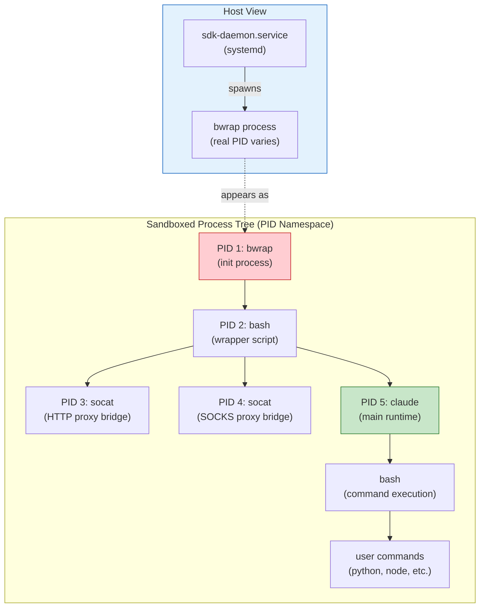

# Claude Cowork Container Environment Analysis

## Executive Summary

This report provides a comprehensive technical analysis of the sandboxed Linux runtime environment used for Claude Code in Cowork mode. The environment implements a defense-in-depth security model using multiple isolation technologies including Bubblewrap (bwrap), Linux namespaces, seccomp-BPF filtering, and controlled network proxying.

---

## System Architecture Overview

The following diagram illustrates the complete system architecture, showing how the sandbox environment isolates the Claude runtime from the host system:

```mermaid
flowchart TB
    subgraph HOST["🖥️ Host System (macOS/Linux)"]
        subgraph HOSTNET["Host Network Stack"]
            INTERNET[("🌐 Internet")]
            PROXY_CTRL["Proxy Controller"]
            USOCK1["claude-http-*.sock"]
            USOCK2["claude-socks-*.sock"]
        end

        subgraph STORAGE["Host Storage"]
            NVME0["/dev/nvme0n1p1<br/>Root FS (9.6G)"]
            NVME1["/dev/nvme1n1<br/>Sessions (9.8G)"]
        end

        DAEMON["SDK Daemon<br/>(systemd service)"]
    end

    subgraph SANDBOX["🔒 Bubblewrap Sandbox Container"]
        subgraph NAMESPACES["Linux Namespace Isolation"]
            NS_PID["PID NS<br/>(isolated process tree)"]
            NS_NET["NET NS<br/>(loopback only)"]
            NS_MNT["MNT NS<br/>(controlled mounts)"]
            NS_USER["USER NS<br/>(uid 1001)"]
        end

        subgraph SECCOMP["Seccomp-BPF Layer"]
            BPF1["Filter 1: Base restrictions"]
            BPF2["Filter 2: unix-block.bpf"]
        end

        subgraph PROXIES["Network Proxy Bridge"]
            SOCAT_HTTP["socat<br/>TCP:3128 → Unix Socket"]
            SOCAT_SOCKS["socat<br/>TCP:1080 → Unix Socket"]
        end

        subgraph RUNTIME["Claude Runtime"]
            CLAUDE["claude binary<br/>(ARM64 ELF)"]
            BASH["bash shells"]
            TOOLS["Python/Node.js<br/>Tools"]
        end

        subgraph MOUNTS["Filesystem Mounts"]
            ROOT_RO["/ (read-only base)"]
            SESSION_RW["/sessions/*/"]
            subgraph WORKING_MOUNTS["Working Mounts"]
                SKILLS_RO[".skills (ro)"]
                UPLOADS_RO["uploads (ro)"]
                OUTPUTS_RW["outputs (rw)"]
            end
        end
    end

    %% Connections
    DAEMON --> |"spawns"| SANDBOX
    NVME0 --> |"bind mount"| ROOT_RO
    NVME1 --> |"ext4 mount"| SESSION_RW

    USOCK1 --> |"bind into container"| SOCAT_HTTP
    USOCK2 --> |"bind into container"| SOCAT_SOCKS

    SOCAT_HTTP --> |"TCP proxy"| RUNTIME
    SOCAT_SOCKS --> |"SOCKS5 proxy"| RUNTIME

    PROXY_CTRL --> USOCK1
    PROXY_CTRL --> USOCK2
    PROXY_CTRL <--> INTERNET

    SECCOMP --> |"filters syscalls"| RUNTIME
    NAMESPACES --> |"isolates"| RUNTIME

    %% Styling
    classDef host fill:#e1f5fe,stroke:#01579b
    classDef sandbox fill:#fff3e0,stroke:#e65100
    classDef security fill:#ffebee,stroke:#c62828
    classDef network fill:#e8f5e9,stroke:#2e7d32
    classDef storage fill:#f3e5f5,stroke:#7b1fa2

    class HOST,HOSTNET,STORAGE host
    class SANDBOX,NAMESPACES,MOUNTS,WORKING_MOUNT sandbox
    class SECCOMP security
    class PROXIES network
```



---

## 1. System Architecture and Runtime Environment

### 1.1 Base System

| Component | Details |
|-----------|---------|
| **Operating System** | Ubuntu 22.04.5 LTS (Jammy Jellyfish) |
| **Kernel** | 6.8.0-90-generic (PREEMPT_DYNAMIC) |
| **Architecture** | ARM64 (aarch64) |
| **CPU** | 4 cores, Apple Silicon (CPU implementer 0x61) |
| **Memory** | 3.8 GiB total, ~3.0 GiB available |
| **Swap** | Disabled (0B) |

### 1.2 Storage Layout

The environment uses a sophisticated multi-volume storage architecture:

```mermaid
flowchart LR
    subgraph PHYSICAL["Physical Storage"]
        NVME0[("💾 /dev/nvme0n1p1<br/>9.6G - Root FS")]
        NVME1[("💾 /dev/nvme1n1<br/>9.8G - Sessions")]
    end

    subgraph MOUNTS["Mount Hierarchy"]
        ROOT["/ (ext4)<br/>System files"]
        SESSIONS["/sessions (ext4)<br/>All session data"]
        SESSION_DIR["/sessions/eloquent-eager-gauss<br/>Current session home"]
    end

    subgraph BINDFS["bindfs (FUSE) Mounts"]
        CLAUDE[".claude (rw)<br/>Configuration"]
        SKILLS[".skills (ro)<br/>Skill definitions"]
        OUTPUTS["outputs (rw)<br/>User deliverables"]
        UPLOADS["uploads (ro)<br/>User files"]
    end

    NVME0 --> ROOT
    NVME1 --> SESSIONS --> SESSION_DIR
    SESSION_DIR --> CLAUDE
    SESSION_DIR --> SKILLS
    SESSION_DIR --> OUTPUTS
    SESSION_DIR --> UPLOADS

    style NVME0 fill:#e1bee7,stroke:#7b1fa2
    style NVME1 fill:#e1bee7,stroke:#7b1fa2
    style SKILLS fill:#ffcdd2,stroke:#c62828
    style UPLOADS fill:#ffcdd2,stroke:#c62828
    style OUTPUTS fill:#c8e6c9,stroke:#2e7d32
    style CLAUDE fill:#c8e6c9,stroke:#2e7d32
```



**Mount Points for Session Data:**

| Path | Type | Purpose | Permissions |
|------|------|---------|-------------|
| `/sessions/eloquent-eager-gauss` | ext4 | Session root | rw |
| `.../mnt/.claude` | bindfs (FUSE) | Claude configuration | rw |
| `.../mnt/.skills` | bindfs (FUSE) | Skill definitions | **ro** |
| `.../mnt/outputs` | bindfs (FUSE) | User-accessible output | rw |
| `.../mnt/uploads` | bindfs (FUSE) | User uploads | **ro** |

The use of bindfs (FUSE) allows fine-grained permission control, with skills and uploads mounted read-only to prevent modification by the sandboxed process.

### 1.3 User Identity

A unique, ephemeral user is created per session:
- **Username:** `eloquent-eager-gauss`
- **UID/GID:** 1001/1001
- **Home:** `/sessions/eloquent-eager-gauss`
- **Shell:** `/bin/bash`

This dynamic user creation provides session isolation and prevents any persistent identity across invocations.

---

## 2. Security Model and Process Isolation

### 2.1 Containment Architecture (Defense in Depth)

The environment implements **four layers** of isolation:

```mermaid
flowchart TB
    subgraph L1["Layer 1: Bubblewrap Container"]
        style L1 fill:#ffcdd2,stroke:#b71c1c
        subgraph L2["Layer 2: Linux Namespaces"]
            style L2 fill:#fff9c4,stroke:#f57f17
            subgraph L3["Layer 3: Seccomp-BPF Filtering"]
                style L3 fill:#c8e6c9,stroke:#2e7d32
                subgraph L4["Layer 4: Capability Dropping"]
                    style L4 fill:#bbdefb,stroke:#1565c0
                    PROCESS["🔐 Sandboxed Process<br/>(Zero capabilities, unprivileged)"]
                end
            end
        end
    end

    ATTACK["⚠️ Potential Attack"] --> L1
    L1 --> |"✓ Contained"| L2
    L2 --> |"✓ Isolated"| L3
    L3 --> |"✓ Filtered"| L4
    L4 --> |"✓ Restricted"| PROCESS
```



Each layer provides independent protection:

```mermaid
flowchart LR
    subgraph LAYERS["Security Layers"]
        direction LR
        B["🛡️ Bubblewrap<br/>Process isolation<br/>Resource limits"]
        N["🔀 Namespaces<br/>PID, NET, MNT, USER<br/>Filesystem isolation"]
        S["🔒 Seccomp-BPF<br/>Syscall filtering<br/>Kernel protection"]
        C["⛔ Capabilities<br/>Zero privileges<br/>No escalation"]
    end

    B --> N --> S --> C
```



### 2.2 Process Hierarchy

The following diagram shows the process tree within the sandbox:



### 2.3 Bubblewrap Configuration

The init process (PID 1) is `bwrap` with the following key flags:

| Flag | Purpose |
|------|---------|
| `--new-session` | Creates new session ID, preventing terminal hijacking |
| `--die-with-parent` | Ensures cleanup when parent process dies |
| `--unshare-net` | Isolates network namespace |
| `--unshare-pid` | Isolates process namespace |
| `--ro-bind / /` + `--bind / /` | Creates overlay-style mount with selective writability |
| `--tmpfs /etc/ssh/ssh_config.d` | Prevents SSH configuration tampering |
| `--dev /dev` | Creates minimal `/dev` with only essential devices |
| `--proc /proc` | Provides namespaced proc filesystem |

### 2.4 Linux Namespace Isolation

Active namespaces with unique IDs:

| Namespace | ID | Purpose |
|-----------|-----|---------|
| **mnt** | 4026532394 | Isolated mount table |
| **net** | 4026532396 | Isolated network stack |
| **pid** | 4026532395 | Isolated process tree |
| **user** | 4026532454 | Isolated user/group mappings |
| **uts** | 4026531838 | Shared hostname |
| **ipc** | 4026531839 | Shared IPC (host) |
| **cgroup** | 4026531835 | Shared cgroups (host) |

The PID namespace is particularly important: inside the container, processes see themselves starting from PID 1, completely isolated from host processes.

### 2.5 Seccomp-BPF Filtering

The environment applies **two layers** of seccomp filtering:

```
Seccomp status: 2 (SECCOMP_MODE_FILTER)
Active filters: 2
```

**Filter Application:**
```bash
apply-seccomp unix-block.bpf /usr/bin/bash -c "claude..."
```

The `unix-block.bpf` filter (88 bytes) is a compiled BPF program that restricts system calls. Analysis of the filter structure reveals it's designed to block Unix socket operations that could be used for sandbox escape (e.g., connecting to host services).

### 2.6 Capability Dropping

All Linux capabilities are explicitly dropped:

```
CapInh: 0000000000000000
CapPrm: 0000000000000000
CapEff: 0000000000000000
CapBnd: 0000000000000000
CapAmb: 0000000000000000
```

This means the process cannot:
- Bind to privileged ports (< 1024)
- Modify file ownership arbitrarily
- Override discretionary access control
- Perform raw network operations
- Load kernel modules
- Access raw I/O ports
- Any other privileged operation

### 2.7 Resource Limits

| Resource | Limit |
|----------|-------|
| Open files | 524,288 |
| Max processes | 14,813 |
| Stack size | 8 MiB |
| Core dumps | Disabled (0) |
| Locked memory | 8 MiB |
| Virtual memory | Unlimited |

---

## 3. Network Architecture

### 3.1 Network Isolation Model

The container operates in a **fully isolated network namespace** with only loopback connectivity. External network access is provided through **proxy tunnels**:

```mermaid
flowchart TB
    subgraph CONTAINER["📦 Container Network Namespace"]
        direction TB
        subgraph APPS["Applications"]
            CURL["curl/wget"]
            PYTHON["Python requests"]
            NODE["Node.js fetch"]
            OTHER["Other tools"]
        end

        subgraph PROXY_LOCAL["Localhost Proxy Endpoints"]
            HTTP_PROXY["localhost:3128<br/>HTTP/HTTPS Proxy"]
            SOCKS_PROXY["localhost:1080<br/>SOCKS5 Proxy"]
        end

        subgraph SOCAT["socat Bridge Processes"]
            SOCAT1["socat<br/>TCP:3128 ↔ Unix Socket"]
            SOCAT2["socat<br/>TCP:1080 ↔ Unix Socket"]
        end

        LO["🔄 lo (loopback)<br/>127.0.0.1"]
    end

    subgraph HOST["🖥️ Host Network"]
        SOCK1["/tmp/claude-http-*.sock"]
        SOCK2["/tmp/claude-socks-*.sock"]
        PROXY_DAEMON["Proxy Daemon<br/>(traffic inspection)"]
        INTERNET[("🌐 Internet")]
    end

    %% Application to proxy flow
    APPS --> |"HTTP_PROXY env"| HTTP_PROXY
    APPS --> |"ALL_PROXY env"| SOCKS_PROXY
    HTTP_PROXY --> LO --> SOCAT1
    SOCKS_PROXY --> LO --> SOCAT2

    %% Unix socket bridge
    SOCAT1 --> |"bind-mounted"| SOCK1
    SOCAT2 --> |"bind-mounted"| SOCK2

    %% Host network
    SOCK1 --> PROXY_DAEMON
    SOCK2 --> PROXY_DAEMON
    PROXY_DAEMON <--> |"filtered traffic"| INTERNET

    %% Styling
    style CONTAINER fill:#fff3e0,stroke:#e65100
    style HOST fill:#e3f2fd,stroke:#1565c0
    style LO fill:#c8e6c9,stroke:#2e7d32
```



### 3.2 Proxy Configuration

All network-capable applications are configured to use proxies via environment variables:

| Variable | Value | Purpose |
|----------|-------|---------|
| `HTTP_PROXY` | `http://localhost:3128` | HTTP traffic |
| `HTTPS_PROXY` | `http://localhost:3128` | HTTPS traffic |
| `ALL_PROXY` | `socks5h://localhost:1080` | Fallback SOCKS5 |
| `NO_PROXY` | `localhost,127.0.0.1,...,192.168.0.0/16` | Bypass list |

### 3.3 DNS Resolution

DNS is handled through the host's systemd-resolved stub resolver (`127.0.0.53`), which the proxy layer can intercept for traffic analysis.

---

## 4. Available Runtime Tools

### 4.1 Programming Languages & Runtimes

| Tool | Version | Notes |
|------|---------|-------|
| Python | 3.10.12 | System default |
| Node.js | 22.21.0 | LTS release |
| npm | 10.9.4 | Package manager |
| Java | (installed) | OpenJDK |
| GCC/G++ | (installed) | C/C++ compilation |
| Make | (installed) | Build automation |

### 4.2 Pre-installed Node.js Modules

Located at `/usr/local/lib/node_modules_global/lib/node_modules/`:

| Package | Purpose |
|---------|---------|
| `@anthropic-ai/sandbox-runtime` | Sandbox orchestration and seccomp |
| `docx` | Word document generation |
| `pptxgenjs` | PowerPoint generation |
| `pdf-lib` | PDF manipulation |
| `pdfjs-dist` | PDF rendering |
| `sharp` | High-performance image processing |
| `typescript` / `ts-node` / `tsx` | TypeScript support |
| `graphviz` | Graph visualization |
| `marked` | Markdown processing |

### 4.3 Key Python Packages

| Package | Purpose |
|---------|---------|
| `beautifulsoup4` | HTML/XML parsing |
| `camelot-py` | PDF table extraction |
| `matplotlib` / `contourpy` | Data visualization |
| `cryptography` | Cryptographic operations |
| `pandas` (implied by deps) | Data analysis |
| `Pillow` | Image processing |

### 4.4 System Utilities

- **Version Control:** git
- **Network:** curl, wget, socat
- **Text Processing:** vim
- **Compression:** unzip

### 4.5 Skills System

Mounted at `/sessions/.../mnt/.skills/skills/` (read-only):

| Skill | Purpose |
|-------|---------|
| `docx` | Word document best practices |
| `xlsx` | Excel spreadsheet handling |
| `pptx` | PowerPoint creation |
| `pdf` | PDF manipulation |
| `skill-creator` | Meta-skill for creating new skills |

---

## 5. Technical Design Analysis

### 5.1 Why Bubblewrap over Docker/Podman?

**Design Choice:** Bubblewrap (bwrap) instead of container runtimes

**Reasoning:**
1. **Lower overhead:** bwrap is a single-purpose sandboxing tool with minimal footprint (~3KB process)
2. **No daemon requirement:** Unlike Docker, bwrap doesn't require a privileged daemon
3. **Fine-grained namespace control:** Individual namespace flags provide precise isolation tuning
4. **Unprivileged operation:** Can run without root after initial setup
5. **Flatpak heritage:** Battle-tested in desktop application sandboxing

### 5.2 Why Network Namespace + Proxy vs. Firewall Rules?

**Design Choice:** Complete network isolation with proxy tunneling

**Reasoning:**
1. **Defense in depth:** Even if seccomp is bypassed, raw network syscalls hit an empty namespace
2. **Traffic inspection:** All traffic flows through controlled proxy, enabling logging/filtering
3. **Protocol enforcement:** SOCKS5 proxy can enforce application-layer policies
4. **Explicit allowlisting:** Rather than blocking bad destinations, only allowed traffic can exit

### 5.3 Why seccomp-BPF over AppArmor/SELinux?

**Design Choice:** Custom BPF filter (`unix-block.bpf`)

**Reasoning:**
1. **Kernel-level enforcement:** BPF runs in kernel, cannot be bypassed from userspace
2. **Syscall granularity:** Can filter at individual syscall + argument level
3. **Performance:** Near-zero overhead compared to LSM interpretation
4. **Portability:** Works across distributions without policy language differences
5. **Composability:** Multiple filters can be stacked (2 active filters observed)

### 5.4 Why bindfs for Mount Points?

**Design Choice:** FUSE-based bindfs for session directories

**Reasoning:**
1. **Permission remapping:** Can present files with different ownership/permissions
2. **Read-only enforcement:** Skills and uploads are immutable from sandbox perspective
3. **User namespace compatibility:** Works correctly with unprivileged user namespaces
4. **Flexibility:** Allows host-side control over what sandbox sees

### 5.5 Why Ephemeral Users?

**Design Choice:** Dynamically created user per session (`eloquent-eager-gauss`)

**Reasoning:**
1. **Session isolation:** No persistent state or credentials between sessions
2. **Least privilege:** Each session starts with minimal, known permissions
3. **Forensic clarity:** Actions attributable to specific session
4. **Home directory binding:** User's home is exactly the session directory

### 5.6 Why socat for Proxy Tunneling?

**Design Choice:** socat TCP-to-Unix-socket bridges

**Reasoning:**
1. **Simplicity:** Single-purpose, well-audited utility
2. **Fork model:** Each connection handled by separate process
3. **Unix socket transport:** Proxy control stays on host, only socket is bind-mounted
4. **Graceful cleanup:** `trap` ensures processes are cleaned on exit

### 5.7 Why Zero Capabilities?

**Design Choice:** Complete capability drop

**Reasoning:**
1. **Minimal privilege:** Code execution shouldn't require any special permissions
2. **Exploit mitigation:** Privilege escalation attacks have nothing to escalate to
3. **Compliance:** Demonstrates principle of least privilege

---

## 6. Security Assessment Summary

```mermaid
flowchart LR
    subgraph THREATS["⚠️ Attack Vectors"]
        direction TB
        T1["Kernel Exploits"]
        T2["Network Exfiltration"]
        T3["Filesystem Escape"]
        T4["Resource Exhaustion"]
        T5["Privilege Escalation"]
    end

    subgraph MITIGATIONS["🛡️ Mitigations"]
        direction TB
        M1["Seccomp-BPF<br/>blocks dangerous syscalls"]
        M2["Network Namespace<br/>+ proxy tunneling"]
        M3["Mount Namespace<br/>+ bindfs restrictions"]
        M4["ulimits + cgroups"]
        M5["Zero capabilities<br/>unprivileged user"]
    end

    subgraph STATUS["✅ Status"]
        direction TB
        S1["Mitigated"]
        S2["Mitigated"]
        S3["Mitigated"]
        S4["Mitigated"]
        S5["Mitigated"]
    end

    T1 --> M1 --> S1
    T2 --> M2 --> S2
    T3 --> M3 --> S3
    T4 --> M4 --> S4
    T5 --> M5 --> S5

    style THREATS fill:#ffcdd2,stroke:#c62828
    style MITIGATIONS fill:#fff9c4,stroke:#f57f17
    style STATUS fill:#c8e6c9,stroke:#2e7d32
```



### 6.1 Strengths

| Aspect | Implementation |
|--------|----------------|
| **Privilege** | Zero capabilities, unprivileged user |
| **Filesystem** | Minimal writable paths, tmpfs for sensitive dirs |
| **Network** | Complete isolation with controlled proxy egress |
| **Syscalls** | Multiple seccomp-BPF filters |
| **Process** | PID namespace prevents host process visibility |
| **Cleanup** | `--die-with-parent` ensures no orphaned processes |

### 6.2 Attack Surface Considerations

| Vector | Mitigation |
|--------|------------|
| Kernel exploits | Seccomp blocks most dangerous syscalls |
| Network exfiltration | All traffic through controlled proxy |
| Filesystem escape | Namespace isolation + bindfs restrictions |
| Resource exhaustion | ulimits + cgroup potential (host-controlled) |
| Time-of-check attacks | Minimal shared state with host |

---

## 7. Conclusion

The Claude Code sandbox environment represents a well-architected, defense-in-depth approach to running untrusted code. By combining Bubblewrap's namespace isolation, seccomp-BPF syscall filtering, complete network namespace isolation with proxy tunneling, and aggressive capability dropping, the system provides multiple independent layers of protection.

Key architectural decisions—such as choosing bwrap over Docker, implementing proxy-based network control, and using ephemeral users—demonstrate careful consideration of both security requirements and operational flexibility. The result is an environment where AI-generated code can be executed with reasonable confidence that it cannot impact the host system or exfiltrate data through unauthorized channels.

---

*Report generated: January 18, 2026*
*Environment: Ubuntu 22.04.5 LTS / Linux 6.8.0-90-generic (ARM64)*
