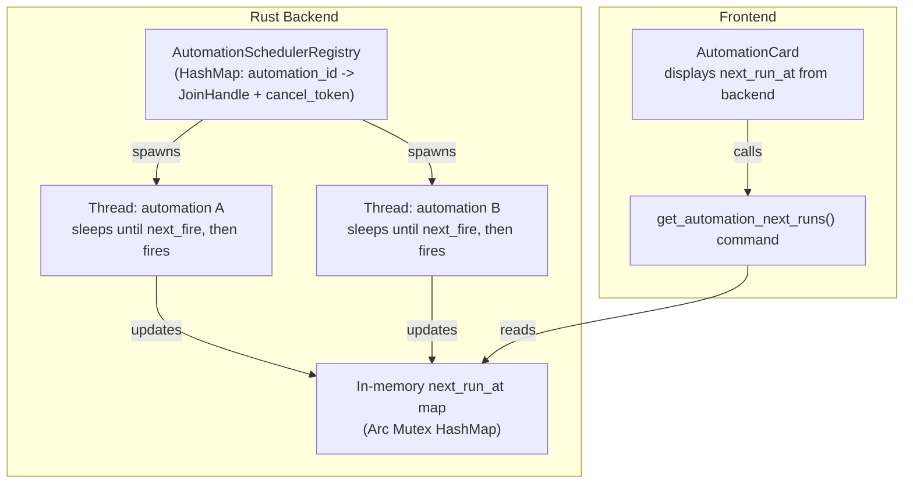

# Automations — Design Spec

> Scheduled, recurring AI tasks that run unattended and surface findings to the user.

Modeled after [Codex App Automations](https://developers.openai.com/codex/app/automations), adapted to Cowork-Z's architecture (Tauri + OpenCode sidecar).

## Overview

Automations let users define recurring tasks that execute on a schedule. Each automation is bound to a workspace, uses an explicit model selection, and runs through the existing task pipeline. Results with findings surface in a dedicated sidebar triage tab; empty runs are auto-archived.

## Decisions

| Decision | Choice |
|----------|--------|
| Scope | Standalone automations only (thread automations as future work) |
| Entry point | Home page "Automations" tab (third tab after Starter Packs, Skills Catalog) |
| Triage location | Sidebar "Automations" tab (between Sessions and Files) |
| Scheduling | Structured picker (frequency + weekday + time dropdowns) with cron preview; Custom mode for direct cron input |
| Scheduler location | Rust backend (Tauri side) |
| Workspace binding | 1:1 (one automation = one workspace) |
| Skills support | `/skill-name` in prompt text (same as regular tasks) |
| Run filtering | Smart — only runs with findings appear in triage; empty runs auto-archived |
| Model selection | Required explicit selection per automation |
| Architecture | Thin Scheduler + Existing Task Pipeline (reuse sidecar, sequential execution) |
| Automation runs in Sessions tab | Excluded — automation runs only appear under the Automations sidebar tab |

## Data Model

### `automations` table

| Field | Type | Description |
|-------|------|-------------|
| `id` | TEXT PK | UUID |
| `workspace_id` | TEXT FK | Bound workspace |
| `name` | TEXT | User-given name (e.g., "Daily code review") |
| `prompt` | TEXT | The task prompt (may include `/skill-name`) |
| `schedule_cron` | TEXT | Standard 5-field Unix cron (e.g., `0 9 * * *`); scheduler normalizes to 6-field internally |
| `schedule_display` | TEXT | Human-readable schedule ("every weekday at 9am") |
| `provider_id` | TEXT | Provider key (e.g., `github-copilot`) — used for display/filtering |
| `model_id` | TEXT | Full provider-qualified model ID (e.g., `github-copilot/claude-sonnet-4.6`) — passed directly to sidecar |
| `enabled` | BOOLEAN | Whether the scheduler should fire this automation |
| `created_at` | DATETIME | |
| `updated_at` | DATETIME | |

### `automation_runs` table

| Field | Type | Description |
|-------|------|-------------|
| `id` | TEXT PK | UUID |
| `automation_id` | TEXT FK | Parent automation |
| `task_id` | TEXT FK | References the task created for this run |
| `status` | TEXT | `pending` / `running` / `completed` / `failed` / `cancelled` |
| `has_findings` | BOOLEAN | Whether the run produced actionable output |
| `is_read` | BOOLEAN | For triage — has the user seen this? |
| `started_at` | DATETIME | |
| `completed_at` | DATETIME | |

### Existing table changes

The `tasks` table gains an optional `automation_run_id` column (nullable FK) to correlate automation-triggered tasks. The Sessions sidebar tab filters out tasks where `automation_run_id IS NOT NULL`.

## Scheduler Design

### Architecture

### `AutomationSchedulerRegistry` (Rust)

A per-automation thread registry managed as Tauri state:

- Each enabled automation gets its own `std::thread` that sleeps until the next fire time via a `Condvar` with timeout
- On wake: if not cancelled, fires the automation (creates task, links run, dispatches to sidecar), then computes the next fire time and sleeps again
- A `CancellationToken` (`Arc<AtomicBool>` + `Condvar`) per thread allows clean cancellation on schedule change or disable
- Maintains an in-memory `next_runs` map (`Arc<Mutex<HashMap<String, Option<String>>>>`) storing the next fire time (RFC 3339, UTC) per automation, updated whenever a thread computes its next fire time; cron expressions are evaluated against the system's local timezone and converted to UTC for storage
- New Tauri command `get_automation_next_runs(automation_ids)` reads from the in-memory map — the frontend uses this instead of client-side cron computation
- On `automation:changed`: the Tauri command handler directly calls `registry.on_changed()` which cancels the existing thread and spawns a new one if the automation is still enabled
- On startup: `reload_all()` iterates enabled automations and spawns a thread for each

### Thread Lifecycle

Each per-automation thread follows this loop:

1. Computes `next_fire` from the cron expression
2. Updates the `next_runs` map with an RFC 3339 timestamp
3. Emits `automation:schedule_updated` event (optional, for reactive UI)
4. Waits on condvar with timeout = (`next_fire` - now)
5. On wake: if cancelled, exit; otherwise fire the automation, loop back to step 1

### Cancel-on-Change Protocol

When `toggle_automation_enabled(id, false)` or `update_automation(id, ...)` is called:

1. Tauri command updates DB
2. Emits `automation:changed` event
3. Registry listener calls `stop_automation(id)` (cancels thread via `AtomicBool` + condvar signal)
4. If automation is still enabled (for update case), calls `start_automation(id)` with new cron

### Concurrency model (v1)

Each automation thread independently determines when to fire. When firing, the thread checks the global `AutomationSchedulerState.is_running` flag:
- If idle: starts the run immediately
- If busy: queues the run as `pending` in the database

When a task completes, `mark_automation_run_complete` releases the lock and calls `process_pending_runs` to start the next queued run (FIFO). **Important:** `mark_automation_run_complete` must drop its DB connection before calling `process_pending_runs`, because `process_pending_runs` also acquires the DB connection. Since `DbState.conn` uses `std::sync::Mutex` (which is not reentrant), holding the lock across both calls causes a self-deadlock on the same thread.

### Lifecycle events

- Automation created/updated/deleted → command handler calls `registry.on_changed()` (stop + restart thread)
- Automation deleted → `registry.stop_automation()` (thread cancelled, next_run removed)
- Task complete → `complete_task` command looks up the associated automation run via `get_running_run_by_task_id`, calls `mark_automation_run_complete` which updates DB status to `completed`, releases the scheduler lock, processes pending runs, and emits `automation:run_completed`
- App quit → threads are cancelled; pending run states persist in DB and resume on next launch

### Determining `has_findings`

When a run completes, the `complete_task` handler inspects the last assistant message from the task's conversation. The message content is checked (case-insensitive) against a list of "no findings" phrases (e.g., "nothing to report", "no files to", "already up to date"). If any phrase matches, `has_findings` is set to `false` and the run is auto-archived. If none match, `has_findings` is `true` and the run surfaces in the triage panel. Failed or cancelled runs always have `has_findings = false`. The prompt can also instruct the agent to use specific phrasing to signal empty results.

### Schedule parsing

The frontend provides a structured schedule picker with three dropdowns in a single row:

1. **Frequency picker:** Hourly, Daily, Weekdays, Weekly, Custom
2. **Weekday picker:** Monday–Sunday (only shown when frequency is "Weekly")
3. **Time picker:** Scrollable list of times in 15-minute increments, 12-hour format with AM/PM (hidden when frequency is "Hourly")

The grid layout adapts based on frequency:
- **Hourly:** 1 column (frequency only)
- **Daily / Weekdays:** 2 columns (frequency + time)
- **Weekly:** 3 columns (frequency + weekday + time)
- **Custom:** Frequency dropdown + free-text cron input field

Once a schedule is configured, the computed 5-field Unix cron expression is displayed below the pickers in a read-only monospace field for user verification.

**Cron normalization:** The Rust `cron` crate (v0.12) requires 6-7 field expressions (`sec min hour dom month dow [year]`). The scheduler's `normalize_cron()` method automatically prepends `"0 "` (seconds = 0) to 5-field expressions before parsing. This allows the frontend and DB to store standard Unix cron while the scheduler handles the conversion internally.

**Timezone handling:** Schedule times are interpreted in the system's local timezone (e.g., if the user picks "9:00 AM" and the system is in `America/New_York`, the automation fires at 9:00 AM ET). The scheduler evaluates cron expressions against `chrono::Local` and converts the resulting fire times to UTC for internal storage and IPC. The frontend time picker displays local times directly — no timezone conversion is needed on the frontend side.

**Cron validation:** The `validate_cron` Tauri command validates a cron expression using the same `normalize_cron()` + `cron::Schedule::from_str()` pipeline as the scheduler. The frontend calls this on every cron change (debounced 400ms for Custom mode, immediate for structured pickers). Invalid expressions display an error below the cron preview and prevent form submission. This ensures only scheduler-parseable expressions are saved to the database.

**Model ID format:** The `model_id` field stores the full provider-qualified identifier (e.g., `github-copilot/claude-sonnet-4.6`). The `provider_id` field stores just the provider key (e.g., `github-copilot`) for filtering/display purposes. When dispatching to the sidecar, `model_id` is used directly without additional prefixing.

## IPC & Sidecar Integration

### New Tauri commands

| Command | Description |
|---------|-------------|
| `create_automation` | Validates + stores automation, notifies scheduler |
| `update_automation` | Updates fields, re-syncs scheduler queue |
| `delete_automation` | Removes automation + orphaned runs, notifies scheduler |
| `list_automations` | Returns automations for a workspace (or all) |
| `get_automation` | Single automation with recent run history |
| `list_automation_runs` | Filtered runs (by automation, by has_findings, by read state) |
| `mark_run_read` | Marks a triage item as read |
| `toggle_automation_enabled` | Quick enable/disable without full update |
| `run_automation_now` | Manual trigger — directly dispatches task to sidecar (bypasses scheduler queue) |
| `get_automation_next_runs` | Returns next scheduled fire times from the in-memory registry (backend-computed) |
| `validate_cron` | Validates a cron expression using the scheduler's normalization pipeline; returns error string on failure |

### Sidecar changes

None. The sidecar receives automation runs as standard `start_task` commands. It doesn't need awareness of the automation system.

### New Tauri events

| Event | Payload | Purpose |
|-------|---------|---------|
| `automation:run_started` | `{ automation_id, run_id, task_id }` | Update sidebar triage |
| `automation:run_completed` | `{ run_id, has_findings, status }` | Surface in triage if findings |
| `automation:schedule_fired` | `{ automation_id, next_run_at }` | Optional — for UI status |

## Frontend Design

### Home Page — Automations Tab

- Third tab in the Home page card (after "Starter Packs" and "Skills Catalog")
- `HomeTab` type becomes `'packs' | 'skills' | 'automations'`
- Content: list view of automation cards

**List view (automation cards):**
- Each card shows: name, schedule (human-readable), next scheduled run time, status badge (Active/Disabled), inline toggle switch for quick enable/disable, last run time
- **Next run time display:** For enabled automations, the card displays the next scheduled run time sourced from the Rust backend's in-memory `next_runs` map (via `get_automation_next_runs` command). The backend computes next fire times from cron expressions using the `cron` crate; the frontend only formats the ISO timestamp for display. Daily/hourly automations show just the time (e.g., "9:00 AM"). Weekly automations show the weekday followed by the time (e.g., "Monday 9:00 AM"). Disabled automations do not show a next run time.
- Toggle switch: positioned between card content and action menu; persists enabled state to DB; when disabled, the scheduler will not fire the automation
- Action menu per card: Edit, Run Now, Disable/Enable (secondary to toggle), Delete
- "+ New" button at the top-right of the list
- Empty state when no automations exist (with "Create your first automation" CTA)

**Inline creation/edit form:**
- Replaces the list view when creating or editing
- Fields: Name, Prompt (textarea, supports `/skill-name`), Schedule (3-dropdown row: frequency/weekday/time + cron preview), Model (provider + model picker dialog)
- Schedule picker: Radix Select for frequency and weekday, custom time picker with scrollable 15-min increments and clock icon. Cron expression displayed below as read-only monospace text.
- Buttons: Cancel (returns to list), Create/Save
- Validation: all fields required, schedule must produce a valid cron expression (validated by Rust backend in real-time), selected model must still be configured; invalid cron shows error message and blocks save

### Sidebar — Automations Tab

- New tab between "Sessions" and "Files" in `Sidebar.tsx`
- Icon + "Automations" label with unread badge (red dot when findings exist)
- `SidebarTab` type becomes `'sessions' | 'automations' | 'files'`

**Tab content:**
- Filter chips: "Unread" (default when unread items exist) / "All"
- "Mark all read" action in the filter row
- Run items: automation name, finding summary, relative timestamp, model + schedule metadata
- Unread runs: amber left-border accent
- Read/no-findings runs: dimmed appearance
- Clicking a run → navigates to `/execution/:taskId`

**Filtering from Sessions:**
- The Sessions tab query excludes tasks where `automation_run_id IS NOT NULL`
- Automation runs are ONLY viewable under the Automations tab

### New components

| Component | Location | Purpose |
|-----------|----------|---------|
| `AutomationsList` | `src/components/landing/` | Home tab list view |
| `AutomationForm` | `src/components/landing/` | Inline create/edit form |
| `AutomationCard` | `src/components/landing/` | Individual automation card |
| `AutomationRunsPanel` | `src/components/sidebar/` | Sidebar tab content |
| `AutomationRunItem` | `src/components/sidebar/` | Individual run item in triage |

### New store

`automationStore.ts` (Zustand) managing:
- Automation list (for Home tab)
- Automation runs (for sidebar triage)
- Unread count (drives badge)
- CRUD operations (wrapping Tauri commands)

### Event-driven refresh (Sidebar.tsx)

The Sidebar subscribes to both `automation:run_started` and `automation:run_completed` Tauri events:
- `automation:run_started` → reloads the runs list so new runs appear immediately as "Running..."
- `automation:run_completed` → reloads both the runs list (to update status from "Running..." to "Completed") and the unread count (to drive the badge)

This ensures the `AutomationRunsPanel` always reflects fresh run status without requiring user-initiated refresh.

## User Flows

### Creating an automation
1. Home → Automations tab → "+ New" → inline form
2. Fill name, prompt, schedule, model → "Create"
3. Saved to SQLite, scheduler picks up immediately
4. List view returns with new automation as "Active"

### Scheduled run executes
1. Scheduler tick → automation due → sidecar idle → start run
2. Task completes → `has_findings` evaluated
3. Findings: sidebar badge appears, run in triage
4. No findings: run archived (viewable under "All" filter)

### Reviewing a run (triage)
1. Red dot on Automations sidebar tab → switch to tab
2. Unread runs with amber accent → click run
3. Navigate to task view → full agent output visible
4. Return to sidebar → run marked read

### Managing automations
- **Edit:** Home tab → click card → form pre-filled
- **Disable/Enable:** Toggle on card (pauses scheduling)
- **Delete:** Action menu → confirmation → removes automation + runs
- **Run Now:** Action menu → immediate trigger (bypasses schedule)

### Sidecar busy
1. Automation fires, manual task active → run queued as `pending`
2. Manual task completes → scheduler picks up pending run
3. Multiple pending → sequential FIFO execution

### "Run Now" execution
"Run Now" directly dispatches the task to the sidecar — it does **not** enter the scheduler's pending queue. It creates a task record, an automation run linked to that task, resolves workspace permissions and API keys, then sends `StartTask` to the sidecar immediately. This mirrors the behavior of a user-initiated task from the Home page, using the automation's configured model and workspace context.

### Workspace context
- The Home tab Automations list is filtered to the currently active workspace
- Deleting a workspace cascades: associated automations and their runs are deleted
- Switching workspace updates both the Home tab list and the sidebar triage view

## Scope Boundaries

### In scope (v1)
- Automation CRUD on Home tab (inline form)
- List view with status, schedule, enable/disable, "Run Now"
- Structured schedule picker (frequency + weekday + time dropdowns) with cron preview; Custom mode for direct cron input
- Required explicit model selection
- Cron-based scheduler in Rust (sequential, one-at-a-time)
- Automation runs as tasks (full sidecar pipeline reuse)
- Sidebar "Automations" tab with triage filtering
- `has_findings` heuristic
- Runs excluded from Sessions tab
- 1:1 workspace binding
- Skills via `/skill-name` in prompt

### Out of scope (future)
- Thread automations (heartbeat within a conversation)
- Multi-workspace automations
- Concurrent/parallel automation runs
- Worktree isolation for Git repos
- Agent-created automations (AI sets up automation from chat)
- Webhooks / external triggers (GitHub events, etc.)
- Automation templates / sharing
- Per-automation sandbox/permission overrides
