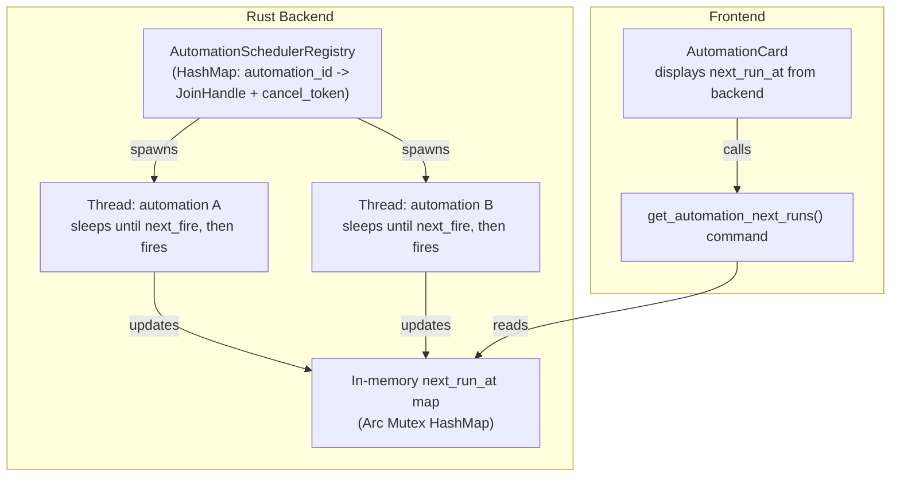

# Per-Automation Scheduler Threads

## Current Architecture

The scheduler is a **single `std::thread`** that maintains a `<ScheduledItem>` priority queue. Every 30 seconds it:

1. Pops due items from the queue
2. Fires them (dispatches to sidecar)
3. Reschedules them
4. Reloads the entire queue from DB

The frontend computes `nextRunDisplay` client-side via `getNextRunDisplay(cron)` in `[src/lib/cron-utils.ts](src/lib/cron-utils.ts)`.

## New Architecture




### Key Changes

**Rust (`src-tauri/src/automation_scheduler.rs`):**

- Replace `BinaryHeap` priority queue with a `HashMap<String, ScheduledThread>` registry
- Each active automation gets its own `std::thread` that:
  - Computes `next_fire` from cron
  - Sleeps until that time (using `std::thread::park_timeout` or a `Condvar` to support early wakeup/cancel)
  - On wake: fires the automation, then re-computes and sleeps again
- A `CancellationToken` (or `Arc<AtomicBool>` + `Condvar`) per thread allows clean cancellation
- On `automation:changed` event: cancel existing thread for that automation, then spawn a new one if automation is still enabled
- Maintain an `Arc<Mutex<HashMap<String, Option<String>>>>` storing `next_run_at` (RFC 3339) per automation, updated whenever a thread (re)computes its next fire time
- New Tauri command `get_automation_next_runs(automation_ids: Vec<String>)` reads from the in-memory map

**Rust (`src-tauri/src/commands/automations.rs`):**

- `toggle_automation_enabled` and `update_automation` already emit `automation:changed`; the registry listens and cancels/restarts threads accordingly
- Add `get_automation_next_runs` command

**Frontend (`src/lib/tauri-api.ts`):**

- Add `getAutomationNextRuns(automationIds: string[]): Promise<Record<string, string | null>>` wrapper

**Frontend (`src/components/landing/AutomationCard.tsx`):**

- Replace `getNextRunDisplay(cron)` with a `nextRunAt` prop sourced from the backend
- Format the ISO timestamp for display (just time for daily, weekday + time for weekly)

**Frontend (`src/stores/automationStore.ts`):**

- Add `nextRuns: Record<string, string | null>` state
- Load next runs after loading automations (and on `automation:changed` event)

**Frontend cleanup (`src/lib/cron-utils.ts`):**

- Remove `getNextCronDate()` and `getNextRunDisplay()` (no longer needed)
- Keep `buildCron`, `buildDisplay`, `detectFrequencyFromCron`, `parseTimeTo24`, `formatHour24ToDisplay`, `WEEKDAY_OPTIONS`, `WEEKDAY_NAMES` (still used by `AutomationForm.tsx`)

**Design doc update (`[docs/specs/automations/design_automations.md](docs/specs/automations/design_automations.md)`):**

- Update "Scheduler Design" section to reflect per-automation threads with cancel-on-change semantics
- Update "Next run time display" to describe backend-sourced `next_run_at`

**Update log (`[UPDATE_LOG.md](UPDATE_LOG.md)`):**

- Add entry under v0.7.4 describing the refactor

## Detailed Implementation

### 1. Scheduler Registry (Rust)

The new `AutomationSchedulerRegistry` replaces the current `AutomationScheduler`:

```rust
struct ScheduledThread {
    cancel: Arc<AtomicBool>,
    condvar: Arc<(Mutex<bool>, Condvar)>,
    handle: std::thread::JoinHandle<()>,
}

pub struct AutomationSchedulerRegistry {
    threads: Arc<Mutex<HashMap<String, ScheduledThread>>>,
    next_runs: Arc<Mutex<HashMap<String, Option<String>>>>,
}
```

Key methods:

- `start_automation(app, automation_id)` - computes next fire, stores `next_run_at`, spawns a thread that sleeps until fire time
- `stop_automation(automation_id)` - sets cancel flag, signals condvar to wake thread, joins it
- `reload_all(app)` - called on startup; iterates enabled automations, calls `start_automation` for each
- `on_changed(app, automation_id)` - stop thread if exists, then restart if automation is enabled

### 2. Thread Lifecycle

Each per-automation thread:

1. Computes `next_fire` from cron expression
2. Updates `next_runs` map with RFC 3339 timestamp
3. Emits `automation:schedule_updated` event (optional, for reactive UI)
4. Waits on condvar with timeout = (next_fire - now)
5. On wake: if cancelled, exit; otherwise fire the automation, loop back to step 1

### 3. Cancel-on-Change Protocol

When `toggle_automation_enabled(id, false)` or `update_automation(id, ...)` is called:

1. Tauri command updates DB
2. Emits `automation:changed` event
3. Registry listener calls `stop_automation(id)` (cancels thread)
4. If automation is still enabled (for update case), calls `start_automation(id)` with new cron

### 4. Frontend: Backend-Sourced Next Run Time

New Tauri command:

```rust
#[tauri::command]
pub fn get_automation_next_runs(
    automation_ids: Vec<String>,
    registry: State<'_, AutomationSchedulerRegistry>,
) -> HashMap<String, Option<String>> { ... }
```

The store fetches this after `loadAutomations()` and on `automation:changed` events. The `AutomationCard` receives `nextRunAt: string | null` and formats it locally (just for display formatting, not cron parsing).

### 5. Frontend Cleanup

- Remove `getNextCronDate` and `getNextRunDisplay` from `cron-utils.ts`
- Update `AutomationCard.tsx` to use backend-sourced timestamp
- The remaining cron-utils functions (`buildCron`, `buildDisplay`, etc.) stay because `AutomationForm.tsx` still needs them to construct cron expressions when creating/editing automations

