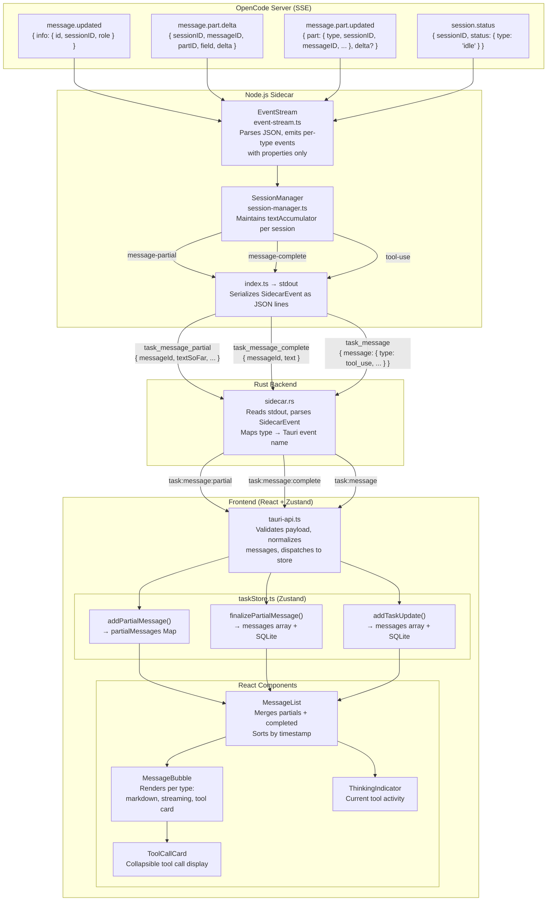

# Chat Experience — Design Document

## Overview

The chat experience layer handles everything the user sees and interacts with during an agent session: message rendering, streaming updates, tool call display, permission/question dialogs, input handling (text, drag-and-drop, slash commands), and sidebar panels (todos, artefacts). It sits between the Zustand state layer and the React component tree, consuming events from the Tauri backend and rendering them as a rich conversational interface.

---

## Message Type System

### TaskMessage

The primary message type used for all completed, persisted messages. Defined in `src/shared/types/task.ts`.

| Field | Type | Required | Description |
|-------|------|----------|-------------|
| `id` | `string` | Yes | Unique message ID (from OpenCode `part.messageID`, `part.id`, or generated `opencode_<timestamp>_<random>`) |
| `type` | `'assistant' \| 'user' \| 'tool' \| 'system'` | Yes | Discriminant that controls the rendering path in `MessageBubble` |
| `content` | `string` | Yes | Raw text content — markdown for assistant/system, plain text for user, empty string for tool |
| `toolName` | `string` | No | Tool identifier (e.g., `'Read'`, `'Bash'`, `'Edit'`). Present only when `type === 'tool'` |
| `toolInput` | `unknown` | No | Parsed tool input object (typically `{ file_path, command, pattern, ... }`). Present only when `type === 'tool'` |
| `toolOutput` | `string` | No | Tool execution result text. Present only when `type === 'tool'` and the tool has completed |
| `timestamp` | `string` | Yes | ISO 8601 timestamp string |
| `attachments` | `TaskAttachment[]` | No | Screenshots or JSON blobs attached to the message |

`TaskAttachment` holds a `type` of `'screenshot'` or `'json'`, a `data` field (base64 or JSON string), and an optional `label`.

### PartialMessage

The streaming variant used while SSE text deltas are still arriving. Has a fixed `type: 'assistant'` (not a union — partial messages are always from the agent).

| Field | Type | Required | Description |
|-------|------|----------|-------------|
| `id` | `string` | Yes | Matches the eventual `TaskMessage.id` when finalized |
| `type` | `'assistant'` | Yes | Always `'assistant'` |
| `textSoFar` | `string` | Yes | Full accumulated text up to this point (not a delta) |
| `isStreaming` | `boolean` | Yes | `true` while SSE deltas are still arriving |
| `timestamp` | `string` | Yes | ISO timestamp, preserved from the first partial event |

### RenderableMessage

A local union type in `MessageList.tsx` that unifies both:

```typescript
type RenderableMessage = TaskMessage | PartialMessage;
```

This allows the merge logic to sort and render both types in a single list. `MessageBubble` receives the normalized form — partial messages are spread into a `TaskMessage`-compatible shape with `content` set to `textSoFar`.

### Event Types

Two event types carry streaming data from the Tauri layer to the store:

| Event Type | Fields | Purpose |
|------------|--------|---------|
| `PartialMessageEvent` | `taskId`, `messageId`, `textSoFar`, `isStreaming` | Emitted per SSE chunk during streaming |
| `CompleteMessageEvent` | `taskId`, `messageId`, `text` | Emitted when a streaming message finalizes |

---

## Message Pipeline — End-to-End

Messages traverse five layers from the OpenCode server to the rendered DOM. Each layer performs specific transformations.

### Layer 1: OpenCode Server (SSE)

The OpenCode server emits SSE events via `GET /event?directory=<workspace>`. The sidecar's `EventStream` class maintains a persistent SSE connection with basic auth (`opencode:<password>`).

Relevant SSE event types for messaging:

| SSE Event | Properties Shape | Purpose |
|-----------|-----------------|---------|
| `message.updated` | `{ info: { id, sessionID, role, time, ... } }` | Signals a new message has started (role: `'assistant'` or `'user'`) |
| `message.part.delta` | `{ sessionID, messageID, partID, field, delta }` | Incremental text chunk (`field === 'text'`) |
| `message.part.updated` | `{ part: { sessionID, messageID, type, ... }, delta? }` | Full part state update — used for both text and tool-use parts |
| `session.status` | `{ sessionID, status: { type } }` | Session lifecycle (status `'idle'` triggers message finalization) |

Note: `sessionID` and `messageID` are at the top level of `properties` for `message.part.delta`, but **nested inside the `part` object** for `message.part.updated`.

### Layer 2: Sidecar SessionManager

`SessionManager` (Node.js `EventEmitter`) maintains per-session state in a `ManagedSession` object:

```typescript
interface ManagedSession {
  taskId: string;
  sessionId: string;
  session: Session;
  status: 'starting' | 'active' | 'completing' | 'completed' | 'error';
  currentMessageId?: string;    // ID of the assistant message currently being streamed
  textAccumulator: string;      // accumulated streaming text for current message
}
```

#### Text Accumulation

The `textAccumulator` is the key mechanism for streaming. It works as follows:

1. **Append on delta** — When `message.part.delta` arrives with `field === 'text'`, the delta string is appended: `managed.textAccumulator += props.delta`. The full accumulated text is emitted as `message-partial`.

2. **Append on part update** — When `message.part.updated` arrives with `part.type === 'text'` and a `delta`, it also appends and emits `message-partial`.

3. **Flush on new message** — When `message.updated` arrives for a new assistant message (`props.info.role === 'assistant'`), the accumulator is flushed: if non-empty, emits `message-complete` with the accumulated text, then resets `textAccumulator = ''` and sets `currentMessageId` to the new message's ID.

4. **Flush on session idle** — When `session.status` with `type: 'idle'` arrives, the accumulator is flushed one final time via `handleSessionIdle()`.

This design ensures each streaming message bubble shows only its own content, and intermediate messages within a multi-step turn are properly finalized before the next begins.

#### Tool-Use Events

When `message.part.updated` arrives with `part.type === 'tool'`, the SessionManager emits a `tool-use` event with the full part object (containing `tool`, `state.input`, `state.output`). This bypasses the text accumulator entirely.

#### SessionManager → stdout Mapping

| SessionManager Event | Sidecar JSON `type` | Payload |
|---------------------|---------------------|---------|
| `message-partial` | `task_message_partial` | `{ messageId, partId: 'text', textSoFar, delta?, isStreaming }` |
| `message-complete` | `task_message_complete` | `{ messageId, text }` |
| `tool-use` | `task_message` | `{ message: { type: 'tool_use', timestamp, part } }` |
| `started` | `task_started` | `{ taskId, sessionId }` |
| `complete` | `task_complete` | `{ status, sessionId }` |
| `error` | `task_error` | `{ error, sessionId? }` |

Each event is serialized as a single JSON line on stdout via `console.log()`.

### Layer 3: Rust IPC Bridge

`sidecar.rs` reads stdout line-by-line, parses each as `SidecarEvent { event_type, task_id?, payload? }`, and maps the `event_type` string to a Tauri event name:

| Sidecar `type` | Tauri Event Name |
|---------------|-----------------|
| `task_message_partial` | `task:message:partial` |
| `task_message_complete` | `task:message:complete` |
| `task_message` | `task:message` |
| `task_started` | `task:started` |
| `task_complete` | `task:complete` |
| `task_error` | `task:error` |
| `task_progress` | `task:progress` |

The Rust layer does not validate or transform payload fields — `payload` is deserialized as `Option<serde_json::Value>` and forwarded as-is. The emitted Tauri event shape is always `{ taskId?: string, payload: <event-specific object> }`.

### Layer 4: Frontend Event Listeners

Two subscription layers handle incoming Tauri events:

**Module-level subscriptions** (in `taskStore.ts`, execute on import):
- `task:message:partial` → `store.addPartialMessage(event)` — updates `partialMessages` Map
- `task:message:complete` → `store.finalizePartialMessage(event)` — moves partial to completed messages

**Component-level subscriptions** (in `Execution.tsx`, wired per task):
- `task:message` → `store.addTaskUpdate(event)` — handles tool messages and text messages
- `task:started` → sets `sessionId` and `status: 'running'`
- `task:complete` / `task:error` → updates task status

#### Message Normalization

The `tauri-api.ts` layer normalizes incoming messages from the OpenCode wire format into `TaskMessage`. The `normalizeOpenCodeMessage()` function handles three incoming `type` discriminants:

| OpenCode `type` | Resulting `TaskMessage.type` | Fields |
|----------------|------------------------------|--------|
| `'text'` | `'assistant'` | `content: part.text` (returns `null` if empty/whitespace) |
| `'tool_call'` | `'tool'` | `toolName: part.tool`, `toolInput: part.input`, no output |
| `'tool_use'` | `'tool'` | `toolName: part.tool`, `toolInput: part.state.input`, `toolOutput: part.state.output` (if non-empty) |

The `tool_use` format reflects OpenCode's tool state machine (`pending` → `running` → `completed`/`error`) where a single `part.id` is reused across multiple updates. The deduplication logic in `addTaskUpdate` allows updates to pass when `toolInput` size or `toolOutput` presence changes.

### Layer 5: Zustand State → React Render

See [State Management](#state-management-for-messages) and [Message Rendering](#message-rendering) sections below.

### Complete Data Flow Diagram



---

## State Management for Messages

### Zustand Store Structure

The `taskStore` maintains two separate data structures for messages:

**`partialMessages: Map<string, PartialMessage>`** — Keyed by `messageId`. Contains only messages that are actively streaming. Entries are created by `addPartialMessage` and removed by `finalizePartialMessage`. The Map is reset to empty on `startTask` and `loadTaskById`.

**`currentTask.messages: TaskMessage[]`** — The completed messages array. Upserted (append or replace by ID) by `addTaskUpdate`, `addTaskUpdateBatch`, and `finalizePartialMessage`. Loaded from SQLite by `loadTaskById`.

### addPartialMessage

Called on every `task:message:partial` event. Processing:

1. Guards: returns unchanged state if `currentTask` is null or `taskId` doesn't match
2. Creates a new Map (copy-on-write for Zustand reactivity)
3. Constructs/updates a `PartialMessage` — `textSoFar` is a **full replacement** (not a delta append), since the sidecar already accumulates
4. Preserves `timestamp` from the first event for this message ID
5. No database persistence — partials exist only in memory

### finalizePartialMessage

Called on every `task:message_complete` event. Processing:

1. Guards: returns unchanged state if `currentTask` is null or `taskId` doesn't match
2. Removes the entry from `partialMessages` Map
3. Early return: if no partial existed **and** `event.text` is empty/falsy, returns with just the Map cleanup
4. Constructs a `TaskMessage` with `content: event.text` (the definitive final text comes from the complete event, not from `textSoFar`)
5. Upserts into `currentTask.messages` — replaces if `id` already exists, appends otherwise
6. Fire-and-forget `saveTaskMessage()` to SQLite

The key design decision: `event.text` is always used as the final content, even if a partial existed with different `textSoFar`. This handles cases where intermediate messages arrive as `message-complete` before any `message-partial` events.

### addTaskUpdate

Called on `task:message` and `task:update` events. Processing:

1. **Deduplication**: Constructs an `eventKey` from `taskId` and message `id`. For tool messages, `normalizedContent` encodes `id:toolInputLength:out:outputLength`, allowing re-entry when tool state changes (e.g., output arrives). Checks against a module-level `lastLoggedEvents` cache.
2. **Persistence**: Fire-and-forget `saveTaskMessage()` for `'message'` events.
3. **State mutation**: Upserts into `currentTask.messages` by ID (append or replace).
4. **Artifact extraction**: After state update, scans `type === 'tool'` messages for file-writing tools (`write`, `edit`, `patch`, `multiedit`, `bash`) and extracts modified file paths for the Artefacts panel.

### Database Persistence

All persistence uses fire-and-forget `invoke()` calls to Rust commands:

| API | Rust Command | Called From |
|-----|-------------|-------------|
| `saveTaskMessage(taskId, message)` | `save_task_message` | `addTaskUpdate`, `finalizePartialMessage`, `startTask`, `sendFollowUp` |
| `completeTask(taskId, status, sessionId)` | `complete_task` | `addTaskUpdate` (for `complete`/`error` events) |
| `saveTaskSession(taskId, sessionId)` | `save_task_session` | `addTaskUpdate` (for `started` events) |

State is mutated synchronously in the same turn as the persistence call is dispatched — there is no waiting for the DB write to confirm before updating UI state.

---

## Message Rendering

### MessageList — Merge and Filter

`MessageList` receives both `messages: TaskMessage[]` and `partialMessages: Map<string, PartialMessage>` as props. It produces a single sorted list for rendering:

```typescript
const messagesToRender = useMemo((): RenderableMessage[] => {
    const completed = messages || [];
    const partials = Array.from(partialMessages.values());
    const partialIds = new Set(partials.map((p) => p.id));
    const filteredCompleted = completed.filter((m) => !partialIds.has(m.id));
    const combined = [...filteredCompleted, ...partials];
    return combined.sort((a, b) => new Date(a.timestamp).getTime() - new Date(b.timestamp).getTime());
}, [messages, partialMessages]);
```

**Deduplication**: When a `PartialMessage` and a `TaskMessage` share the same `id` (during the transition from streaming to finalized), the partial wins — the completed message is filtered out. This prevents flash/duplication during finalization.

**Bash tool filtering**: Tool messages with `toolName === 'bash'` (case-insensitive) are hidden from the rendered list. The `ThinkingIndicator` handles displaying bash activity separately.

**Spacing**: Consecutive `tool` messages get `mt-1` (4px) gap instead of the default spacing, creating a dense tool call grouping.

### MessageBubble — Per-Message Rendering

`MessageBubble` is wrapped in `React.memo` with a custom equality function comparing: `message.id`, `message.content`, `message.toolName`, `message.toolInput`, `message.toolOutput`, `shouldStream`, `isLastMessage`, `isRunning`, `showContinueButton`, `isLoading`, `isRealStreaming`.

#### Rendering Branches by Type

| Type | Condition | Rendering |
|------|-----------|-----------|
| `tool` | `message.type === 'tool'` | Early return — delegates to `ToolCallCard` inside a `motion.div` entrance animation |
| `user` | `message.type === 'user'` | Plain `<p className="whitespace-pre-wrap">` — no markdown, no enrichment |
| `assistant` (real streaming) | `isAssistant && isRealStreaming` | `StreamingText` with `isRealStreaming={true}` — immediate text + pulsing cursor |
| `assistant` (typewriter) | `isAssistant && shouldStream && !streamComplete` | `StreamingText` at 120 chars/second via `requestAnimationFrame` |
| `assistant` / `system` (default) | All other cases | Direct `ReactMarkdown` with `remarkGfm` and custom components |

#### Content Pipeline (Assistant + System Messages)

Three sequential `useMemo` transformations applied to `message.content`:

```
message.content
  → normalizeMarkdownBlocks()    // fix missing blank lines before tables/headings/fences
  → enrichContentWithLinks()     // convert bare URLs and file paths to markdown links
  → ReactMarkdown + remarkGfm   // render to HTML with GFM support
```

Additionally, `extractMediaPaths(displayContent)` scans the raw content for absolute image/video file paths and renders them as thumbnail previews via `MediaGallery` below the message bubble.

#### Partial Message Normalization

When `MessageList` encounters a `PartialMessage`, it normalizes it to `TaskMessage` shape before passing to `MessageBubble`:

```typescript
{
  ...message,                    // spreads id, type, isStreaming, timestamp
  content: messageContent,       // set to textSoFar
  type: 'assistant' as const,
}
```

The `isRealStreaming={isPartial}` prop enables the live cursor display.

### Markdown Block Normalization

LLMs frequently omit blank lines before block-level markdown elements (tables, code fences, headings). The `normalizeMarkdownBlocks` function in `src/lib/markdown-normalize.ts` ensures correct GFM parsing:

**Phase 1 — `splitInlineTableHeaders`**: Detects lines where prose text runs directly into a table header (e.g., `Some text.| Col A | Col B |` before a separator row) and splits them onto separate lines.

**Phase 2 — blank-line insertion**: Iterates lines, tracking fenced code block state (toggled on `` ``` ``). Outside fenced blocks, inserts blank lines before:
- **Tables** — Lines starting with `|` where the next line is a separator row matching `/^\|[\s:|-]+\|$/`
- **Headings** — Lines matching `/^#{1,6}\s/`

Content inside fenced code blocks is never modified. This is a display-layer concern — raw content is preserved as-is in the database.

### Rich File & URL Display

> **Plan:** [Rich File & URL Display](plan_rich-file-url-display-in-chat.md)

The `enrichContentWithLinks()` function converts bare URLs and absolute file paths in message text to markdown link syntax. The `createMarkdownComponents()` factory then provides custom renderers:

**`<a>` elements** — All links render as `EnhancedLink`, which:
- Shows a file-type icon (via `getFileCategory()` → `getFileIcon()`) for file paths, or a `Globe` icon for URLs
- On click: file paths open the in-app `FilePreviewPanel` (with path safety validation via `isPathSafe()`); URLs open the OS default browser via Tauri shell
- Long text is truncated to 60 chars with ellipsis (first 40 + `...` + last 17)

**Inline `<code>` elements** — Backtick-wrapped file paths (`/absolute/path` or `~/relative`) are converted to clickable `EnhancedLink` elements. Fenced code blocks (which have a `language-*` className) are not affected.

**Media previews** — Image and video file paths are extracted and shown as `MediaGallery` thumbnails at the bottom of the message bubble. Clicking opens the file preview panel.

---

## Streaming Text Display

### Two Streaming Modes

The chat supports two distinct streaming modes, controlled by props on `MessageBubble`:

#### Real-time Streaming (`isRealStreaming`)

Used when a `PartialMessage` is actively receiving SSE deltas. The `StreamingText` component renders the full `textSoFar` immediately (no animation) with a pulsing block cursor (`animate-pulse`, `w-2 h-4`, `bg-foreground/60`) appended inline. This is a simple early return path — no `useEffect` or `requestAnimationFrame` involved.

**When active**: `isRealStreaming` is `true` when the message is a `PartialMessage` with `isStreaming: true`, meaning SSE chunks are still arriving live.

#### Typewriter Animation (`shouldStream`)

Used for the last assistant message when a task is running but the message arrived as a complete `TaskMessage` (not a partial). The `StreamingText` component uses `requestAnimationFrame` to reveal text at 120 characters per second:

1. `displayedLength` starts at 0
2. Each animation frame computes `elapsed × charsPerMs` and advances the reveal position
3. `text.slice(0, displayedLength)` is rendered via the render-prop pattern
4. The same pulsing cursor appears while animation is in progress
5. When `displayedLength` reaches `text.length`, calls `onComplete()` and sets `streamComplete = true`

**When active**: `shouldStream` is `true` only for the last assistant message while `isTaskRunning` and the message is not a partial.

### Streaming State Transitions

```
SSE deltas arriving          → PartialMessage in Map    → isRealStreaming=true  (live cursor)
SSE stops, message-complete  → TaskMessage in array     → shouldStream=true     (typewriter)
Typewriter finishes          → same TaskMessage         → static ReactMarkdown  (no cursor)
Task ends / next message     → same TaskMessage         → static ReactMarkdown  (no cursor)
```

---

## Tool Call Display

> **Plan:** [Chat UI Rewrite](plan_chat_ui_rewrite.md)

### Tool Message Lifecycle

Tool messages arrive via two pathways, corresponding to different stages of the OpenCode tool state machine:

**`tool_call` (initial)** — Emitted when the agent decides to call a tool, before execution begins:
```typescript
{ type: 'tool', content: '', toolName: part.tool, toolInput: part.input }
```

**`tool_use` (with state)** — Emitted as the tool state transitions (`pending` → `running` → `completed`/`error`):
```typescript
{ type: 'tool', content: '', toolName: part.tool, toolInput: part.state.input, toolOutput?: part.state.output }
```

Both share the same `id` (derived from `part.messageID` or `part.id`). The `addTaskUpdate` deduplication logic allows state updates through: two events with the same `id` are considered different when `toolInput` size or `toolOutput` presence changes. This means the `TaskMessage` is upserted in-place as tool execution progresses.

### ToolCallCard Component

Tool-type messages render as `ToolCallCard` — a collapsible card with two states:

#### Collapsed State (Default)

A single-row button displaying:
1. **Expand toggle** — `ChevronRight`/`ChevronDown` icon (or blank spacer if no expandable content)
2. **Tool icon** — From `TOOL_PROGRESS_MAP` lookup
3. **Human-readable label** — From `TOOL_PROGRESS_MAP` (e.g., "Reading files" for `Read`)
4. **Input summary** — Truncated monospace text (file path, command, search query)
5. **Status icon** — `SpinningIcon` (counter-clockwise animation) when active, `Check` when completed

#### Expanded State

Two sections in monospace `<pre>` blocks with `max-h-48` scrollable overflow:
- **Input**: `JSON.stringify(message.toolInput, null, 2)` (or raw string if already a string)
- **Output**: `message.toolOutput` as raw text (only shown when present)

`hasExpandableContent` is `true` when either `toolInput` or `toolOutput` is defined.

### Tool Name Resolution

The card resolves the tool name with fallback:
```typescript
const toolName = message.toolName || message.content?.match(/Using tool: (\w+)/)?.[1] || '';
```

### TOOL_PROGRESS_MAP

Static lookup table mapping tool names to display metadata:

| Tool Name | Label | Icon |
|-----------|-------|------|
| `Read` | Reading files | `FileText` |
| `Glob` | Finding files | `Search` |
| `Grep` | Searching code | `Search` |
| `Bash` | Running command | `Terminal` |
| `Write` | Writing file | `FileText` |
| `Edit` | Editing file | `FileText` |
| `Task` | Running agent | `Brain` |
| `WebFetch` | Fetching web page | `Search` |
| `WebSearch` | Searching web | `Search` |
| `dev_browser_execute` | Executing browser action | `Terminal` |
| `skill` | Using skill | `BookOpen` |

Unknown tools fall back to a `Wrench` icon and the raw `toolName` string.

### Tool Input Summary Extraction

The `getToolInputSummary()` function extracts a one-line display string from `toolInput` based on `toolName`:

| Tool | Summary Source | Example |
|------|---------------|---------|
| `Read` / `Write` / `Edit` / `MultiEdit` / `patch` / `multiedit` | `input.path` or `input.file_path` | `/src/App.tsx` |
| `Bash` | `input.command` (truncated 80 chars) | `npm install express` |
| `Grep` | `input.pattern` | `TODO\|FIXME` |
| `Glob` | `input.glob_pattern` or `input.pattern` | `**/*.tsx` |
| `WebFetch` | `input.url` | `https://example.com` |
| `WebSearch` | `input.search_term` or `input.query` | `react hooks` |
| `Task` | `input.description` | `Review the auth module` |
| `skill` | `input.name` | `commit` |
| Default | First string-valued key (truncated 80 chars) | — |

### Activity State

```typescript
const isActive = isLastMessage && isRunning;
```

When `true`, the status icon animates (spinning). When `false`, a static checkmark is shown. This means only the most recently rendered tool card shows the spinner — all prior tool cards show checkmarks.

---

## Thinking Indicator

The `ThinkingIndicator` component shows what the agent is currently doing. It appears below all message bubbles and is visible when `isTaskRunning && !hasPermissionRequest`.

### Display Priority

The indicator selects its label based on four priority levels:

1. **Active tool with description** — Shows `currentToolInput.description` directly (agent-provided context)
2. **Active tool without description** — Shows the tool's `TOOL_PROGRESS_MAP` label (e.g., "Reading files")
3. **Startup stage** — Shows `startupStage.message` (e.g., "Starting OpenCode server...")
4. **Fallback** — Shows "Thinking..."

### Secondary Information

- When displaying a tool label (priority 2), a dim `(toolName)` span shows the raw identifier
- When in startup stage (priority 3), a dim `(Xs)` elapsed-time counter is shown
- On the first task with `startupStage === 'browser'`, a hint line "First task takes a bit longer..." appears

### Animation

The indicator enters with `{ opacity: 0, y: 8 }` and exits with `{ opacity: 0, y: -8 }` using Framer Motion's `AnimatePresence` with a gentle spring preset.

---

## Continue / Waiting-for-User Detection

### Logic

The "Continue" button appears on the last assistant message when all conditions are met:
- A `sessionId` exists (task is resumable)
- The message is not a partial (not still streaming)
- Either: task status is `'interrupted'`, **or** task status is `'completed'` and `isWaitingForUser(messageContent)` returns `true`

### Waiting Detection

`isWaitingForUser()` in `src/lib/waiting-detection.ts` tests message content against 30+ regex patterns grouped into categories:

| Category | Example Patterns |
|----------|-----------------|
| Direct prompts | `let me know when`, `tell me when`, `notify me when` |
| Waiting | `waiting for you`, `I'll wait`, `standing by` |
| Conditional | `once you've`, `after you`, `when you're done` |
| Action requests | `please log in`, `enter your credentials`, `fill in` |
| Manual steps | `manual action`, `need(s)? you to` |
| Continuation | `ready to continue`, `press "continue"` |

Returns `true` on the first match. This drives the display of a "Done, Continue" or "Continue" button with a `Play` icon on the message bubble.

---

## Question & Permission Dialogs

### Question Dialog

> **Plan:** [Chat UI Rewrite](plan_chat_ui_rewrite.md)

When the agent sends a `task:question_request` event, a modal dialog appears with:
- Question text
- Selectable options (single-select by default)
- Optional free-text input
- Submit and cancel buttons

**Multi-select support:** When the OpenCode server sends `multiple: true`, the dialog shows checkbox indicators, "Select one or more options" helper text, and a count badge on the submit button when 2+ options are selected.

### Permission Dialog

When the agent needs file/command access outside the workspace, a permission dialog shows:
- Requested path
- Access level (read or read-write)
- Allow/Deny buttons

Multiple concurrent permission requests (from parallel tool calls) are queued and presented in order. Approving a pattern auto-approves matching queued/subsequent requests.

---

## Chat Input

### Multi-Line Text Input

- Multi-line textarea for all chat input areas (task launcher and follow-up input)
- `Shift+Enter` inserts newlines; `Enter` submits the message
- Auto-resize up to a maximum height

### Drag-and-Drop Support

> **Plan:** [Drag-and-Drop in Chat](plan_drag-and-drop-support.md)

**Important:** Tauri 2.x intercepts ALL drag events at the native webview level. HTML5 `dragover`, `dragleave`, and `drop` DOM events never fire for intra-webview drags. The implementation uses a module-level variable pattern:

1. On `dragStart`: store the payload in a module-level variable
2. On Tauri `onDragDropEvent` `drop`: if `paths` is empty, check the module-level variable for intra-app payload
3. Export getter/setter functions for drop targets to consume

Files dropped from the OS file manager or the sidebar file tree are inserted as `@path/to/file` at the cursor position. Paths with spaces are wrapped in quotes.

### Slash Command Skill Invocation

> **Plan:** [Slash Command Skill Invocation](plan_slash-command-skill-invocation.md)

Typing `/` at the start of input triggers a popover autocomplete menu listing installed skills. Features:
- Real-time filtering by name, ID, and description (case-insensitive)
- Selection via click or Tab key
- Selected skill renders as a visual pill/chip above the textarea
- One skill per message
- Prompt constructed as `/<skill-id> <user-text>` on submission

---

## Conversation Management

### Conversation Rename

> **Plan:** [Rename Conversation in Sidebar](plan_rename-conversation-in-sidebar.md)

Right-clicking a conversation in the sidebar shows a context menu with "Rename" and "Delete" options. Rename replaces the label with an inline text input. The implementation handles Radix UI focus-stealing by checking `e.relatedTarget` in blur handlers and deferring state changes past menu teardown.

### Stop/Cancel Task

Clicking the Stop button or pressing `Escape` during a running task sends `abort_session` to the sidecar with the session's `directory` parameter. The `task:started` event provides the `sessionId` to the frontend early in the session lifecycle, enabling abort at any point during execution (see [Resolved Issue: Stop Button](#resolved-stop-button)).

---

## Sidebar Panels

### Todo Panel

> **Plan:** [Todo Panel in Sidebar](../app-ux/plan_todo-panel-in-sidebard.md)

Wires OpenCode's todo API (`GET /session/{sessionID}/todo`) and real-time SSE events (`todo.updated`) through all five layers of the stack (OpenCode SSE → Sidecar → Rust → Frontend). Renders the agent's planned and in-progress work items with status icons and a progress bar.

- Sorted by status: in-progress first, then pending, completed, cancelled
- Auto-expands when new todos arrive during a task

### Artefacts Panel

> **Plan:** [Artefacts Panel](../app-ux/plan_artefacts-panel.md)

Collects all files the agent creates or modifies during a session and displays them in a sidebar panel. Files are clickable (opens in the in-app file preview panel) and the artefact list is restored when a session is resumed.

---

## Component Architecture

> **Plan:** [Chat UI Rewrite](plan_chat_ui_rewrite.md)

| Component | Location | Responsibility |
|-----------|----------|---------------|
| `Execution.tsx` | `src/pages/` | Page-level Tauri event subscriptions, state management |
| `MessageList.tsx` | `src/components/chat/` | Merge completed + partial messages, scroll management |
| `MessageBubble.tsx` | `src/components/chat/` | Individual message rendering (markdown, media) |
| `ToolCallCard.tsx` | `src/components/chat/` | Collapsible tool call display |
| `PermissionModal.tsx` | `src/components/chat/` | Permission request dialog |
| `QuestionDialog.tsx` | `src/components/chat/` | Agent question dialog (single/multi-select) |
| `ChatInput.tsx` | `src/components/chat/` | Follow-up input with drag-drop and slash commands |
| `ThinkingIndicator.tsx` | `src/components/chat/` | Streaming/thinking state visualization |
| `StreamingText.tsx` | `src/components/ui/` | Two-mode text streaming (real-time SSE + typewriter animation) |

All Tauri event subscriptions are kept in `Execution.tsx` and state is passed to child components via props.

---

## Key Source Locations

| Path | Purpose |
|------|---------|
| `src/pages/Execution.tsx` | Chat view page, event subscriptions |
| `src/components/chat/` | All chat UI components |
| `src/components/ui/streaming-text.tsx` | Streaming text display (real-time + typewriter) |
| `src/components/markdown/EnhancedLink.tsx` | Rich link rendering (file icons, click handlers, inline code → links) |
| `src/components/media/` | Image/video thumbnails and modals |
| `src/lib/markdown-normalize.ts` | Markdown block normalization utility |
| `src/lib/waiting-detection.ts` | "Waiting for user" regex pattern detection |
| `src/stores/taskStore.ts` | Task state, partial messages, event handling, persistence |
| `src/lib/tauri-api.ts` | Tauri IPC bridge, event listeners, message normalization |
| `src/shared/types/task.ts` | Type definitions (TaskMessage, PartialMessage, events) |
| `src/hooks/useSkillAutocomplete.ts` | Slash-command skill autocomplete |
| `src-tauri/sidecar-opencode/src/session-manager.ts` | Sidecar message handling, text accumulation |
| `src-tauri/sidecar-opencode/src/event-stream.ts` | SSE connection to OpenCode server |
| `src-tauri/sidecar-opencode/src/types.ts` | IPC protocol types (SidecarEvent, OpenCodeEvent) |
| `src-tauri/src/sidecar.rs` | Rust sidecar process management, event forwarding |

---

## Resolved Issues

### Resolved: Stop Button Does Not Work {#resolved-stop-button}

**Problem:** Clicking the Stop button (or pressing Escape) during a running task had no effect. The agent continued executing and the UI stayed in the "running" state.

**Root Cause (chain of failure):**

1. `startTask` returns `session_id: None` — The Rust command returns `None` because the session hasn't been created yet at that point.
2. `task:started` event emitted but never consumed — The sidecar emits `task_started` with `{ taskId, sessionId }`, but the frontend's `onTaskUpdate` only listened for `task:update`, `task:message`, `task:progress`, `task:complete`, and `task:error` — **not** `task:started`.
3. `interruptTask` has no `sessionId` — Without a `sessionId`, the code falls through to `cancelTask`, which sends `cancel_task` — a no-op in server mode.

**Secondary issue:** Even when `abortSession` was called, the `directory` parameter was not passed to the OpenCode API (unlike `replyToPermission` and `replyToQuestion` which both extract `managed?.session?.directory`).

**Fix:**

- `tauri-api.ts` — Added `task:started` listener in `onTaskUpdate` that extracts `taskId` and `sessionId`
- `task.ts` — Added `'started'` to `TaskUpdateEvent.type` union
- `taskStore.ts` — Handles `started` events: sets `sessionId` on current task, updates status to `'running'`, persists `sessionId` to DB. Widened `interruptTask` status guard to include `'starting'`.
- `session-manager.ts` — Passes `directory` to `abortSession`, matching the pattern used by `replyToPermission` and `replyToQuestion`

---

### Resolved: Long-Running Task False Failure

**Problem:** Long-running conversations (>10 minutes) showed false "Failed" status even though the agent was still executing successfully.

**Root Cause:** The `sendMessage` call in `SessionManager.startTask()` and `resumeSession()` was `await`ed with a 10-minute HTTP timeout. OpenCode's `POST /session/{id}/message` blocks until the entire agent turn completes (including tool execution, permission waits, multi-step reasoning). For complex tasks exceeding 10 minutes, the `AbortController` fires, the fetch throws, and the error propagates to `task_error` — while the SSE stream continues delivering events because the OpenCode session is still running.

There was also a race condition: if the session completes via SSE *before* `sendMessage` returns, `handleSessionIdle()` calls `cleanup()` (removing session from maps), then `sendMessage` returns/times-out, and the error propagates to emit `task_error` *after* `task_complete`.

**Fix:** The `sendMessage` HTTP response is not used for anything — all lifecycle events arrive via SSE. Changed to fire-and-forget:

- `session-manager.ts` — Changed `await this.client.sendMessage(...)` to fire-and-forget with local error logging (no error emission). If the session truly failed, the SSE stream delivers `session.error`.
- `opencode-client.ts` — Support no-timeout mode (`timeout: 0` skips `AbortController` creation)

---

### Resolved: Streaming Partial Message Duplication {#resolved-streaming-partial-message-duplication}

**Problem:** During multi-step agentic turns (think → tool → think → tool → think), streaming text messages appeared as multiple repeated blocks with cascading duplicate content instead of updating a single message in-place. Symptom: 4–5 assistant message bubbles, each containing progressively longer text repeating all prior messages' content.

**Root Cause (two bugs in `session-manager.ts`):**

1. **`textAccumulator` never resets between messages within one turn.** Deltas from message N get appended to leftover text from messages 1…N-1, producing `textSoFar` values that cascade.
2. **No `message-complete` emitted between messages within one turn.** `message-complete` was only emitted in `handleSessionIdle()` — when the entire session becomes idle. During a multi-step turn the session stays busy, so partial message 1 is never removed from the `partialMessages` Map, and the `MessageList` renders all partials as separate bubbles.

**Fix:** In the `message.updated` handler, before setting the new `currentMessageId`, finalize the previous message if text was accumulated

No frontend changes needed — `finalizePartialMessage` and the `MessageList` merge logic already handle the transition correctly.

---

### Resolved: Intermediate Assistant Messages Not Persisted {#resolved-intermediate-messages-not-persisted}

**Problem:** When an agent session produces multiple assistant messages (e.g., assistant text → tool calls → assistant text → tool calls → final), only the last assistant message and all tool messages were saved to SQLite. Intermediate assistant messages were lost, so resuming a session showed gaps in the conversation.

**Root Cause:** `finalizePartialMessage` in `taskStore.ts` is the only code path that persists assistant messages to the database. It has a guard:

```typescript
const partial = state.partialMessages.get(event.messageId);
if (!partial) {
  return { partialMessages: newPartialMessages };
}
```

This silently drops the DB save when no matching entry exists in the `partialMessages` Map. For intermediate messages, the `task_message_complete` event can arrive before any `task_message_partial` events (especially for short assistant messages), so no `partialMessages` entry exists and the save is skipped. The last message is saved because it typically has streaming deltas before the session goes idle.

**Fix:** Modified `finalizePartialMessage` to always persist the assistant message when `event.text` contains content, regardless of whether a `partialMessages` entry exists

---

### Resolved: Markdown Table Rendering

**Problem:** When the AI agent returns a markdown table immediately after prose text without a blank line separator, `remarkGfm` fails to parse it as a table. Per the GFM spec, a table must be preceded by a blank line to be recognized as a block-level element.

**Root Cause:** The raw `message.content` from the sidecar sometimes lacks proper blank-line separation before block-level markdown elements. Neither `enrichContentWithLinks()` nor ReactMarkdown fixes this.

**Fix:** Added a content normalization function (`normalizeMarkdownBlocks` in `src/lib/markdown-normalize.ts`) that ensures blank lines before GFM block elements. Runs in `MessageBubble.tsx` before the content reaches `enrichContentWithLinks()` and `ReactMarkdown`.

The normalizer:
- Splits content into lines and tracks fenced code block state
- For each line that starts a block element (table row `|`, fenced code `` ``` ``, heading `#`), checks if the previous line is non-empty text
- If so, inserts a blank line before the block element
- Table detection: a line starting with `|` is treated as a table start only if the next line is a separator row matching `/^\|[\s:|-]+\|$/`
- Content inside fenced code blocks is not modified (no false positives)

This is a display-layer concern — inserting blank lines before block elements never changes the semantic meaning of well-formed markdown, and the raw content is preserved as-is in the database.
