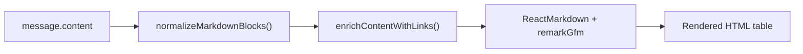

# Fix Markdown Table Rendering in MessageBubble

## Problem

When the AI agent returns a markdown table immediately after prose text without a blank line separator, `remarkGfm` fails to parse it as a table. The content arrives like:

```
...compile them into a nice markdown table format.| Skill | Description |
|-------|-------------|
| experience-prototype | Guide users... |
```

The `|` table syntax starts on the same line as the preceding paragraph text. Per the GFM spec, a table must be preceded by a blank line (or start at the beginning of the document) to be recognized as a block-level element. Without that blank line, the entire table is rendered as inline text.

## Root Cause

The raw `message.content` from the sidecar sometimes lacks proper blank-line separation before block-level markdown elements (tables, code fences, headings, etc.). Neither `enrichContentWithLinks()` nor ReactMarkdown itself fixes this — they pass the content through as-is.

## Solution

Add a **content normalization function** that ensures blank lines before GFM block elements that require them. This runs in `MessageBubble.tsx` before the content reaches `enrichContentWithLinks()` and `ReactMarkdown`.

The normalizer will handle:

1. **Tables** — Ensure a blank line before lines starting with `|` that are part of a table (header row followed by separator row `|---|`)
2. **Fenced code blocks** — Ensure a blank line before opening `

``` `3. **Headings** — Ensure a blank line before`#` headings

The function must skip content already inside fenced code blocks to avoid corrupting code.

## Files to Change

### 1. New utility: `[src/lib/markdown-normalize.ts](src/lib/markdown-normalize.ts)`

Create a `normalizeMarkdownBlocks(content: string): string` function that:

- Splits content into lines
- Tracks whether we're inside a fenced code block
- For each line that starts a block element (table row `|`, fenced code ``

``` ``, heading `#`), checks if the previous line is non-empty text

- If so, inserts a blank line before the block element
- Table detection: a line starting with `|` is treated as a table start only if the next line is a separator row matching `/^\|[\s:|-]+\|$/`

```typescript
export function normalizeMarkdownBlocks(content: string): string {
  if (!content) return content;
  const lines = content.split('\n');
  const result: string[] = [];
  let inFencedBlock = false;

  for (let i = 0; i < lines.length; i++) {
    const line = lines[i];
    const trimmed = line.trimStart();

    if (trimmed.startsWith('

```')) {
      // Ensure blank line before opening fence (not closing)
      if (!inFencedBlock && result.length > 0 && result[result.length - 1].trim() !== '') {
        result.push('');
      }
      inFencedBlock = !inFencedBlock;
      result.push(line);
      continue;
    }

    if (inFencedBlock) {
      result.push(line);
      continue;
    }

    const needsBlankLine =
      // Table: line starts with | and next line is separator
      (trimmed.startsWith('|') && i + 1 < lines.length && /^\|[\s:|-]+\|$/.test(lines[i + 1].trim())) ||
      // Heading
      /^#{1,6}\s/.test(trimmed);

    if (needsBlankLine && result.length > 0 && result[result.length - 1].trim() !== '') {
      result.push('');
    }

    result.push(line);
  }

  return result.join('\n');
}
```

### 2. Update `[src/components/chat/MessageBubble.tsx](src/components/chat/MessageBubble.tsx)`

- Import `normalizeMarkdownBlocks` from `@/lib/markdown-normalize`
- Apply it to `displayContent` before `enrichContentWithLinks`:

```typescript
const normalizedContent = useMemo(() => {
  return normalizeMarkdownBlocks(displayContent);
}, [displayContent]);

const enrichedContent = useMemo(() => {
  return enrichContentWithLinks(normalizedContent);
}, [normalizedContent]);
```

Alternatively, chain both in a single memo to reduce overhead — but two separate memos is clearer and the cost is negligible.

### 3. New test file: `[src/lib/__tests__/markdown-normalize.test.ts](src/lib/__tests__/markdown-normalize.test.ts)`

Test cases:

- Table immediately after text gets a blank line inserted
- Table already preceded by blank line is unchanged
- Table at the start of content is unchanged
- Heading immediately after text gets a blank line inserted
- Fenced code block immediately after text gets a blank line inserted
- Content inside fenced code blocks is not modified (no false positives on `|` inside code)
- Multiple block elements in sequence are all separated
- Empty/null content returns as-is

### 4. Update `[UPDATE_LOG.md](UPDATE_LOG.md)`

Add entry under `v0.5.12`:

```
- **Fix: Markdown table rendering** — Tables and other block-level markdown elements in agent responses now render correctly when not preceded by a blank line
```

## Data Flow




## Why Not Fix Upstream?

The sidecar passes through whatever the LLM returns. LLMs frequently omit blank lines before tables. Fixing this at the rendering layer is the correct approach — it's a display concern, and the normalization is safe (inserting blank lines before block elements never changes the semantic meaning of well-formed markdown).