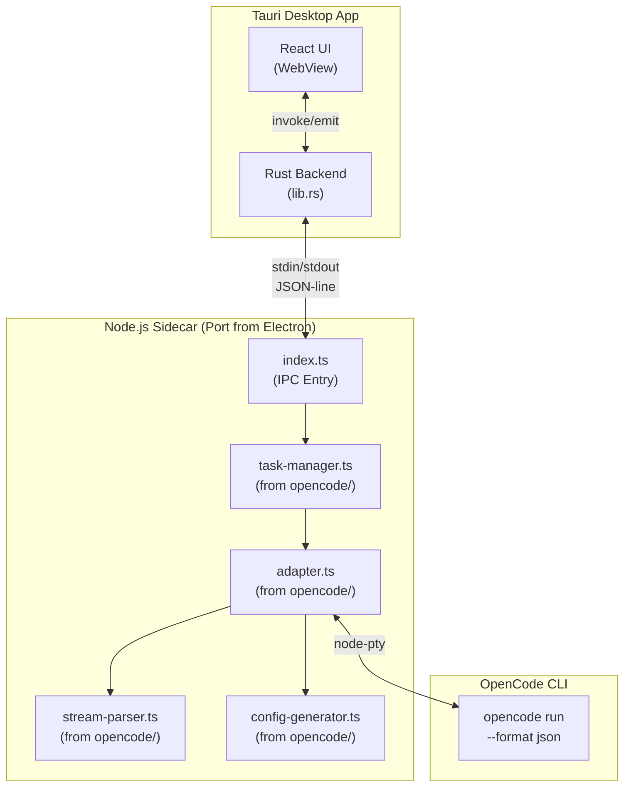

# Electron to Tauri Migration Plan

## Overview

Migrate the Electron app at `apps/desktop/` to the existing Tauri boilerplate, preserving all UI and functionality.

**Scope:**
- Move `apps/desktop/src/renderer/*` → `src/`
- Move `apps/desktop/src/shared/*` → `src/shared/`
- Convert 90+ Electron IPC handlers to Tauri commands
- Replace native modules with Rust/Tauri equivalents
- Skip all tests (`e2e/`, `__tests__/`)
- Update `CLAUDE.md` at the end

### Architecture Overview



---

## Phase 1: Frontend Migration

### 1.1 Copy Frontend Files

```
apps/desktop/src/renderer/  →  src/
├── App.tsx                 →  src/App.tsx
├── main.tsx               →  src/main.tsx
├── pages/                 →  src/pages/
├── components/            →  src/components/
├── stores/                →  src/stores/
├── lib/                   →  src/lib/
├── styles/                →  src/styles/
└── index.css              →  src/index.css

apps/desktop/src/shared/   →  src/shared/
```

### 1.2 Install Frontend Dependencies

Add to `package.json`:
```json
{
  "dependencies": {
    "@radix-ui/react-avatar": "^1.1.2",
    "@radix-ui/react-dialog": "^1.1.4",
    "@radix-ui/react-dropdown-menu": "^2.1.4",
    "@radix-ui/react-label": "^2.1.1",
    "@radix-ui/react-scroll-area": "^1.2.2",
    "@radix-ui/react-separator": "^1.1.1",
    "@radix-ui/react-slot": "^1.1.1",
    "@radix-ui/react-tooltip": "^1.1.6",
    "class-variance-authority": "^0.7.1",
    "clsx": "^2.1.1",
    "framer-motion": "^12.26.2",
    "lucide-react": "^0.454.0",
    "react-markdown": "^9.0.1",
    "react-router-dom": "^7.1.1",
    "tailwind-merge": "^3.3.1",
    "zod": "^3.24.1",
    "zustand": "^5.0.2"
  },
  "devDependencies": {
    "autoprefixer": "^10.4.20",
    "postcss": "^8.4.49",
    "tailwindcss": "^3.4.17",
    "@tailwindcss/typography": "^0.5.15"
  }
}
```

### 1.3 Update Build Configuration

**vite.config.ts** - Add path aliases:
```typescript
resolve: {
  alias: {
    "@": path.resolve(__dirname, "src"),
    "@shared": path.resolve(__dirname, "src/shared"),
  },
}
```

**tsconfig.json** - Add paths:
```json
{
  "compilerOptions": {
    "baseUrl": ".",
    "paths": {
      "@/*": ["src/*"],
      "@shared/*": ["src/shared/*"]
    }
  }
}
```

**tailwind.config.ts** - Copy from Electron app, update content paths.

### 1.4 Create Tauri API Bridge

Replace `src/lib/accomplish.ts` with `src/lib/tauri-api.ts`:
```typescript
import { invoke } from '@tauri-apps/api/core';
import { listen, UnlistenFn } from '@tauri-apps/api/event';

// Task operations
export const startTask = (config: TaskConfig) => invoke<Task>('start_task', { config });
export const cancelTask = (taskId: string) => invoke<void>('cancel_task', { taskId });
export const getTask = (taskId: string) => invoke<Task>('get_task', { taskId });
export const listTasks = () => invoke<Task[]>('list_tasks');

// Event subscriptions
export const onTaskUpdate = (cb: (e: TaskUpdateEvent) => void): Promise<UnlistenFn> =>
  listen<TaskUpdateEvent>('task:update', (e) => cb(e.payload));
// ... etc
```

---

## Phase 2: Rust Backend - Core Commands

### 2.1 Database Layer (rusqlite)

**Files to create:**
- `src-tauri/src/db/mod.rs` - Database connection pool
- `src-tauri/src/db/migrations.rs` - Schema migrations
- `src-tauri/src/db/tasks.rs` - Task CRUD operations
- `src-tauri/src/db/settings.rs` - App settings

**Cargo.toml additions:**
```toml
rusqlite = { version = "0.31", features = ["bundled"] }
tokio = { version = "1", features = ["full"] }
uuid = { version = "1", features = ["v4"] }
chrono = { version = "0.4", features = ["serde"] }
```

### 2.2 Task Commands

**src-tauri/src/commands/task.rs:**
```rust
#[tauri::command]
async fn start_task(config: TaskConfig, state: State<'_, AppState>) -> Result<Task, String>;

#[tauri::command]
async fn cancel_task(task_id: String, state: State<'_, AppState>) -> Result<(), String>;

#[tauri::command]
async fn get_task(task_id: String, state: State<'_, AppState>) -> Result<Task, String>;

#[tauri::command]
async fn list_tasks(state: State<'_, AppState>) -> Result<Vec<TaskSummary>, String>;
```

### 2.3 Settings Commands

**src-tauri/src/commands/settings.rs:**
```rust
#[tauri::command]
fn get_provider_settings() -> Result<ProviderSettings, String>;

#[tauri::command]
fn set_active_provider(provider_id: String) -> Result<(), String>;

#[tauri::command]
fn get_app_settings() -> Result<AppSettings, String>;
```

---

## Phase 3: Sidecar for OpenCode CLI

### 3.1 Node.js Sidecar Setup

Create `sidecar/` directory with simplified task runner:
```
sidecar/
├── package.json
├── index.ts          # Entry point
├── task-manager.ts   # From apps/desktop/src/main/opencode/
├── adapter.ts        # OpenCode CLI adapter
└── stream-parser.ts  # Output parsing
```

**tauri.conf.json:**
```json
{
  "bundle": {
    "externalBin": ["sidecar/opencode-runner"]
  }
}
```

### 3.2 Sidecar Communication

Rust spawns sidecar, communicates via stdin/stdout JSON:
```rust
use tauri::api::process::{Command, CommandEvent};

let (mut rx, child) = Command::new_sidecar("opencode-runner")?
    .args(["--task", &task_id])
    .spawn()?;

while let Some(event) = rx.recv().await {
    match event {
        CommandEvent::Stdout(line) => {
            let msg: SidecarMessage = serde_json::from_str(&line)?;
            app.emit_all("task:update", msg)?;
        }
        // ...
    }
}
```

---

## Phase 4: Secure Storage & Provider Settings

### 4.1 Secure Storage (OS Keychain)

**Cargo.toml:**
```toml
keyring = "2"
```

**src-tauri/src/secure_storage.rs:**
```rust
use keyring::Entry;

pub fn store_api_key(provider: &str, key: &str) -> Result<(), String> {
    let entry = Entry::new("com.kevinlin.cowork-z", provider)?;
    entry.set_password(key)?;
    Ok(())
}

pub fn get_api_key(provider: &str) -> Result<Option<String>, String> {
    let entry = Entry::new("com.kevinlin.cowork-z", provider)?;
    match entry.get_password() {
        Ok(key) => Ok(Some(key)),
        Err(keyring::Error::NoEntry) => Ok(None),
        Err(e) => Err(e.to_string()),
    }
}
```

### 4.2 Provider Integration Commands

```rust
#[tauri::command]
async fn test_ollama_connection(url: String) -> Result<bool, String>;

#[tauri::command]
async fn fetch_openrouter_models(api_key: String) -> Result<Vec<Model>, String>;
```

For Azure/AWS: delegate to sidecar (keeps SDK complexity in Node.js).

---

## Phase 5: Skills & Resources

### 5.1 Bundle Skills

```json
// tauri.conf.json
{
  "bundle": {
    "resources": [
      { "from": "../apps/desktop/skills", "to": "skills" }
    ]
  }
}
```

### 5.2 Skills Path Resolution

```rust
let skills_dir = app.path_resolver()
    .resource_dir()
    .unwrap()
    .join("skills");
```

---

## Phase 6: Cleanup & Documentation

### 6.1 Remove Electron App

After migration verified:
```bash
rm -rf apps/desktop/
```

### 6.2 Update CLAUDE.md

Update with:
- New project structure
- Updated commands
- Sidecar architecture details
- Removed Electron references

---

## Decisions Made

| Decision | Choice | Rationale |
|----------|--------|-----------|
| **Database** | rusqlite (Rust) | Type-safe, fast, no extra runtime |
| **Secure Storage** | OS Keychain | Most secure, native macOS integration |
| **PTY/CLI Spawning** | Node.js sidecar | Preserves existing task-manager.ts logic |
| **AWS/Azure SDKs** | Node.js sidecar | Reuses existing SDK code |

---

## Verification Plan

1. **Frontend renders:** `pnpm tauri dev` shows UI correctly
2. **Navigation works:** All routes accessible
3. **Task creation:** Can start a task, see streaming output
4. **Task history:** Previous tasks load from database
5. **Settings persist:** API keys and preferences saved
6. **Provider connections:** Can test Ollama/OpenRouter connections
7. **Build succeeds:** `pnpm tauri build` creates working .app

---

## Files to Modify

### Frontend (copy/adapt)
- `src/App.tsx` - Replace boilerplate with Electron app's App.tsx
- `src/main.tsx` - Update imports
- `src/pages/*` - Copy all pages
- `src/components/*` - Copy all components
- `src/stores/taskStore.ts` - Update API calls to use Tauri invoke
- `src/lib/tauri-api.ts` - New file replacing accomplish.ts

### Backend (create new)
- `src-tauri/src/commands/mod.rs` - Command modules
- `src-tauri/src/commands/task.rs` - Task commands
- `src-tauri/src/commands/settings.rs` - Settings commands
- `src-tauri/src/db/mod.rs` - Database module
- `src-tauri/src/state.rs` - App state management

### Configuration
- `package.json` - Add frontend dependencies
- `vite.config.ts` - Add path aliases
- `tsconfig.json` - Add path mappings
- `tailwind.config.ts` - Copy from Electron app
- `src-tauri/Cargo.toml` - Add Rust dependencies
- `src-tauri/tauri.conf.json` - Add sidecar, resources, permissions
