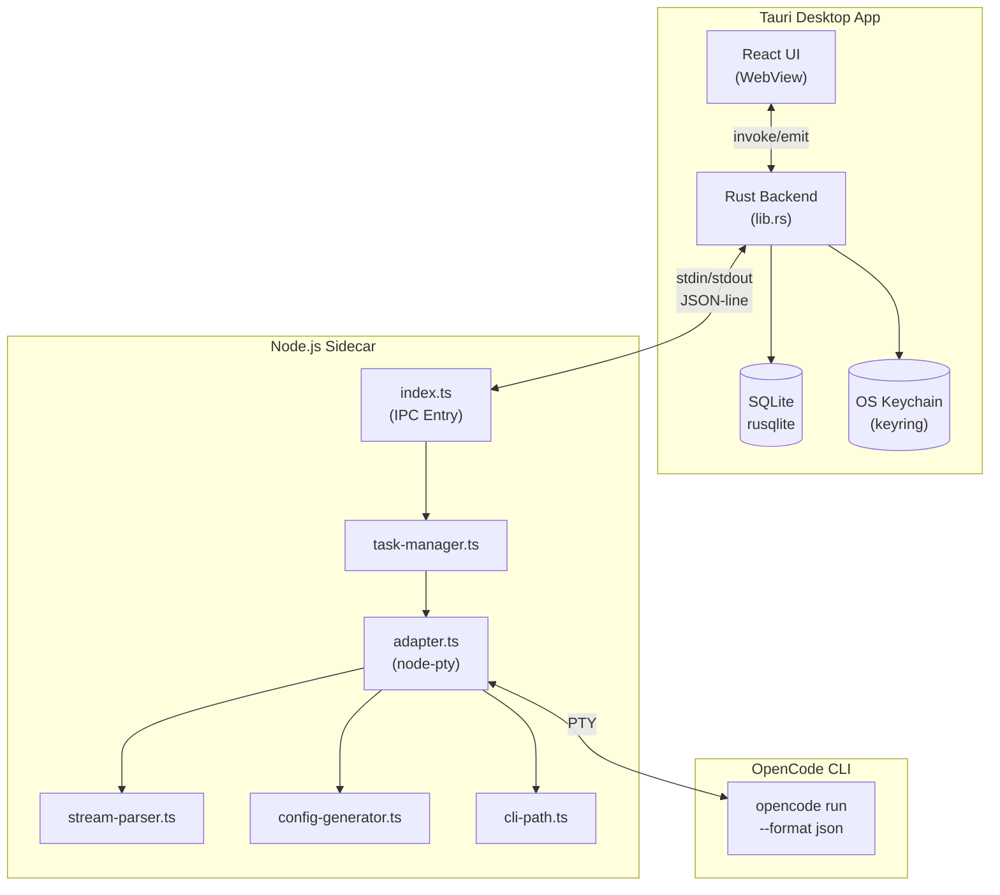

# Electron to Tauri Migration - Task Progress

## Architecture Overview



## Migration Status

### Phase 1: Frontend Migration ✅
| Task | Status |
|------|--------|
| Copy frontend files to src/ | ✅ Done |
| Copy shared types to src/shared/ | ✅ Done |
| Install dependencies (Radix, Tailwind, Zustand, etc.) | ✅ Done |
| Update Vite config with path aliases | ✅ Done |
| Update TypeScript config with paths | ✅ Done |
| Create tailwind.config.ts | ✅ Done |
| Create Tauri API bridge (tauri-api.ts) | ✅ Done |
| Fix imports, verify TypeScript compiles | ✅ Done |

### Phase 2: Rust Backend ✅
| Task | Status |
|------|--------|
| Implement Rust backend stub commands (50+) | ✅ Done |
| Database Layer (rusqlite) - migrations, tasks, settings, providers | ✅ Done |
| Implement database commands (get/list/delete tasks, settings) | ✅ Done |
| Secure Storage (OS Keychain via keyring crate) | ✅ Done |
| API key management commands | ✅ Done |
| Ollama connection testing (HTTP client) | ✅ Done |
| LiteLLM connection testing | ✅ Done |

### Phase 3: Sidecar Implementation ✅
| Task | Status |
|------|--------|
| Sidecar scaffolding (package.json, TypeScript setup) | ✅ Done |
| Port stream-parser.ts from Electron | ✅ Done |
| Port adapter.ts (node-pty integration) | ✅ Done |
| Port task-manager.ts | ✅ Done |
| Port config-generator.ts | ✅ Done |
| Port cli-path.ts | ✅ Done |
| Create types.ts for sidecar | ✅ Done |
| Update index.ts to integrate modules | ✅ Done |
| Create sidecar.rs (Rust integration) | ✅ Done |
| Update lib.rs with sidecar commands | ✅ Done |

### Phase 4: Tauri Configuration ✅
| Task | Status |
|------|--------|
| Update tauri.conf.json (externalBin, resources) | ✅ Done |
| Update capabilities/default.json (shell permissions) | ✅ Done |
| Add tauri-plugin-shell to Cargo.toml | ✅ Done |
| Create sidecar placeholder binary | ✅ Done |
| Update sidecar build configuration (package.json, tsconfig.json) | ✅ Done |

### Phase 5: Documentation ✅
| Task | Status |
|------|--------|
| Update implementation-plan.md with mermaid | ✅ Done |
| Update task-progress.md | ✅ Done |
| Update CLAUDE.md | ✅ Done |

## Key Implementation Details

### Sidecar Structure (`sidecar/src/`)
```
sidecar/src/
├── index.ts           # IPC entry point, JSON-line protocol
├── types.ts           # OpenCode types, IPC protocol definitions
├── stream-parser.ts   # NDJSON parser with Windows PTY handling
├── adapter.ts         # OpenCode CLI adapter (node-pty)
├── task-manager.ts    # Multi-task lifecycle management
├── config-generator.ts# OpenCode config generation
└── cli-path.ts        # CLI binary resolution
```

### Rust Sidecar Integration (`src-tauri/src/sidecar.rs`)
- `SidecarManager` - Spawns and manages sidecar process
- `SidecarState` - Thread-safe state wrapper
- `SidecarCommand` - Commands sent to sidecar (StartTask, CancelTask, etc.)
- `SidecarEvent` - Events received from sidecar
- `get_all_api_keys()` - Collects API keys from secure storage for sidecar

### IPC Protocol
**Rust → Sidecar (stdin):**
```json
{"type":"start_task","taskId":"task_123","payload":{"taskId":"task_123","prompt":"...","apiKeys":{...}}}
```

**Sidecar → Rust (stdout):**
```json
{"type":"task_message","taskId":"task_123","payload":{"message":{...}}}
{"type":"task_progress","taskId":"task_123","payload":{"progress":{"stage":"executing"}}}
{"type":"task_complete","taskId":"task_123","payload":{"result":{"status":"success"}}}
```

## Build Verification
```bash
# Frontend
pnpm install
pnpm exec tsc --noEmit  # TypeScript compiles without errors
pnpm build              # Vite builds successfully

# Sidecar
cd sidecar && pnpm install && pnpm build  # TypeScript compiles

# Rust
cd src-tauri && cargo check  # Compiles (warnings about unused functions expected)

# Full app
pnpm tauri dev          # Launches the app
```

## Remaining Work

### Future Enhancements
1. **Build sidecar binaries** - Run `pnpm build:binary` to create standalone executables
2. **Full Provider Integration**:
   - Azure Foundry connection testing (requires Azure SDK)
   - OpenRouter model fetching (requires API key)
   - Bedrock model fetching (requires AWS SDK)
3. **Dev Browser Integration** - Playwright/dev-browser support (deferred)
4. **Permission API** - HTTP server for permission handling (deferred)

### To Test
1. `pnpm install` - Install frontend dependencies
2. `cd sidecar && pnpm install` - Install sidecar dependencies
3. `pnpm tauri dev` - Launch the app

The UI renders correctly. Settings persistence works (debug mode, model selection, provider configs). API key storage uses the OS keychain. Task creation will attempt to spawn the sidecar and run OpenCode CLI.
