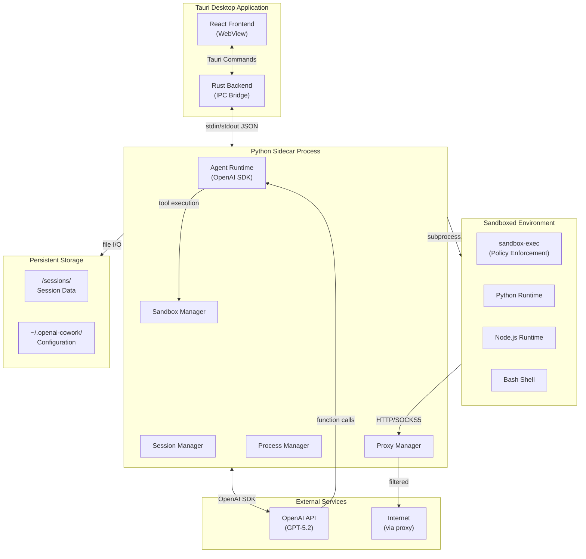
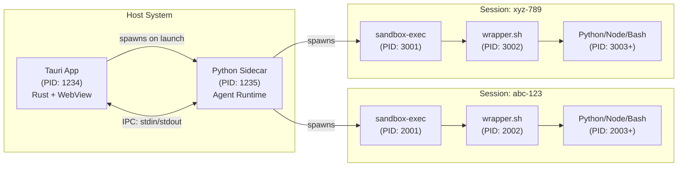

# OpenAI Cowork - Technical Design Document

## Overview

OpenAI Cowork is an open-source desktop application inspired by Claude Cowork that provides a sandboxed environment for autonomous AI agents powered by OpenAI's GPT-5 series models. The application enables end users to interact with AI agents that can safely execute code, manipulate files, and perform multi-step workflows while maintaining strong isolation from the host system.

**Note:** This is an open-source implementation inspired by Claude Cowork, using the OpenAI API instead of Anthropic's Claude API.

### Design Goals

1. **Security First**: Implement defense-in-depth isolation using macOS sandboxing mechanisms
2. **Seamless AI Integration**: Provide robust OpenAI API integration with function calling and streaming
3. **User-Friendly Interface**: Create an intuitive desktop UI inspired by Claude Cowork
4. **Session Isolation**: Maintain strict boundaries between concurrent sessions
5. **Observability**: Provide visibility into agent actions and system state
6. **Single Cohesive Application**: UI and agent lifecycle tied together

### Technology Stack

| Layer | Technology | Rationale |
|-------|-----------|-----------|
| **UI Framework** | Tauri 2.x | Lightweight (~10MB), secure Rust backend, system WebView, native performance |
| **Frontend** | React 18 + TypeScript | Component reusability, type safety, rich ecosystem |
| **Agent Runtime** | Python 3.11+ (Sidecar) | Packaged as sidecar process, excellent OpenAI SDK integration, async capabilities |
| **Communication** | Tauri IPC (stdin/stdout + JSON) | Structured message passing between Rust and Python |
| **Sandbox** | sandbox-exec + custom policies | Native macOS sandboxing with fine-grained control |
| **AI Integration** | OpenAI Python SDK | Function calling, streaming, structured outputs |
| **State Management** | Zustand | Lightweight, TypeScript-friendly state management |
| **Styling** | Tailwind CSS | Utility-first, rapid UI development |

---

## Architecture

### High-Level System Architecture



### Process Architecture



### Key Architectural Decisions

1. **Python Sidecar (Not Web Server)**: Agent runs as a subprocess packaged with the Tauri app, communicates via IPC
2. **Tied Lifecycle**: Launching the app starts the sidecar; quitting the app shuts it down
3. **Structured IPC Protocol**: JSON messages over stdin/stdout for commands, events, and streaming updates
4. **Async Event Loop**: Python uses asyncio for non-blocking operations and streaming
5. **Clear Separation**: Tauri handles desktop concerns (windowing, menus, packaging), Python focuses on agent behavior

---

## Components and Interfaces

### 1. Tauri Application

#### 1.1 React Frontend

**Responsibilities:**
- Render three-panel UI (navigation, content, monitoring)
- Handle user input and display AI responses
- Stream conversation updates in real-time
- Display artifacts with syntax highlighting
- Manage UI state and routing

**Key Components:**
```typescript
// src/App.tsx
import { useEffect, useState } from 'react';
import { invoke } from '@tauri-apps/api/tauri';
import { listen } from '@tauri-apps/api/event';

interface AppState {
  currentSession: Session | null;
  messages: Message[];
  artifacts: Artifact[];
  progress: WorkflowStep[];
}

function App() {
  const [state, setState] = useState<AppState>({
    currentSession: null,
    messages: [],
    artifacts: [],
    progress: []
  });

  // Listen for streaming events from Python sidecar
  useEffect(() => {
    const unlisten = listen('agent-event', (event) => {
      handleAgentEvent(event.payload);
    });

    return () => {
      unlisten.then(fn => fn());
    };
  }, []);

  const createSession = async (config: SessionConfig) => {
    const session = await invoke<Session>('create_session', { config });
    setState(prev => ({ ...prev, currentSession: session }));
  };

  const sendMessage = async (message: string) => {
    await invoke('send_message', {
      sessionId: state.currentSession?.id,
      message
    });
  };

  return (
    <div className="app">
      <Sidebar sessions={[state.currentSession]} />
      <MainContent
        messages={state.messages}
        onSendMessage={sendMessage}
      />
      <MonitoringSidebar
        progress={state.progress}
        artifacts={state.artifacts}
      />
    </div>
  );
}
```

#### 1.2 Rust Backend (Tauri Commands & IPC Bridge)

**Responsibilities:**
- Spawn and manage Python sidecar process
- Provide Tauri commands for frontend
- Forward commands to Python via stdin
- Listen for events from Python via stdout
- Emit Tauri events to frontend

**Key Modules:**
```rust
// src-tauri/src/main.rs
use tauri::{Manager, State};
use serde::{Serialize, Deserialize};
use std::process::{Command, Stdio, ChildStdin, ChildStdout};
use std::sync::Mutex;
use std::io::{BufRead, BufReader, Write};
use std::thread;

#[derive(Serialize, Deserialize)]
struct IPCMessage {
    id: String,
    command: String,
    payload: serde_json::Value,
}

#[derive(Serialize, Deserialize)]
struct IPCResponse {
    id: String,
    success: bool,
    data: Option<serde_json::Value>,
    error: Option<String>,
}

struct SidecarState {
    stdin: Mutex<Option<ChildStdin>>,
}

#[tauri::command]
async fn create_session(
    state: State<'_, SidecarState>,
    config: serde_json::Value
) -> Result<serde_json::Value, String> {
    send_command(&state, "create_session", config).await
}

#[tauri::command]
async fn send_message(
    state: State<'_, SidecarState>,
    session_id: String,
    message: String
) -> Result<(), String> {
    send_command(&state, "send_message", serde_json::json!({
        "session_id": session_id,
        "message": message
    })).await?;
    Ok(())
}

async fn send_command(
    state: &State<'_, SidecarState>,
    command: &str,
    payload: serde_json::Value
) -> Result<serde_json::Value, String> {
    let msg = IPCMessage {
        id: uuid::Uuid::new_v4().to_string(),
        command: command.to_string(),
        payload,
    };

    let json = serde_json::to_string(&msg).map_err(|e| e.to_string())?;

    let mut stdin = state.stdin.lock().unwrap();
    if let Some(stdin) = stdin.as_mut() {
        writeln!(stdin, "{}", json).map_err(|e| e.to_string())?;
        stdin.flush().map_err(|e| e.to_string())?;
    }

    // TODO: Wait for response from Python (implement response queue)
    Ok(serde_json::json!({}))
}

fn start_python_sidecar(app_handle: tauri::AppHandle) -> SidecarState {
    // Get path to bundled Python sidecar
    let resource_path = app_handle
        .path_resolver()
        .resolve_resource("sidecar/main.py")
        .expect("Failed to resolve sidecar path");

    let mut child = Command::new("python3")
        .arg(resource_path)
        .stdin(Stdio::piped())
        .stdout(Stdio::piped())
        .stderr(Stdio::piped())
        .spawn()
        .expect("Failed to start Python sidecar");

    let stdin = child.stdin.take().expect("Failed to get stdin");
    let stdout = child.stdout.take().expect("Failed to get stdout");

    // Spawn thread to read stdout and emit events
    let app_handle_clone = app_handle.clone();
    thread::spawn(move || {
        let reader = BufReader::new(stdout);
        for line in reader.lines() {
            if let Ok(line) = line {
                if let Ok(event) = serde_json::from_str::<serde_json::Value>(&line) {
                    app_handle_clone.emit_all("agent-event", event).ok();
                }
            }
        }
    });

    SidecarState {
        stdin: Mutex::new(Some(stdin)),
    }
}

fn main() {
    tauri::Builder::default()
        .setup(|app| {
            let sidecar_state = start_python_sidecar(app.handle());
            app.manage(sidecar_state);
            Ok(())
        })
        .invoke_handler(tauri::generate_handler![
            create_session,
            send_message,
        ])
        .run(tauri::generate_context!())
        .expect("error while running tauri application");
}
```

---

### 2. Python Sidecar Process

The Python sidecar is packaged with the Tauri app and runs as a subprocess. It communicates via stdin/stdout using JSON messages.

#### 2.1 Main Entry Point

```python
# sidecar/main.py
import sys
import json
import asyncio
from typing import Dict, Any

from agent import AgentRuntime
from session import SessionManager
from sandbox import SandboxExecutor
from proxy import ProxyManager
from process import ProcessManager

class SidecarApp:
    def __init__(self):
        self.session_manager = SessionManager()
        self.agent_runtime = AgentRuntime()
        self.sandbox_executor = SandboxExecutor()
        self.proxy_manager = ProxyManager()
        self.process_manager = ProcessManager()

        # Command handlers
        self.handlers = {
            'create_session': self.handle_create_session,
            'destroy_session': self.handle_destroy_session,
            'send_message': self.handle_send_message,
            'list_sessions': self.handle_list_sessions,
        }

    async def handle_create_session(self, payload: Dict) -> Dict:
        """Create a new session"""
        config = payload.get('config', {})
        session = await self.session_manager.create_session(config)
        return session.to_dict()

    async def handle_destroy_session(self, payload: Dict) -> Dict:
        """Destroy a session"""
        session_id = payload['session_id']
        await self.session_manager.destroy_session(session_id)
        return {'status': 'destroyed'}

    async def handle_send_message(self, payload: Dict) -> Dict:
        """Send message to agent (starts streaming)"""
        session_id = payload['session_id']
        message = payload['message']

        # Stream agent responses as events
        async for event in self.agent_runtime.stream_message(session_id, message):
            self.emit_event('agent_event', event.to_dict())

        return {'status': 'completed'}

    async def handle_list_sessions(self, payload: Dict) -> Dict:
        """List all sessions"""
        sessions = self.session_manager.list_sessions()
        return {'sessions': [s.to_dict() for s in sessions]}

    def emit_event(self, event_type: str, data: Dict[str, Any]):
        """Emit event to Tauri frontend via stdout"""
        event = {
            'type': event_type,
            'data': data
        }
        print(json.dumps(event), flush=True)

    def send_response(self, message_id: str, success: bool, data: Any = None, error: str = None):
        """Send response to a command"""
        response = {
            'id': message_id,
            'success': success,
            'data': data,
            'error': error
        }
        print(json.dumps(response), flush=True)

    async def process_command(self, message: Dict):
        """Process incoming command from Tauri"""
        message_id = message.get('id')
        command = message.get('command')
        payload = message.get('payload', {})

        try:
            if command in self.handlers:
                result = await self.handlers[command](payload)
                self.send_response(message_id, True, result)
            else:
                self.send_response(message_id, False, error=f"Unknown command: {command}")
        except Exception as e:
            self.send_response(message_id, False, error=str(e))

    async def run(self):
        """Main event loop - read from stdin, process commands"""
        loop = asyncio.get_event_loop()

        # Read from stdin in a non-blocking way
        while True:
            line = await loop.run_in_executor(None, sys.stdin.readline)
            if not line:
                break  # EOF - Tauri closed

            try:
                message = json.loads(line.strip())
                await self.process_command(message)
            except json.JSONDecodeError:
                continue

if __name__ == '__main__':
    app = SidecarApp()
    asyncio.run(app.run())
```

#### 2.2 Session Manager

```python
# sidecar/session.py
import os
import uuid
import aiofiles
from dataclasses import dataclass, asdict
from datetime import datetime
from typing import Dict, List, Optional
from enum import Enum

class SessionState(str, Enum):
    INITIALIZING = "initializing"
    ACTIVE = "active"
    PAUSED = "paused"
    TERMINATED = "terminated"
    ERROR = "error"

@dataclass
class Session:
    id: str
    created_at: datetime
    updated_at: datetime
    state: SessionState
    working_dir: str
    config: Dict
    sandbox_pid: Optional[int] = None
    proxy_endpoints: Optional[Dict[str, str]] = None

    def to_dict(self):
        return {
            'id': self.id,
            'created_at': self.created_at.isoformat(),
            'updated_at': self.updated_at.isoformat(),
            'state': self.state.value,
            'working_dir': self.working_dir,
            'config': self.config,
            'sandbox_pid': self.sandbox_pid,
            'proxy_endpoints': self.proxy_endpoints
        }

class SessionManager:
    def __init__(self, sessions_dir: str = None):
        if sessions_dir is None:
            sessions_dir = os.path.expanduser("~/.openai-cowork/sessions")
        self.sessions_dir = sessions_dir
        self.sessions: Dict[str, Session] = {}

    async def create_session(self, config: Dict) -> Session:
        """Create a new isolated session"""
        # Generate unique ID
        session_id = self._generate_session_id()

        # Create directory structure
        working_dir = os.path.join(self.sessions_dir, session_id)
        await self._create_directories(working_dir)

        # Initialize session
        session = Session(
            id=session_id,
            created_at=datetime.now(),
            updated_at=datetime.now(),
            state=SessionState.INITIALIZING,
            working_dir=working_dir,
            config=config
        )

        # Start proxy for session
        from proxy import ProxyManager
        proxy_mgr = ProxyManager()
        session.proxy_endpoints = await proxy_mgr.start_proxy_for_session(session_id)

        session.state = SessionState.ACTIVE
        self.sessions[session_id] = session

        return session

    async def _create_directories(self, working_dir: str):
        """Create session directory structure"""
        dirs = [
            working_dir,
            f"{working_dir}/mnt/uploads",
            f"{working_dir}/mnt/outputs",
            f"{working_dir}/working",
            f"{working_dir}/.config",
        ]

        for dir_path in dirs:
            os.makedirs(dir_path, exist_ok=True)

    def _generate_session_id(self) -> str:
        """Generate human-readable session ID"""
        import random
        adjectives = ["eloquent", "eager", "elegant", "efficient"]
        nouns = ["gauss", "euler", "turing", "lovelace"]
        return f"{random.choice(adjectives)}-{random.choice(nouns)}-{random.choice(adjectives)}"

    async def destroy_session(self, session_id: str):
        """Cleanup session resources"""
        if session_id not in self.sessions:
            raise ValueError(f"Session {session_id} not found")

        session = self.sessions[session_id]

        # Kill sandbox processes
        if session.sandbox_pid:
            from process import ProcessManager
            proc_mgr = ProcessManager()
            await proc_mgr.kill_process_tree(session.sandbox_pid)

        # Stop proxy
        if session.proxy_endpoints:
            from proxy import ProxyManager
            proxy_mgr = ProxyManager()
            await proxy_mgr.stop_proxy_for_session(session_id)

        session.state = SessionState.TERMINATED
        del self.sessions[session_id]

    def list_sessions(self) -> List[Session]:
        """List all active sessions"""
        return list(self.sessions.values())
```

#### 2.3 Agent Runtime

```python
# sidecar/agent.py
from openai import AsyncOpenAI
from typing import AsyncIterator, List, Dict, Any, Optional
from dataclasses import dataclass
from enum import Enum
import json

class AgentEventType(str, Enum):
    TEXT_DELTA = "text_delta"
    TOOL_CALL_START = "tool_call_start"
    TOOL_CALL_RESULT = "tool_call_result"
    COMPLETION = "completion"
    ERROR = "error"

@dataclass
class AgentEvent:
    type: AgentEventType
    content: Optional[str] = None
    tool: Optional[Dict] = None
    result: Optional[Dict] = None
    error: Optional[str] = None

    def to_dict(self):
        return {
            'type': self.type.value,
            'content': self.content,
            'tool': self.tool,
            'result': self.result,
            'error': self.error
        }

class AgentRuntime:
    def __init__(self):
        self.client = AsyncOpenAI()
        self.conversations: Dict[str, List[Dict]] = {}

    async def stream_message(
        self,
        session_id: str,
        message: str
    ) -> AsyncIterator[AgentEvent]:
        """Stream agent response with tool calling"""

        # Initialize conversation for session
        if session_id not in self.conversations:
            self.conversations[session_id] = []

        # Add user message
        self.conversations[session_id].append({
            "role": "user",
            "content": message
        })

        # Stream completion
        stream = await self.client.chat.completions.create(
            model="gpt-5.2",
            messages=self.conversations[session_id],
            tools=self._get_tool_definitions(),
            stream=True,
            tool_choice="auto"
        )

        assistant_message = {"role": "assistant", "content": "", "tool_calls": []}

        async for chunk in stream:
            delta = chunk.choices[0].delta

            # Handle text content
            if delta.content:
                assistant_message["content"] += delta.content
                yield AgentEvent(
                    type=AgentEventType.TEXT_DELTA,
                    content=delta.content
                )

            # Handle tool calls
            if delta.tool_calls:
                for tool_call_delta in delta.tool_calls:
                    if tool_call_delta.index is not None:
                        # Ensure tool_calls array is large enough
                        while len(assistant_message["tool_calls"]) <= tool_call_delta.index:
                            assistant_message["tool_calls"].append({
                                "id": "",
                                "type": "function",
                                "function": {"name": "", "arguments": ""}
                            })

                        current_tool = assistant_message["tool_calls"][tool_call_delta.index]

                        if tool_call_delta.id:
                            current_tool["id"] = tool_call_delta.id
                        if tool_call_delta.function.name:
                            current_tool["function"]["name"] = tool_call_delta.function.name
                        if tool_call_delta.function.arguments:
                            current_tool["function"]["arguments"] += tool_call_delta.function.arguments

        # Execute tool calls if any
        if assistant_message.get("tool_calls"):
            self.conversations[session_id].append(assistant_message)

            for tool_call in assistant_message["tool_calls"]:
                yield AgentEvent(
                    type=AgentEventType.TOOL_CALL_START,
                    tool=tool_call
                )

                # Execute tool
                from sandbox import SandboxExecutor
                executor = SandboxExecutor()
                result = await executor.execute_tool(session_id, tool_call)

                yield AgentEvent(
                    type=AgentEventType.TOOL_CALL_RESULT,
                    result=result
                )

                # Add tool result to conversation
                self.conversations[session_id].append({
                    "role": "tool",
                    "tool_call_id": tool_call["id"],
                    "content": json.dumps(result)
                })

            # Continue conversation with tool results
            async for event in self.stream_message(session_id, ""):
                yield event
        else:
            self.conversations[session_id].append(assistant_message)
            yield AgentEvent(type=AgentEventType.COMPLETION)

    def _get_tool_definitions(self) -> List[Dict]:
        """Define tools available to the agent"""
        return [
            {
                "type": "function",
                "function": {
                    "name": "read_file",
                    "description": "Read the contents of a file in the session directory",
                    "strict": True,
                    "parameters": {
                        "type": "object",
                        "properties": {
                            "file_path": {
                                "type": "string",
                                "description": "Path to file within session directory"
                            }
                        },
                        "required": ["file_path"],
                        "additionalProperties": False
                    }
                }
            },
            {
                "type": "function",
                "function": {
                    "name": "write_file",
                    "description": "Write content to a file",
                    "strict": True,
                    "parameters": {
                        "type": "object",
                        "properties": {
                            "file_path": {"type": "string"},
                            "content": {"type": "string"}
                        },
                        "required": ["file_path", "content"],
                        "additionalProperties": False
                    }
                }
            },
            {
                "type": "function",
                "function": {
                    "name": "execute_code",
                    "description": "Execute code in sandboxed environment",
                    "strict": True,
                    "parameters": {
                        "type": "object",
                        "properties": {
                            "language": {
                                "type": "string",
                                "enum": ["python", "node", "bash"]
                            },
                            "code": {"type": "string"},
                            "timeout": {"type": "number", "default": 30}
                        },
                        "required": ["language", "code"],
                        "additionalProperties": False
                    }
                }
            }
        ]
```

#### 2.4 Sandbox Executor

```python
# sidecar/sandbox.py
import asyncio
import subprocess
import json
import os
from typing import Dict, Any, List
from dataclasses import dataclass

@dataclass
class ExecutionResult:
    stdout: str
    stderr: str
    exit_code: int
    duration: float

class SandboxExecutor:
    def __init__(self, policy_path: str = "/usr/local/etc/openai-cowork/openai-cowork.sb"):
        self.policy_path = policy_path

    async def execute_tool(self, session_id: str, tool_call: Dict) -> Dict[str, Any]:
        """Execute a tool call from the AI agent"""
        function_name = tool_call["function"]["name"]
        arguments = json.loads(tool_call["function"]["arguments"])

        if function_name == "read_file":
            return await self._read_file(session_id, arguments["file_path"])
        elif function_name == "write_file":
            return await self._write_file(session_id, arguments["file_path"], arguments["content"])
        elif function_name == "execute_code":
            return await self._execute_code(
                session_id,
                arguments["language"],
                arguments["code"],
                arguments.get("timeout", 30)
            )
        else:
            raise ValueError(f"Unknown tool: {function_name}")

    async def execute(
        self,
        session_id: str,
        command: str,
        args: List[str],
        cwd: str,
        env: Dict[str, str] = None,
        timeout: int = 30
    ) -> ExecutionResult:
        """Execute command in sandbox"""

        # Build sandbox command
        sandbox_cmd = [
            "/usr/bin/sandbox-exec",
            "-f", self.policy_path,
            "-D", f"SESSION_ID={session_id}",
            command
        ] + args

        # Prepare environment
        exec_env = os.environ.copy()
        if env:
            exec_env.update(env)

        import time
        start_time = time.time()

        try:
            process = await asyncio.create_subprocess_exec(
                *sandbox_cmd,
                cwd=cwd,
                env=exec_env,
                stdout=asyncio.subprocess.PIPE,
                stderr=asyncio.subprocess.PIPE
            )

            stdout, stderr = await asyncio.wait_for(
                process.communicate(),
                timeout=timeout
            )

            duration = time.time() - start_time

            return ExecutionResult(
                stdout=stdout.decode('utf-8'),
                stderr=stderr.decode('utf-8'),
                exit_code=process.returncode,
                duration=duration
            )

        except asyncio.TimeoutError:
            process.kill()
            raise TimeoutError(f"Command exceeded timeout of {timeout}s")

    async def _execute_code(
        self,
        session_id: str,
        language: str,
        code: str,
        timeout: int
    ) -> Dict[str, Any]:
        """Execute code in specified language"""
        from session import SessionManager
        session_mgr = SessionManager()
        session = session_mgr.sessions[session_id]

        if language == "python":
            code_file = f"{session.working_dir}/working/temp_code.py"
            with open(code_file, 'w') as f:
                f.write(code)

            result = await self.execute(
                session_id,
                "/usr/bin/python3",
                [code_file],
                cwd=f"{session.working_dir}/working",
                timeout=timeout
            )

        elif language == "node":
            code_file = f"{session.working_dir}/working/temp_code.js"
            with open(code_file, 'w') as f:
                f.write(code)

            result = await self.execute(
                session_id,
                "/usr/local/bin/node",
                [code_file],
                cwd=f"{session.working_dir}/working",
                timeout=timeout
            )

        elif language == "bash":
            result = await self.execute(
                session_id,
                "/bin/bash",
                ["-c", code],
                cwd=f"{session.working_dir}/working",
                timeout=timeout
            )

        else:
            raise ValueError(f"Unsupported language: {language}")

        return {
            "success": result.exit_code == 0,
            "stdout": result.stdout,
            "stderr": result.stderr,
            "exit_code": result.exit_code
        }

    async def _read_file(self, session_id: str, file_path: str) -> Dict[str, Any]:
        """Read file content"""
        from session import SessionManager
        session_mgr = SessionManager()
        session = session_mgr.sessions[session_id]

        full_path = os.path.join(session.working_dir, file_path)

        if not full_path.startswith(session.working_dir):
            raise PermissionError(f"Access denied: {file_path}")

        with open(full_path, 'r') as f:
            content = f.read()

        return {"content": content}

    async def _write_file(self, session_id: str, file_path: str, content: str) -> Dict[str, Any]:
        """Write file content"""
        from session import SessionManager
        session_mgr = SessionManager()
        session = session_mgr.sessions[session_id]

        full_path = os.path.join(session.working_dir, file_path)

        if not full_path.startswith(session.working_dir):
            raise PermissionError(f"Access denied: {file_path}")

        os.makedirs(os.path.dirname(full_path), exist_ok=True)

        with open(full_path, 'w') as f:
            f.write(content)

        return {"success": True, "path": file_path}
```

---

## IPC Protocol

### Message Format

All communication between Tauri and Python sidecar uses JSON over stdin/stdout.

**Command (Tauri → Python):**
```json
{
  "id": "uuid-v4",
  "command": "create_session",
  "payload": {
    "config": {
      "model": "gpt-5.2"
    }
  }
}
```

**Response (Python → Tauri):**
```json
{
  "id": "uuid-v4",
  "success": true,
  "data": {
    "session": {...}
  },
  "error": null
}
```

**Event (Python → Tauri):**
```json
{
  "type": "agent_event",
  "data": {
    "type": "text_delta",
    "content": "Hello, "
  }
}
```

### Command Reference

| Command | Payload | Description |
|---------|---------|-------------|
| `create_session` | `{config}` | Create new session |
| `destroy_session` | `{session_id}` | Destroy session |
| `send_message` | `{session_id, message}` | Send message to agent |
| `list_sessions` | `{}` | List all sessions |
| `read_file` | `{session_id, file_path}` | Read file |
| `write_file` | `{session_id, file_path, content}` | Write file |

### Event Types

| Event Type | Data | Description |
|------------|------|-------------|
| `agent_event` | `{type, ...}` | Agent streaming event |
| `session_created` | `{session}` | Session created |
| `session_destroyed` | `{session_id}` | Session destroyed |
| `error` | `{message}` | Error occurred |

---

## Sandbox Policy

```scheme
(version 1)
(debug deny)

;; Allow basic operations
(allow process-exec* process-fork)
(allow sysctl-read)

;; Filesystem access - restrict to session directory
(allow file-read* file-write*
  (subpath "/sessions/${SESSION_ID}/working")
  (subpath "/sessions/${SESSION_ID}/mnt/uploads")
  (subpath "/sessions/${SESSION_ID}/mnt/outputs"))

(allow file-read*
  (literal "/usr/bin")
  (literal "/usr/lib")
  (subpath "/System/Library"))

;; Deny direct network access
(deny network*)

;; Allow proxy socket
(allow network-outbound
  (literal "/tmp/openai-cowork-proxy-${SESSION_ID}.sock"))

;; Deny access to other sessions
(deny file-read* file-write*
  (regex "^/sessions/(?!${SESSION_ID})"))
```

---

## Implementation Phases

### Phase 1: Core Infrastructure (Weeks 1-2)
- Set up Tauri project structure
- Implement Python sidecar with IPC communication
- Create basic session management
- Establish stdin/stdout message passing

### Phase 2: OpenAI Integration (Weeks 3-4)
- Implement agent runtime with OpenAI SDK
- Add function calling / tool execution
- Implement streaming via IPC events
- Create tool definitions

### Phase 3: UI Development (Weeks 5-6)
- Build React component library
- Implement three-panel layout
- Create conversation view with streaming
- Add artifact viewer with syntax highlighting

### Phase 4: Security & Isolation (Week 7)
- Implement sandbox-exec integration
- Create sandbox policy file
- Add proxy manager for network isolation
- Implement process tracking

### Phase 5: Testing & Polish (Week 8)
- Write comprehensive test suites
- Performance optimization
- Error handling refinement
- Documentation and packaging

---

## References and Sources

### macOS Sandboxing
- [sandbox-exec: macOS's Little-Known Command-Line Sandboxing Tool](https://igorstechnoclub.com/sandbox-exec/)
- [Sandboxing on macOS // Mark Rowe](https://bdash.net.nz/posts/sandboxing-on-macos/)
- [OSX Sandboxing Design - Chromium](https://www.chromium.org/developers/design-documents/sandbox/osx-sandboxing-design/)

### OpenAI API
- [Function calling | OpenAI API](https://platform.openai.com/docs/guides/function-calling)
- [Using tools | OpenAI API](https://platform.openai.com/docs/guides/tools)
- [OpenAI Python SDK](https://github.com/openai/openai-python)

### Desktop Frameworks
- [Best framework for desktop application in 2026 - Tibicle](https://tibicle.com/blog/best-framework-for-desktop-application-in-2026)
- [Tauri vs Electron Comparison](https://raftlabs.medium.com/tauri-vs-electron-a-practical-guide-to-picking-the-right-framework-5df80e360f26)
- [Tauri Sidecar Documentation](https://tauri.app/v1/guides/building/sidecar/)

### Python Async
- [asyncio Documentation](https://docs.python.org/3/library/asyncio.html)
- [OpenAI Python SDK Async Usage](https://github.com/openai/openai-python#async-usage)
