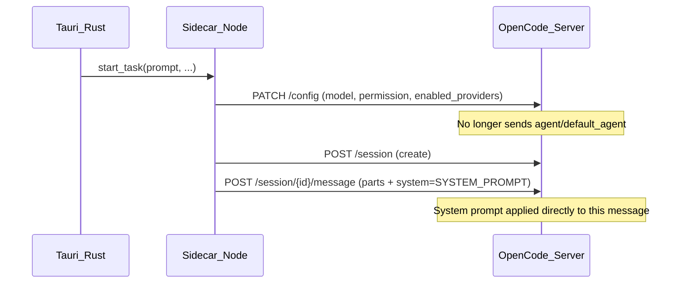

# Fix System Prompt Not Being Applied in Sidecar

## Root Cause Analysis

The system prompt defined in [config-builder.ts](src-tauri/sidecar-opencode/src/config-builder.ts) is not taking effect despite being correctly sent to the OpenCode server. Here's the full chain of evidence:

### What's happening

1. **Config is sent correctly** -- `PATCH /config` sends `default_agent: "accomplish"` with the full agent config including the system prompt. The server returns 200 with the config echoed back.
2. **OpenCode 1.1.48 ignores the custom agent** -- Despite accepting the config, the server falls back to the built-in `build` agent. Log evidence:
  - Messages show `"agent": "build"`, `"mode": "build"` 
  - The `default_agent` API spec says: *"Falls back to 'build' if not set or if the specified agent is invalid"*
  - OpenCode treats the custom `accomplish` agent as invalid at runtime
3. **The `agent` parameter on sendMessage also doesn't work** -- As documented in the [sidecar rewrite plan](docs/specs/opencode-sidecar/plan_sidecar-opencode-rewrite.md) (line 195): OpenCode 1.1.48's `sendMessage` API fails to resolve custom agent names, causing `TypeError: undefined is not an object (evaluating 'agent.name')`.

### The fix: Use the `system` field on `sendMessage`

The `POST /session/{sessionID}/message` API accepts a `**system` field** (type: string) that provides a direct system prompt override, bypassing the agent resolution entirely. This is the correct way to inject a custom system prompt in OpenCode 1.1.48.

## Changes Required

### 1. Update `config-builder.ts` -- separate config from system prompt

- Stop including `agent` and `default_agent` in the config sent via `PATCH /config` (they have no effect)
- Export the `SYSTEM_PROMPT` constant so it can be used by `session-manager.ts`
- Keep permission, model, and enabled_providers in the config (these work fine)

### 2. Update `session-manager.ts` -- pass `system` in sendMessage

- Import the system prompt from `config-builder.ts`
- Pass `system: SYSTEM_PROMPT` in both `sendMessage` calls (startTask and resumeSession)
- Update the `OpenCodeClient.sendMessage` signature to accept a `system` parameter

### 3. Update `opencode-client.ts` -- add `system` to sendMessage

- Add `system?: string` to the `sendMessage` options
- Include it in the request body when present

## Files to modify

- [src-tauri/sidecar-opencode/src/config-builder.ts](src-tauri/sidecar-opencode/src/config-builder.ts) -- export `SYSTEM_PROMPT`, remove agent/default_agent from config
- [src-tauri/sidecar-opencode/src/session-manager.ts](src-tauri/sidecar-opencode/src/session-manager.ts) -- pass system prompt in sendMessage calls
- [src-tauri/sidecar-opencode/src/opencode-client.ts](src-tauri/sidecar-opencode/src/opencode-client.ts) -- add `system` field to sendMessage
