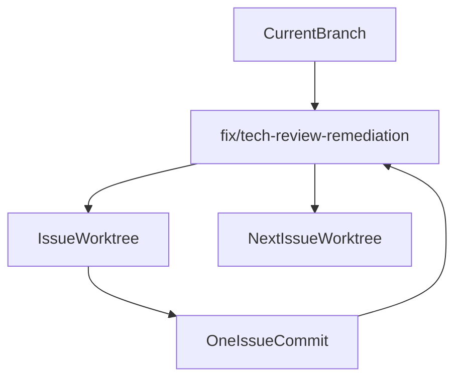

# Technical Review Fix Remediation Plan

## Scope
Implement only the confirmed findings from `docs/review/technical-review_20260612.html` (June 12, 2026 review of `main` @ `f55c5f0`), assessed as Fix. Treat `#20` (port TOCTOU, upstream behavior change) and `#36` (Rust test-coverage initiative) as review-later, and low-severity findings `#37`–`#43` as out of scope for this pass.

Fix queue (grouped):
- CI/repo hygiene: `#7` CI lint backgrounded (regression), `#31` CI missing typecheck/build, `#33` husky skips `.tsx`, `#32` no dependency audit / `.env` gitignore, `#34` floating build-dep versions
- Filesystem sandbox: `#2` unscoped `read_directory`, `#3` unvalidated permission grants, `#4` `skills_delete_installed` traversal, `#15` workspace validator canonicalization, `#10` preview paths bypass `isPathSafe`, `#30` opener `$HOME/**` grant
- Secret handling: `#6` apiKeys escape redaction, `#13` `get_api_key` returns full secret, `#28` streaming logs full message text, `#5` bulk API keys over IPC, `#1` server password in LLM system prompt
- Sidecar lifecycle: `#8` unserialized stdin, `#18` no ready handshake, `#9` sendMessage failures swallowed, `#24` permission-reply failures dropped, `#21` stale sessions not aborted, `#23` SSE filter disabled without directory, `#22` ollama key unused, `#25` config merge clobbers user settings
- Frontend store/perf: `#11` arena double-persist, `#26` unlisten races, `#27` deleteTask map leaks, `#19` non-recursive watcher, `#12` streaming re-renders, `#35` O(n²) message scan
- Rust robustness: `#16` non-transactional migrations, `#17` DB panic paths, `#14` task_id validation, `#29` CSP residual weaknesses

## Worktree And Commit Workflow
Use a sequential integration branch, with one temporary worktree per issue:

For each issue:
- Create an isolated worktree branch named like `fix/tr-01-csp`, based on the latest integration branch.
- Implement only that issue plus its tests/docs/changelog.
- Update the tracking artifact and add exactly one entry under `UPDATE_LOG.md`.
- Run required verification for touched areas:
  - TypeScript/frontend or sidecar: `pnpm typecheck`; relevant `pnpm test --run ...` or sidecar Jest test; `pnpm dlx ultracite fix src/ src-tauri/sidecar-opencode/` after code changes.
  - Rust: `cd src-tauri && cargo check`; targeted Rust tests when added/changed.
  - Config-only/CI-only changes: validate by inspection plus the narrow applicable command if any.
- Commit from the issue worktree with a concise fix message referencing the finding number.
- Integrate that commit back into the integration branch before starting the next worktree.

Note: `.gitignore` currently does not ignore `.worktrees/`, so the first implementation step will need to add `.worktrees/` to `.gitignore` before creating project-local worktrees, unless a global worktree path is used.

## Tracking Artifact
Create `docs/review/technical-review-remediation_20260612.md` from the verified assessment (the June 11 tracker `docs/review/technical-review-remediation.md` stays untouched as the record of the prior round). It will contain:
- A table-free checklist grouped by status: queued, in progress, fixed, ignored, review later.
- For each fixed issue: branch/worktree name, commit hash, `UPDATE_LOG.md` entry label, verification commands and outcomes.

Update this artifact in each issue commit so it is the canonical remediation tracker.

## Documentation And Repo Checklist
For every issue commit:
- Add one `UPDATE_LOG.md` bullet under the latest version, including the review finding number.
- Update `docs/technical-review-remediation.md` with status and verification evidence.
- Do not update `docs/specs/requirements.md` unless the fix directly completes an existing numbered product requirement; these are remediation tasks rather than new feature requirements.

## Verification Strategy
Before reporting each issue complete:
- Run the narrow test/check command for the changed area.
- Run required project checks for touched languages: `pnpm typecheck` for TypeScript edits and `cd src-tauri && cargo check` for Rust edits.
- Use `ReadLints` on edited files after substantive TypeScript/Rust edits.
- Inspect `git diff` for only the intended issue scope before committing.

Before reporting the full remediation complete:
- Run `pnpm typecheck`.
- Run `pnpm test --run` if frontend code changed.
- Run `cd src-tauri && cargo check` and targeted Rust tests if Rust changed.
- Run sidecar Jest tests if sidecar changed.
- Confirm the integration branch contains separate commits, one per issue fix.