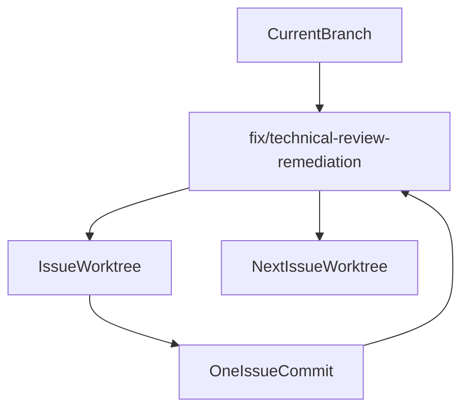

# Technical Review Fix Remediation Plan

## Scope
Implement only the confirmed findings from `docs/technical-review_cowork-z.html` whose recommended action is `Fix`. Treat `#6`, `#7`, `#9`, `#11`, `#12`, `#25`, and `#26` as out of scope for this pass because they were assessed as `Ignore` or `Review later`.

Fix queue:
- `#1` CSP disabled
- `#2` global `asset:` filesystem scope
- `#3` unscoped file read/write/trash commands
- `#4` OpenCode server password logged
- `#5` unsafe HTML preview sandbox/base href
- `#8` Git PAT persisted to `.git/config`
- `#10` plaintext MCP/HTTP/SSE logging
- `#13` SSE reconnect timer/no backoff
- `#14` API keys ignored after first sidecar initialization
- `#15` unused shell/opener capabilities
- `#16` CI lint command backgrounds failures
- `#17` Azure Foundry key/provider ID drift
- `#18` MCP config update missing `workingDirectory`
- `#19` stale folder-permission grant updates
- `#20` duplicate task update listeners
- `#21` `StreamingText` hook-order violation
- `#22` `file://` markdown links stripped
- `#23` auto-scroll sentinel selector mismatch
- `#24` always-on debug-log listener

## Worktree And Commit Workflow
Use a sequential integration branch, with one temporary worktree per issue:

For each issue:
- Create an isolated worktree branch named like `fix/tr-01-csp`, based on the latest integration branch.
- Implement only that issue plus its tests/docs/changelog.
- Update the tracking artifact and add exactly one entry under `UPDATE_LOG.md` `v0.7.15`.
- Run required verification for touched areas:
  - TypeScript/frontend or sidecar: `pnpm typecheck`; relevant `pnpm test --run ...` or sidecar Jest test; `pnpm dlx ultracite fix src/ src-tauri/sidecar-opencode/` after code changes.
  - Rust: `cd src-tauri && cargo check`; targeted Rust tests when added/changed.
  - Config-only/CI-only changes: validate by inspection plus the narrow applicable command if any.
- Commit from the issue worktree with a concise fix message referencing the finding number.
- Integrate that commit back into the integration branch before starting the next worktree.

Note: `.gitignore` currently does not ignore `.worktrees/`, so the first implementation step will need to add `.worktrees/` to `.gitignore` before creating project-local worktrees, unless a global worktree path is used.

## Tracking Artifact
Create `docs/technical-review-remediation.md` from the verified assessment. It will contain:
- A table-free checklist grouped by status: queued, in progress, fixed, ignored, review later.
- For each fixed issue: branch/worktree name, commit hash, `UPDATE_LOG.md` entry label, verification commands and outcomes.
- Notes explaining why `#6` and `#7` are ignored as stale, and why `#9`, `#11`, `#12`, `#25`, `#26` are review-later.

Update this artifact in each issue commit so it is the canonical remediation tracker.

## Implementation Order
Start with narrow, low-conflict fixes to establish the workflow, then move into broader security and lifecycle changes:

1. `#16` CI lint failure masking: change `.github/workflows/test.yml` from `&` to `&&`; add tracker and changelog entry.
2. `#23` auto-scroll sentinel: add `data-messages-end` or move scroll behavior into `MessageList`; prefer the minimal sentinel fix.
3. `#21` `StreamingText` hooks: hoist hooks before conditional return and make effects no-op in real-streaming mode.
4. `#19` folder grant stale state: use a functional Zustand update or accumulate grants before one `set`.
5. `#22` `file://` links: add a `ReactMarkdown` `urlTransform` that preserves default safe protocols plus `file:`, leaving `EnhancedLink` path safety checks as enforcement.
6. `#24` debug log listener: subscribe only when debug mode is enabled, cap retained logs, and isolate debug panel rendering if needed.
7. `#20` duplicate task listeners: centralize task update subscription so components do not double-register persistence paths.
8. `#18` MCP `workingDirectory`: extend Rust payload and settings command to send active workspace directory to sidecar.
9. `#17` Azure Foundry drift: align Rust key status, sidecar `ApiKeys`, and env/config mapping for Azure Foundry.
10. `#13` SSE reconnect: store/clear reconnect timer, re-check reconnect intent, and add bounded exponential backoff.
11. `#14` API key lifecycle: detect key changes after initialization and restart/reconfigure sidecar behavior deliberately; add warning or restart path.
12. `#4` password log leak: remove password logging and add logger redaction for known secret keys.
13. `#10` plaintext logs: redact MCP config secrets and gate full HTTP/SSE payload logs behind debug mode or explicit flag.
14. `#5` HTML preview: escape `baseHref`, remove sandbox escape permissions, and consider disabling scripts unless required.
15. `#15` capabilities: remove unused shell grants and narrow broad opener path grants; confirm frontend still works.
16. `#8` Git PAT persistence: avoid token persistence for pulls or restore scrubbed remote URL after pull; add Rust tests around URL handling.
17. `#3` unscoped file commands: introduce canonical path validation against active workspace/granted roots and apply it to read/write/trash.
18. `#2` asset scope: narrow `assetProtocol.scope` once the file-preview path validation model is in place.
19. `#1` CSP: add a restrictive CSP last, after asset/file preview behavior is constrained, then validate the app in dev/build.

## Documentation And Repo Checklist
For every issue commit:
- Add one `UPDATE_LOG.md` bullet under `v0.7.15`, including the review finding number.
- Update `docs/technical-review-remediation.md` with status and verification evidence.
- Do not update `docs/specs/requirements.md` unless the fix directly completes an existing numbered product requirement; these are remediation tasks rather than new feature requirements.

## Verification Strategy
Before reporting each issue complete:
- Run the narrow test/check command for the changed area.
- Run required project checks for touched languages: `pnpm typecheck` for TypeScript edits and `cd src-tauri && cargo check` for Rust edits.
- Use `ReadLints` on edited files after substantive TypeScript/Rust edits.
- Inspect `git diff` for only the intended issue scope before committing.

Before reporting the full remediation complete:
- Run `pnpm typecheck`.
- Run `pnpm test --run` if frontend code changed.
- Run `cd src-tauri && cargo check` and targeted Rust tests if Rust changed.
- Run sidecar Jest tests if sidecar changed.
- Confirm the integration branch contains separate commits, one per issue fix.