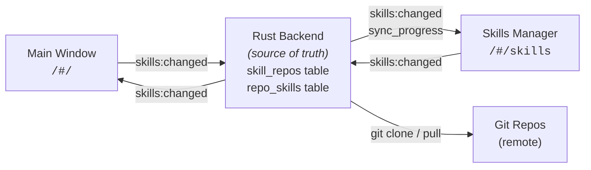

# Skills Manager — Design

**Date:** 2026-02-21
**Requirements:** [8.3 Skills Manager](../cowork-z/requirements.md)
**Status:** Implemented

---

## Overview

The Skills Manager is a dedicated native Tauri window that enables users to register Git repositories as skill sources, browse and install skills from them, and manage all installed skills across multiple global skill directories. It complements the existing Home screen Skills Catalog (8.1–8.2) which handles bundled skill templates.

---

## Architecture

### Window Model

The Skills Manager runs as a separate Tauri `WebviewWindow` with label `skills`, loading `/#/skills` from the same frontend bundle as the main window.

- **Single-instance:** If the window is already open, focus it instead of creating a new one.
- **State isolation:** Each window has its own JS runtime. The Rust backend is the single source of truth. Both windows subscribe to `skills:changed` events to stay in sync.
- **Capabilities:** The Skills Manager window shares the main window's capability set (`src-tauri/capabilities/default.json` scoped to `["main", "skills"]`), granting access to all Tauri commands and `shell:allow-execute` for Git CLI operations. A supplementary `src-tauri/capabilities/skills.json` adds `shell:allow-execute` and `opener` permissions scoped to the `skills` window.
- **Theme:** The Skills Manager window calls `useTheme()` on mount to load and apply the persisted theme, ensuring visual consistency with the main window.



### Routing

| Window | URL | Layout |
|--------|-----|--------|
| Main | `/#/` | Existing routes (Home, Execution) with sidebar |
| Skills Manager | `/#/skills` | Three-panel layout (file tree, skills grid, preview) |

The `App.tsx` router gains a new top-level route `/skills` that renders the `SkillsManagerPage` component with its own layout (no sidebar from the main app).

### Opening the Window

```typescript
import { WebviewWindow } from "@tauri-apps/api/webviewWindow";

export async function openSkillsManagerWindow() {
  const label = "skills";
  const existing = await WebviewWindow.getByLabel(label);
  if (existing) {
    await existing.setFocus();
    return;
  }
  new WebviewWindow(label, {
    url: "/#/skills",
    title: "Skills Manager",
    width: 1100,
    height: 750,
  });
}
```

> **Note:** `WebviewWindow.getByLabel()` returns a `Promise` in Tauri 2.x, so the function must be `async`.

Entry points: sidebar button in main window, Help menu item, and footer link in the Home screen Skills Catalog ("For full control of your skills, use Skills Manager").

---

## Data Model

### `skill_repos` Table

| Column | Type | Description |
|--------|------|-------------|
| `id` | TEXT PK | UUID |
| `url` | TEXT UNIQUE | Git clone URL (HTTPS or SSH) |
| `name` | TEXT | Display name (derived from URL, e.g., `anthropics/knowledge-work-plugins`) |
| `branch` | TEXT NOT NULL DEFAULT 'main' | Branch to track |
| `auth_token_key` | TEXT NULL | Reference key for OS keychain entry (token itself never in DB) |
| `last_synced_at` | TEXT NULL | ISO timestamp of last successful sync |
| `last_sync_error` | TEXT NULL | Error message from last failed sync |
| `created_at` | TEXT NOT NULL | ISO timestamp |

### `repo_skills` Table

| Column | Type | Description |
|--------|------|-------------|
| `repo_id` | TEXT FK | References `skill_repos.id` ON DELETE CASCADE |
| `skill_path` | TEXT | Relative path within repo (e.g., `data/skills/sql-queries`) |
| `skill_id` | TEXT | Derived ID for install directory (e.g., `data-sql-queries`) |
| `name` | TEXT | From SKILL.md frontmatter |
| `description` | TEXT | From SKILL.md frontmatter |
| `category` | TEXT | Derived from path or manifest |
| PRIMARY KEY | | `(repo_id, skill_path)` |

### Cache Directory

Cache directories use a human-readable name derived from the repo URL (`derive_cache_dir_name()` in `git_ops.rs`): the display name (e.g. `anthropics/knowledge-work-plugins`) with `/` replaced by `_`.

```
{app_data_dir}/skill-repo-cache/
  anthropics_knowledge-work-plugins/   ← shallow clone of repo
    .git/
    data/skills/sql-queries/SKILL.md
    ...
  owner_another-repo/                  ← shallow clone of another repo
    ...
```

### Source Tracking Files (per installed skill)

```
~/.config/opencode/skills/{skill-id}/
  SKILL.md
  .coworkz-checksum       ← SHA256 hex digest (existing)
  .coworkz-source         ← JSON: { repo_id, repo_url, skill_path, installed_at }
```

---

## Skill Discovery

### Default: Convention-Based Scan

After cloning or pulling a repo, recursively scan for directories containing `SKILL.md`. Parse YAML frontmatter for `name` and `description`. Derive category using the existing `derive_category()` prefix logic, extended to handle nested structures.

### Optional: Manifest Override

If `skills.json` exists at the repo root, use it to define the skill catalog:

```json
{
  "skills": [
    {
      "path": "data/skills/sql-queries",
      "name": "SQL Query Writer",
      "description": "Generate SQL queries from natural language",
      "category": "Data"
    }
  ]
}
```

When a manifest is present, it takes precedence over the scan for metadata (name, description, category) but the scan still validates that each declared path exists.

### Repo-Specific Adapter: `anthropics/knowledge-work-plugins`

This repo uses a non-standard structure (`{category}/skills/{name}/` and `{category}/commands/{name}.md`). Apply the same parsing logic as `scripts/sync-skills.mjs`:

- Map upstream category directories to local category prefixes (e.g., `product-management` → `product`)
- Prefer skills directories over command files when both exist
- Prefix skill IDs with category (e.g., `data-sql-queries`)

This adapter is activated when the repo URL matches `github.com/anthropics/knowledge-work-plugins`.

---

## Sync Lifecycle

### On App Launch

1. After main window setup completes, spawn a background task
2. For each registered repo, run `git pull` in the cached clone directory
3. Emit `skills:sync_progress { repo_id, status: "syncing" | "synced" | "error", error? }` per repo
4. Re-scan each updated repo for skills, update `repo_skills` table
5. Emit `skills:changed` when all syncs complete

### Manual Sync

- "Sync" button in the Skills Manager header toolbar
- Per-repo sync or "Sync All"
- Same flow as launch sync but triggered by user

### Git Operations

All Git operations use `std::process::Command` in Rust:

- **Clone:** `git clone --depth 1 --branch {branch} {url} {cache_dir}` — `cache_dir` uses `derive_cache_dir_name(url)` (repo name with `/` → `_`)
- **Pull:** `git -C {cache_dir} pull --ff-only`
- **Auth:** For token-based HTTPS repos, rewrite URL to `https://{token}@github.com/...`

---

## Target Folder Switcher

The Skills Manager supports three global skill directories, matching OpenCode's discovery paths (requirement 2.2):

| Label | Path | Description |
|-------|------|-------------|
| OpenCode Skills | `~/.config/opencode/skills/` | Default. OpenCode native discovery path. |
| Claude Skills | `~/.claude/skills/` | Claude-compatible global skills. |
| Agent Skills | `~/.agents/skills/` | Agent-compatible global skills. |

The folder switcher appears in two places:
1. **Left sidebar header** — controls which folder the file tree displays
2. **Install action** — determines where skills are installed to

Both are bound to the same state. Switching folders refreshes the file tree and re-evaluates install status for repo skills.

> **Implementation note:** `homeDir()` from `@tauri-apps/api/path` returns the home directory **without** a trailing slash (e.g. `/Users/kevinlin`). All path construction must normalize with a trailing `/` before concatenating dotfile paths (e.g. `${homePath}.config/opencode/skills`).

---

## UI Layout

```
┌──────────────────────────────────────────────────────────────────────────┐
│  Skills Manager                                               [─] [□] [×] │
├───────────────┬───────────────────────────────────┬──────────────────────┤
│ [Folder ▾]    │ [All Repos ▾] [+ Add] [↻ Sync]   │                      │
│ opencode/     │  Last synced: 2 min ago           │  File Preview Pane   │
│ skills/       ├───────────────────────────────────┤                      │
│ [🔍 Search][👁]│ [🔍 Search skills...]              │  (FilePreviewPanel   │
│ 📁 brainstorm │ [All] [Data] [Marketing] [Legal]  │   minus "Add to Chat"│
│ 📁 data-query │ ┌──────────────┐ ┌──────────────┐│   closable with X    │
│ 📁 legal-rev  │ │ SQL Queries   │ │ Brand Voice   ││   and Esc)           │
│ 📁 marketing  │ │ Data · repo1  │ │ Mktg · repo1  ││                      │
│ 📁 seo-audit  │ │ [View][Install]│ │ [✓][Reinstall]││                      │
│   ...         │ ├──────────────┤ │ [🗑 Delete]   ││                      │
│               │ │ Legal Review  │ ├──────────────┤│                      │
│               │ │ Legal · repo1 │ │ SEO Audit     ││                      │
│               │ │ [View][Update]│ │ Mktg · repo2  ││                      │
│               │ │ [🗑 Delete]   │ │[View][Install] ││                      │
│               │ └──────────────┘ └──────────────┘│                      │
├───────────────┴───────────────────────────────────┴──────────────────────┤
│ 3 repos · 47 skills · All synced                                         │
└──────────────────────────────────────────────────────────────────────────┘
```

### Left Sidebar
- **Adjustable width** (drag handle on right edge, min 200px, max 400px, default 250px)
- **Folder switcher dropdown** at the top — styled with **primary color** border and text to emphasize the active target folder
- **File tree** of the selected skills folder, reusing the existing file tree pattern (lazy-load, expand/collapse, icons)
- **Auto-refresh:** The sidebar subscribes to `skills:changed` Tauri events and calls `refreshRoot()` (debounced 200ms) to reload the file tree whenever a skill is installed, updated, or deleted — from either the Skills Manager or the main window's catalog
- **Hidden file filter toggle:** An eye icon button next to the search input toggles visibility of dotfiles and system entries (`.coworkz-checksum`, `.coworkz-source`, `.DS_Store`, etc.). Uses the shared `isHiddenEntry()` from `FileTreePanel.tsx`. Hidden by default (matching the main window's file tree behavior).
- Click a file → opens in right preview pane

### Center Panel
- **Header toolbar:** repo filter dropdown ("All Repos" or individual repo names), "Add Repo" button, "Sync" button, last-synced time. When a specific repo is selected (not "All Repos"), the dropdown is styled with **primary color** border and text to indicate active filtering.
- **Search bar + category tabs:** consistent with existing SkillsCatalog design
- **2-column card grid:** each card is a standalone `SkillCard` component (`src/components/skills-manager/SkillCard.tsx`) showing name, description, category badge, source repo badge, and action buttons
- **Card actions:** View (opens `SKILL.md` from the **local cloned repo cache** at `{app_data_dir}/skill-repo-cache/{repo_cache_name}/{skill_path}/SKILL.md` where `repo_cache_name` is the repo display name with `/` → `_`), Install/Update/Installed badge, Re-install, Delete (trash icon, visible only for installed skills)

### Right Preview Pane
- Reuses `FilePreviewPanel.tsx` implementation
- **Adjustable width** (drag handle on left edge, min 280px, max 700px, default 400px) — same resize pattern as the main window's file preview panel
- "Add to Chat" button hidden
- Closable via X button and Escape key

### Status Bar
- Bottom bar: repo count, total remote skill count, sync status

---

## Tauri Commands

| Command | Parameters | Returns | Description |
|---------|-----------|---------|-------------|
| `skill_repos_list` | — | `Vec<SkillRepo>` | List all registered repos with sync status |
| `skill_repos_add` | `url, branch?, auth_token?` | `SkillRepo` | Add repo, trigger initial clone |
| `skill_repos_remove` | `id` | — | Remove repo, delete cache |
| `skill_repos_sync` | `id` | — | Sync single repo |
| `skill_repos_sync_all` | — | — | Sync all repos |
| `skill_repos_skills` | `repo_id?` | `Vec<RepoSkill>` | List skills from one or all repos |
| `skills_install_from_repo` | `repo_id, skill_path, target_folder` | — | Install a repo skill |
| `skills_list_installed` | `target_folder` | `Vec<InstalledSkill>` | List installed skills in a folder |
| `skills_delete_installed` | `skill_id, target_folder` | — | Delete an installed skill |

### Tauri Events

| Event | Payload | Direction |
|-------|---------|-----------|
| `skills:changed` | — | Backend → all windows |
| `skills:sync_progress` | `{ repo_id, status, error? }` | Backend → Skills Manager |

---

## Cross-Window Communication

The main window and Skills Manager stay in sync via events, not direct window-to-window calls:

1. **Skills Manager installs/deletes a skill** → backend emits `skills:changed`
2. **Main window's SkillsCatalog** listens for `skills:changed` and re-fetches install status
3. **Main window's useSkillsStore** (autocomplete) re-fetches installed skills list
4. **Home screen Skills Catalog installs a bundled skill** → emits `skills:changed` → Skills Manager file tree refreshes
5. **Skills Manager's SkillsSidebar** subscribes to `skills:changed` and calls `refreshRoot()` (debounced 200ms) to reload the file tree — this ensures the sidebar reflects installs, updates, and deletes without manual refresh

---

## Error Handling

| Scenario | Behavior |
|----------|----------|
| `git` not found on PATH | Display message in Skills Manager: "Git is required for repo-based skill management. Install Git and restart." |
| Clone fails (bad URL, auth) | Show error inline on "Add Repo" dialog. Repo is NOT saved to DB. |
| Pull fails (network, conflict) | Show error on repo entry in toolbar dropdown. Other repos continue syncing. |
| Skill install/delete fails | Show error inline on the skill card. |
| SKILL.md parse fails | Skip the skill in discovery, log warning. |
